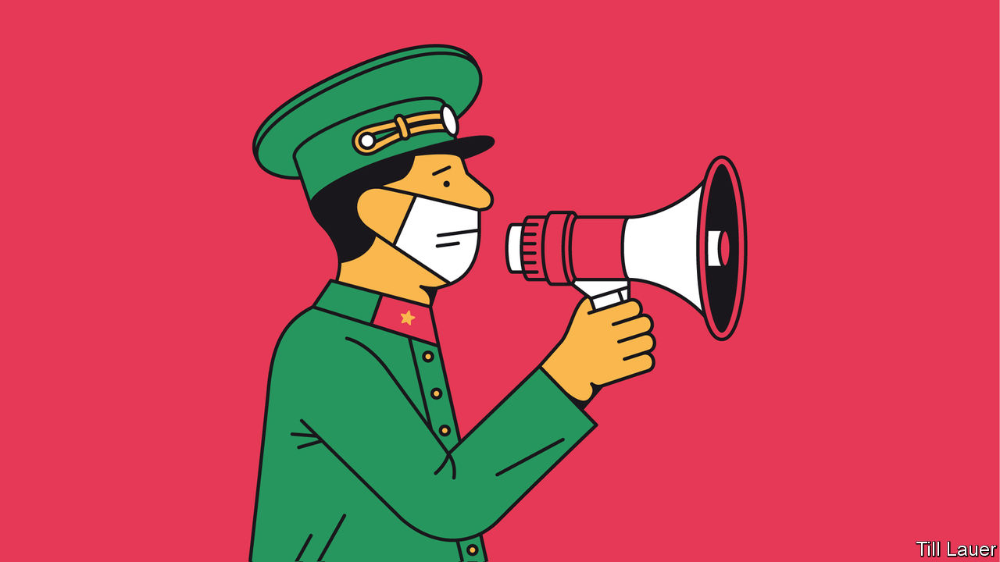

## Banyan

# How two Korean cults measure up against covid-19

> The “promised pastor” v the god-king of Pyongyang

> Mar 14th 2020

CULTS AND coronavirus to do not mix—or perhaps mix only too well. Take South Korea which, until recently overtaken by Italy, had the highest number of covid-19 infections outside China. Of 7,869 diagnosed cases, three-fifths trace back to a sect called the Shincheonji Church of Jesus.

Shincheonji’s 88-year-old founder, Lee Man-hee, is said to descend from ancient Korean kings. As the “Promised Pastor”, he is uniquely able to interpret the Book of Revelation and to foresee the apocalypse it describes. He will take 144,000 followers with him to Heaven on the Day of Judgment, apparently.

Other Christian leaders call Shincheonji a cult. Many of its 245,000 adherents hide their membership from family and workmates. At church they worship sitting on the ground in serried ranks, are not allowed to wear glasses—or, at least until recently, face masks—and are encouraged to attend even when ill. In February one congregant with undiagnosed covid-19 infected dozens of worshippers in Daegu, a southern city.

Mr Lee, who has a taste for videos of white chargers and for mass games performed by his followers in stadiums, has become the butt of nationwide invective. He has therefore had to abase himself. Not long ago he blamed the epidemic on evil types jealous of Shincheonji’s success. But at a press conference last week he was on his knees apologising for his church’s role in spreading the virus. Shincheonji, he said, would do everything to help the authorities check its spread. Meanwhile, politicians are grandstanding. The mayor of Seoul wants prosecutors to investigate Mr Lee for murder through negligence. A provincial governor and presidential hopeful showed up with 40 officials at Shincheonji’s headquarters demanding a full list of members.

What of that other cult leader, North Korea’s Kim Jong Un? He also goes in for white chargers, mass games and dodgy family mythology, but is far swifter at spotting threats. In January, soon after reports surfaced of a growing epidemic in China, North Korea slammed its borders shut. The country responded similarly to China’s outbreak of SARS in 2003 and even to the outbreak of Ebola in West Africa in 2014. The measures were much more comprehensive this time. All travel in and out of the country was stopped. Foreigners already in the country, notably diplomats and aid workers, were put in quarantine. Trade across the border with China, three times higher than in 2003, has ground to a halt, including (to judge by rising domestic prices for staples) the huge, officially sanctioned smuggling rackets that get around UN sanctions. North Korea has even refused to take back defectors rounded up by Chinese authorities.

A nasty virus is yet another foreign threat—like Japanese or American imperialism—against which a loving leader must guard his pure, vulnerable people. The response includes the mobilisation of tens of thousands of “disease-control workers” and the production of “our-style” disinfectants. Vagrants are being rounded up to stop them bringing illness into the capital, Pyongyang. In official pictures Mr Kim, who this week fired off another round of missiles, is the only North Korean not wearing a mask.

The question is whether the “super-special” quarantine measures are working. North Korea supposedly has not a single infection. Perhaps its extreme quarantine has worked. As Andrei Lankov of Kookmin University puts it, the regime is readier to see tens of thousands of already malnourished citizens starve to death, as the price of staple foods rises sharply, than it is to let the virus take hold. Mr Lankov predicts pockets of hunger in remoter rural areas and among groups deemed to be disloyal.

But with so much cross-border activity before the clampdown, it seems implausible that the virus has been kept wholly at bay. It is impossible to know for sure. One report claims that 200 North Korean soldiers have died from covid-19. If that is true, and anything like the typical ratio of infections to deaths holds true, then tens of thousands of North Koreans have the virus—and the chances of keeping it away from the well-fed elites in Pyongyang are close to zero.

If the new coronavirus does take hold, it will ravage the malnourished (including many army conscripts) before anyone else. To Mr Kim, these people are expendable. Nonetheless, the ferocity of his response suggests he is terrified of the virus. A big epidemic would make him look ineffective—something no all-powerful god-king can afford.

Dig deeper:

## URL

https://www.economist.com/asia/2020/03/14/how-two-korean-cults-measure-up-against-covid-19
