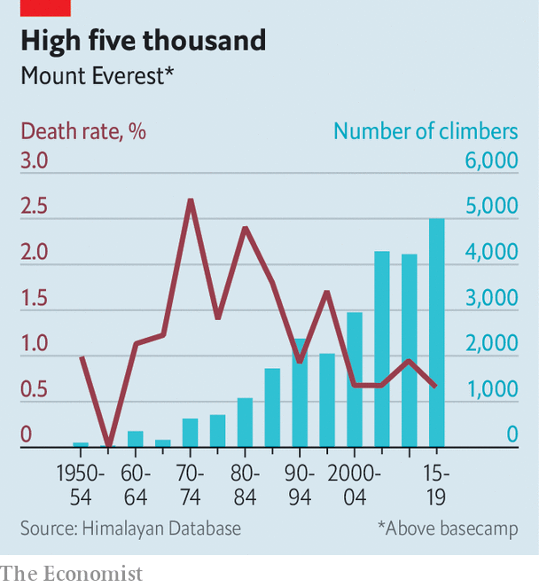

## High and climbing

# New rules to limit numbers on Everest are delayed

> Getting people up the world’s tallest mountain is a big industry for Nepal

> Mar 12th 2020

LIKE BEADS on a slender string, a long queue of mountaineers clings to a single safety rope. They are waiting to ascend to the icy peak of the world’s tallest mountain: Everest. The climbers and their guides have braved sheer rock, avalanches and wild winds. But the crowds that await interludes of good weather to rush for the summit can be just as deadly. Climbers jostle and bicker; long delays deplete supplies of oxygen. Last year four of the 11 deaths on the mountain during the spring climbing season were blamed on overcrowding.

“It is quite a commotion up there,” says Jeremy Tong of JTRACE, a trekking firm, who had to queue to reach the summit last year. The Nepalese government had promised new rules to thin out the mob. (Because of coronavirus the Chinese government has called off all ascents this year on the northern face of the mountain, which is in its territory.) It came up with a series of new requirements to obtain a permit to make an attempt on the peak. Applicants should have successfully climbed another Nepalese mountain of at least 6,500 metres (Everest is 8,848 metres). They should provide documentation certifying their physical fitness for the challenge and employ experienced guides. The authorities are also considering raising the cost of a permit from $11,000 to $35,000. Yet this week they announced that they would not put these changes into effect this year, since there had not been sufficient consultation on them within the government.

Mountaineers are far less likely to die on Everest than they were just a few decades ago. Rescue teams and helicopters stand ready to help those in need, which is not always the case with other Himalayan peaks. But there are many more climbers than there used to be (see chart).

The Nepalese authorities handed out 381 permits to teams of mountaineers last year, generating a welcome dollop of cash. They are presumably keen to ensure that stricter rules do not shrink revenues. Even if the government comes out ahead, with extra income from higher fees offsetting any decrease in the number of permits issued, an entire industry depends on Everest. Nepal is among Asia’s poorest places: about half of its 30m people subsist on less than $3.20 a day, according to the World Bank. Guides risk their lives because they can earn perhaps $5,000 a season working at the highest altitudes, more than seven times the average annual wage. With last year’s bad publicity and the impending tightening of the rules, their earnings may have peaked.■

## URL

https://www.economist.com/asia/2020/03/12/new-rules-to-limit-numbers-on-everest-are-delayed
