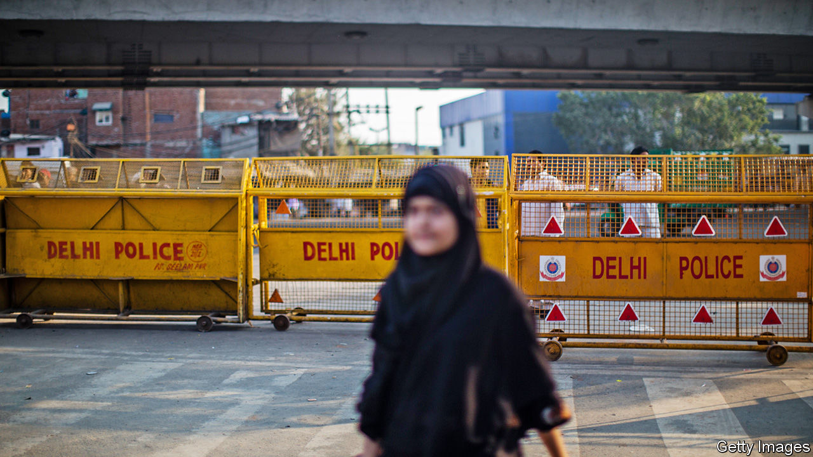

## First the mob, then the law

# Victims of rioting in India are bashed by the police and courts, too

> Judges who decry anti-Muslim bias find themselves overruled or transferred

> Mar 12th 2020DELHI

LAST MONTH a judge in Mangaluru, in the southern state of Karnataka, did something increasingly unusual in an Indian court. Not only did he grant bail to 21 Muslim men charged with joining a riot, he also roundly condemned the police for fabricating evidence against them. They had failed to establish a link between the accused and any crime, he said. They had also failed to register even a single case on behalf of multiple witnesses who claimed that it was the police themselves who had shot dead two people in the city in December during a protest against controversial new citizenship rules. There appeared to have been “a deliberate attempt to cover up police excesses”, he concluded. Two weeks later, in much more typical fashion, the Supreme Court struck down the ruling, sending the men back to prison.

Since the Hindu nationalist government of Narendra Modi changed the laws on citizenship in a way that discriminated against Muslims, at least 80 people have died in related protests, including 53 in riots that engulfed parts of Delhi, the capital, in February. And although it is Muslims, both protesters and bystanders, who have borne the brunt of the violence and vandalism, the government, the agencies of the state and much of the press have persisted in blaming the victims.

In one of many such cases, for instance, a court elsewhere in Karnataka rejected a plea for bail by three students from Kashmir, charged with sedition for singing “Long live Pakistan” in a video on Facebook. Indian legal precedent defines sedition as the direct instigation of violence against the state, yet the judge found it sufficient that the students had “created unhealthy atmosphere”. In Uttar Pradesh, the most populous state, where police were repeatedly caught on film vandalising private property during the protests, the state is fining not the errant officers, but lawyers and human-rights activists who have supposedly damaged public property. The police even erected giant billboards with the photos, names and addresses of several dozen people from whom it is seeking damages. The state’s highest court did order a stop to the legally groundless public shaming campaign, but the state government, which happens to be run by Mr Modi’s Bharatiya Janata Party (BJP), has appealed to the Supreme Court.

It is likely to get a sympathetic hearing. During the riots in Delhi, it was only after the high court ordered police to help evacuate wounded people to hospital that the city’s 80,000-person police force began to intervene, after 48 hours of arson and murder. The same bench also demanded that the police register cases against members of the BJP for hate speech, which they had refused to do despite copious footage of politicians calling for protesters to be shot. Hours later the Supreme Court transferred one of the troublesome judges out of Delhi. The next day the high court postponed all hearings about hate speech to April.

As the bodies were fished out of Delhi’s fetid canals, it became clear that some three-quarters of the victims had Muslim names. Most of the homes and businesses damaged in the riots belonged to Muslims. Yet the police seem to think that Muslims orchestrated it all. Hundreds have been rounded up for questioning on flimsy pretexts, say locals. In one example, a Muslim local councillor who owns a tall building near the scene of some of the worst violence repeatedly called the police to plead for help, warning that his building was being invaded by a mob. He has since been charged with the murder of an undercover policeman whose body was found nearby.

On the night of February 24th, witnesses say, a mob surged into a neighbourhood called Shiv Vihar, systematically targeting Muslim property. Wasiq Khan, a lawyer trying to help victims claim compensation, says the police have made no effort to investigate, not even to note the telltale serial numbers of cooking gas canisters used to firebomb shops and homes. He suspects they are “hoping that renovations overtake the evidence”. Once residents clear away the ashes or haul away the carcasses of torched vehicles, there will be nothing to show what happened. ■

## URL

https://www.economist.com/asia/2020/03/12/victims-of-rioting-in-india-are-bashed-by-the-police-and-courts-too
