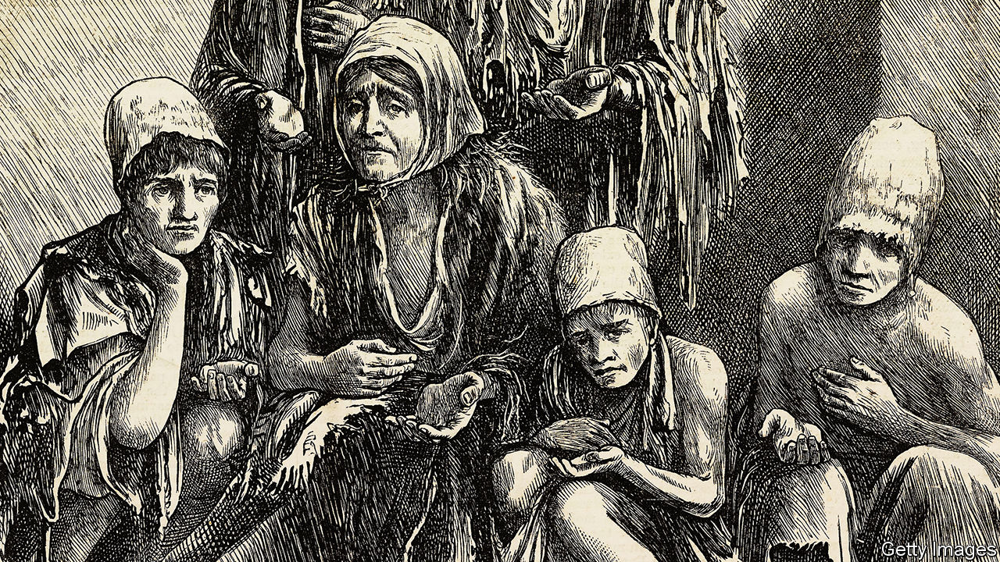

## The famished

# Listening to the voices of the hungry

> For all its eccentricities, Martín Caparrós’s new book powerfully captures their plight

> Mar 14th 2020

Hunger: The Oldest Problem. By Martín Caparrós.Melville House; 544 pages; $32 and £26.99.

DUNCAN GREEN, an in-house thinker at Oxfam, a charity, and an academic at the London School of Economics, makes an intriguing observation. Often, he notes, a person’s views about poverty and development are shaped by the first region of the developing world that he or she gets to know. Those who begin by studying Africa tend to have strong views on foreign aid (whether for or against) and are obsessed with the quality of government. Those who learned first about east Asia tend to focus on economic growth. And those whose first experience is in Latin America are preoccupied with justice and power.

Martín Caparrós is an Argentinian journalist and novelist whose book, “Hunger”, has already appeared in French, German and Spanish. It has now been updated and translated into English. The book introduces English-speaking readers to a Latin American perspective on poverty. But “Hunger” is also highly idiosyncratic—a peculiar, often perplexing tour through some of the world’s most desperate places, interspersed with muddled ranting. It is an off-putting, infuriating book that nonetheless gets one big thing right.

The best parts of the book are the sections in which Mr Caparrós interviews hungry people. He hangs out with a woman who scavenges a rubbish tip in Argentina, with an Indian widow who has been left to die in a holy city and with a peasant farmer in Niger who keeps glancing at his chunky digital watch. He asks stupid questions, as good journalists do, and gets answers that reveal much about how extremely poor people think.

Why, the author asks, is an Indian mother taking her malnourished daughter out of the hospital before she has recovered? Because, the mother explains, her sister-in-law has fallen ill, and she must look after the household. What would a poor woman in South Sudan eat, if she could eat anything? Walwal, she replies—a kind of sorghum porridge. But suppose you could have meat or fish, Mr Caparrós presses. No: she would eat walwal.

“Hunger” is also a political book. Mr Caparrós believes that people go hungry chiefly because the powerful behave in unjust ways. He is against multinational agribusiness firms such as Cargill (though not against crop science), and implies that trade is a major cause of high food prices. He thinks little of humanitarian or development aid, and describes welfare as “a way of maintaining poverty” because it keeps the poor from rebelling. Much of this is nonsense, and it is not even clear that the author believes it. He has travelled too widely and interviewed too many people to hold fast to simple explanations.

Strangest of all are the chapters in which Mr Caparrós steps back to address the reader and his own conscience. More than once he poses the question: “How the hell do we manage to live knowing these things?” Sometimes he seems to be fighting an internal battle, in which his desire for justice pushes against his feelings of despair and horror about the lives of the poorest: “I’ve got enough problems without going around thinking about those poor bastards in Africa or Kolkata or those places I don’t even…” At such moments the book seems not just Latin American but distinctively Argentinian. Few countries are so thick with psychoanalysts.

The great thing about “Hunger” is its relentlessness. Most books about poverty (indeed, most articles in The Economist about poverty) introduce the reader to the poor, then pull back into dispassionate consideration of agricultural productivity, social safety-nets, credit constraints and the like. All that policy talk is fine, but it is not how extremely poor people think about their lives. Deep poverty and hunger often make no sense to those who suffer those things, except perhaps as evidence of God’s will. Misfortune simply hit them, when the rains failed, when a husband vanished or a child fell ill. Mr Caparrós holds you there, in the unsettling presence of the desperate, and forces you to listen to them. ■