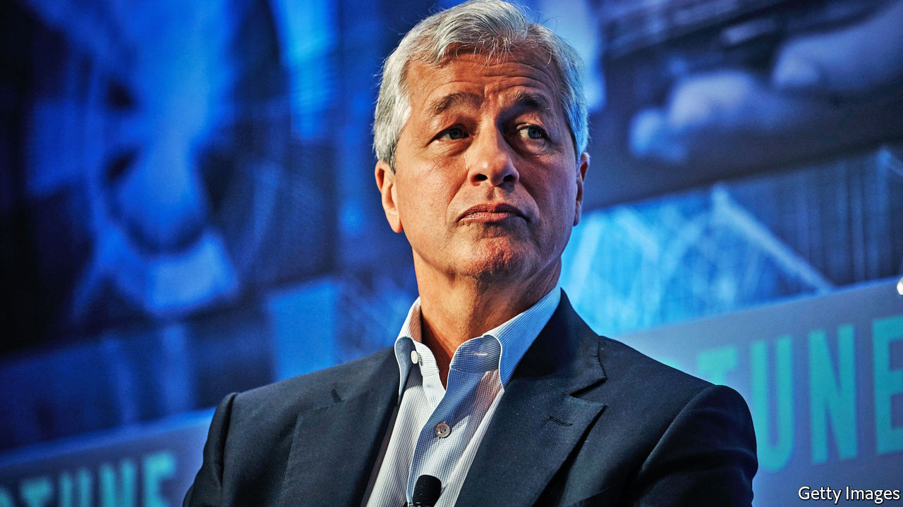
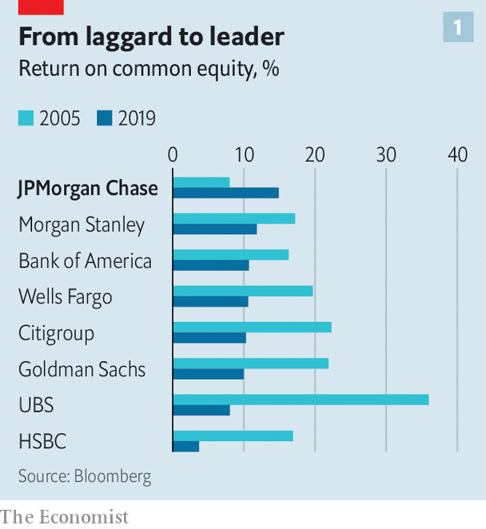
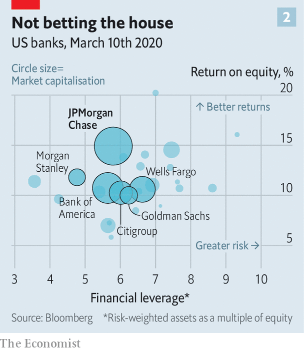
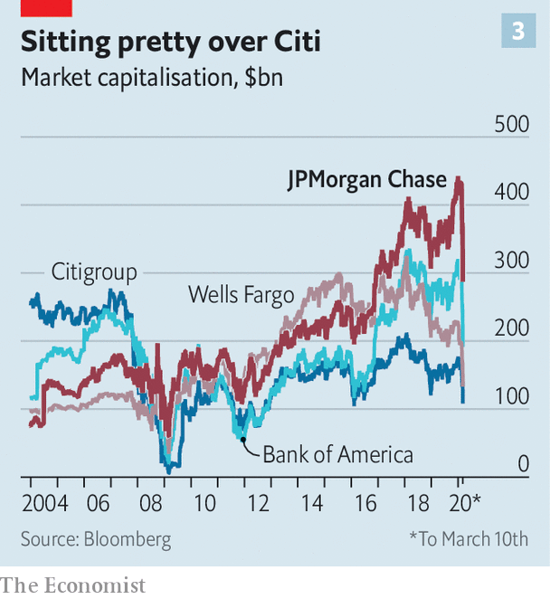
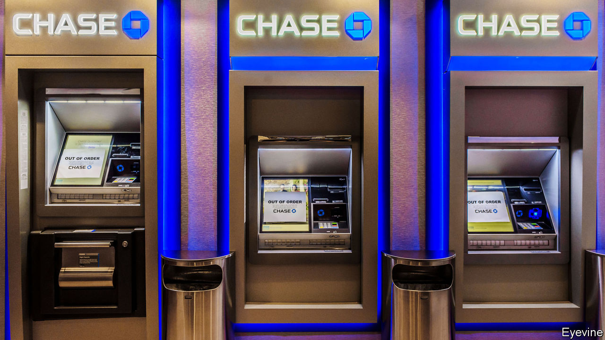
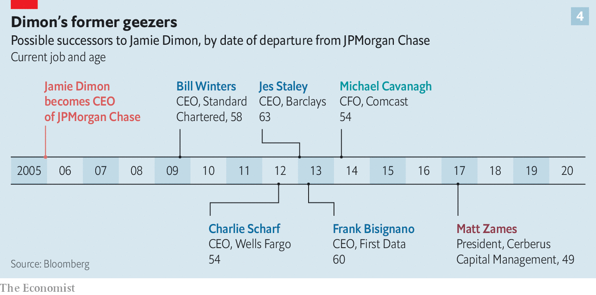

## The house that Jamie built

# Is Dimon’s work done at JPMorgan Chase?

> A second health scare puts the focus on succession

> Mar 12th 2020NEW YORK

IT HAD BECOME a running joke on Wall Street that whenever Jamie Dimon was asked, after beating cancer in 2014, how much longer he intended to stay at the helm of JPMorgan Chase (JPM), he always replied: “another five years”. Sometimes he said it with a twinkle in his eye; at other times the response was tetchy. The matter became more serious after March 5th, when the 63-year-old underwent emergency surgery for a rare heart condition. The bank said afterwards that he was “recovering well”, and that two trusted lieutenants, Gordon Smith and Daniel Pinto, had stepped in to run the bank until his return. The question of how long before he steps down, and who will replace him, is now a more urgent one, though.

For a man not known to underestimate himself, even Mr Dimon cannot imagine he has much more to achieve as a banker. Over 15 years he has built JPM into the world’s most reputable bank. It is America’s biggest by assets and also its most profitable: in 2019 it broke the world record for bank earnings in a single year. It is the dominant player on Wall Street, while also running a formidable retail bank.

Mr Dimon is his firm’s best-known boss since its bulbous-nosed namesake, John Pierpont Morgan, lorded it over Wall Street in the late 19th century. The straight-talking son of second-generation Greek immigrants who settled in New York, he has brought a down-to-earth (some would say brusque) authenticity to what was once one of America’s most buttoned-up, blue-blooded financial firms. (JPM spokespeople have long joked that their main job is to make sure he doesn’t swear in public.) He is known for encouraging openness and inspiring loyalty.

Even as JPM has continued to grow into a dizzyingly sprawling financial giant, and as Mr Dimon has weighed in on a range of public-policy issues beyond his ken, from health-care reform to inequality, he has avoided much of the public vilification directed at his peers. At various times he has been touted as a possible treasury secretary, and even as a dark-horse presidential candidate. It is hard to imagine any other moneyman being in a position to consider canvassing for popular support.

Mr Dimon made arguably the most important decision of his career in his twenties, when he turned down a cushy job at Goldman Sachs to help create a vast financial firm with his mentor, Sanford Weill, then boss of American Express. Mr Dimon’s impatience to run Citigroup, the institution they built together, at the tender age of 42, ran up against Mr Weill’s unwillingness to relinquish the top job. He unceremoniously fired Mr Dimon in 1999. In the year that followed Mr Dimon turned down a raft of job offers, earning himself the moniker of “the most famous unemployed man in the country”. He was waiting for his moment. It came in 2004 when he pulled off a merger between Bank One, the Chicago-based bank he had run for four years, and the more illustrious JPMorgan Chase.

It was a sign of his steely determination to reach the top that, with a beady eye on Mr Weill, he said the merger would “give Citi a run for its money”. Under Mr Dimon, JPM has achieved far more than that. At the time Citigroup was considered the greatest American bank. It was twice as valuable as its newly merged rival; it had the biggest pile of assets of any bank globally; and it had earned an average return on equity (ROE) of 19.2% over the previous five years. JPM had registered a paltry 8.9%. It was seen as a lumbering laggard (see chart 1).

How times have changed. JPM has since become a world-beater on a wide range of metrics. In 2006 its investment bank won a fat share of the advisory fees on Wall Street but its trading business was comfortably outclassed by rivals. Today it is number one in both businesses.

Its retail bank has ballooned in size. In 2006 JPM held 3.6% of American retail deposits; it now holds 9%. The bank opened almost a quarter of all new checking (current) accounts in America last year. It has also scooped up a growing share of corporate deposits. JPM’s asset-management business runs $2.7trn-worth of investments on behalf of clients, double the amount held in 2006. Acquisitions made opportunistically during the financial crisis of 2007-09, such as Bear Stearns, an investment bank, and Washington Mutual (WaMu), a savings-and-loan institution, have helped JPM leapfrog other American and European banks in size (though a clutch of Chinese banks are still larger).

Importantly, this growth has been reflected in the bottom line. Earnings per share of $9 in 2019 were four times higher than in 2005. The bank’s ROE in 2019 was 15%, several percentage points higher than those of American and Chinese rivals and double that of the best-performing European ones. This has been achieved without relying on easy ways of boosting performance, like increasing leverage or the risk the bank takes (see chart 2).

Financial markets have acknowledged the feat. JPM’s market value is 50% higher than that of its closest American rival, Bank of America, which has a balance-sheet almost as big, and more than double that of Citigroup. It beats overseas competitors too. It is, for instance, six times more valuable than Banco Santander, the biggest euro-zone bank by market value. Over the past 15 years The Economist has described an array of global banks—Citigroup, Bank of America, HSBC, Deutsche Bank—that we thought could become serious rivals to JPM. It has left them all in the dust.

What are the ingredients of Mr Dimon’s success? The best bosses are both lucky and smart, and he is no exception. European banks, which stormed into America in the 1990s, have fallen by the wayside in part owing to problems in sclerotic domestic markets where rock-bottom interest rates have crimped margins. The same is true of Japanese banks. The burgeoning Chinese lenders are kept at arm’s length by international investors, who are rightly wary of what they stuff into their loan books.

In some key businesses Mr Dimon has deftly taken advantage of the evolution of the financial system since the crisis. Take fixed-income trading. Before the meltdown, the most successful investment banks focused on complex derivatives transactions. These are much less profitable now, thanks to a thicket of post-crisis regulation, so the largest players are those that excel at “boring” flow trades (buying and selling financial instruments with clients’ funds rather than their own). This is just one market in which Mr Dimon’s bank has gobbled up market share.

But he also deserves credit for strategic thinking, which some once doubted he possessed. When he took the helm, he was already one of America’s highest-profile bank executives: precocious, telegenic and charismatic. As such, he had long attracted media attention. Some fretted about his temperament. His shouting matches with Mr Weill were infamous, and he was also considered brash. Mr Dimon’s wife once reportedly asked him why he couldn’t be as “patient” and “mature” as Bill Harrison, his predecessor at JPM.

He also had a reputation as little more than a number-cruncher and cost-cutter. The value he had created at Bank One was mostly generated by frugality, not revenue growth. Doubts lingered about his ability to pull off a similar trick on a bigger stage.

Yet in his 2005 letter to shareholders, his first as the boss of JPM, he sketched out a vision for the firm that he has stuck with through thick and thin. It registered not only his loathing of bureaucracy and bloat, but also his fondness for a “fortress balance-sheet”. He wrote of the natural connections between different parts of a large bank—between the commercial and investment banks, the credit-card business and the retail bank, and the cash-management and asset-management arms. In summary, Mr Dimon declared that “size, scale and staying power matter”.

This vision has been vindicated. First, during the pre-crisis years, he focused on ridding the bank of flab. This came naturally to him, given his experience wielding the scalpel with Mr Weill, and tidying up an ill-executed, pre-Dimon merger between Bank One and First USA. He then set about allocating costs properly, in order to cut them more effectively. Mr Dimon was perturbed, for example, that managers at Chase branches claimed they were more profitable than their Bank One counterparts when the firm did not allocate all their firmwide costs—like marketing, risk and legal—to each branch individually, as they did at Bank One. Once accounted for on a like-for-like basis, the Bank One branches made more money. He jettisoned consultants the firm had hired and trimmed benefits for executives. He declared the merger complete in January 2006, and ROE duly climbed to 13%, narrowing the gap with rivals.

But it was the financial crisis that was the making of him. It quickly became clear than JPM was better prepared to weather the storm than most. This was in part thanks to his insistence on a solid balance-sheet, but also because of his management style. As one bank analyst puts it, “Jamie is always looking from the perspective of what can go wrong.”

Such healthy paranoia forms the basis for a weekly meeting between Mr Dimon and the heads of all the main businesses. The meeting has no time limit—sometimes it takes minutes, other times all day—and he quizzes them on what the risks are in their units. It was over the course of these meetings in 2006 that problems with subprime mortgages were revealed. As a result JPM began to reduce its exposure across all its businesses, 18 months before most other banks did. While they were struggling to stay afloat, JPM was in a position to snap up Bear Stearns and WaMu for a song.

Despite navigating the crisis relatively unscathed, the bank has paid heavily for mishaps. Mortgage-related fines have cost it tens of billions of dollars—the most expensive being a $13bn bill for misleading investors over toxic securitised loans. JPM also had to cough up $2.6bn to settle allegations that it turned a blind eye to Bernie Madoff’s giant Ponzi scheme.

One blow-up in the post-crisis years made it appear that even Mr Dimon was incapable of running a bank as large as JPM had become. In 2012 it lost $6bn as a result of outsized derivatives trades by an employee known as the “London Whale”. Shareholders proposed a motion to separate the job of chief executive from chairman (though it was defeated). Politicians, pundits and analysts alike accused JPM of being both too big to fail and too big to manage. It has also faced criticism for remaining wedded to dirty industries. It is a big financier of fossil fuels—though in February it announced a partial pullback.

Throughout, however, Mr Dimon has stuck to his overarching strategy, and the economies of scale have paid off. This is clear not only from the firm’s financial results but also from the behaviour of its rivals. Goldman Sachs, whose executives once scoffed at prosaic banking businesses like taking deposits, now seek to emulate JPM’s type of full-service bank. When asked whether he feels a sense of vindication, Mr Dimon simply replies: “I always believed that scale mattered.”

What, then, is there left for the boss to do? Health permitting, he could of course find plenty of reasons to stay put. In the past three weeks alone, the bank’s share price has fallen by a third, as the covid-19 epidemic has shaken financial markets. The ship will need steadying.

In the longer term there is also a tech war to win. With fintech firms continuing to sprout, and tech giants like Amazon and Google busily experimenting in financial services, digital disruption is set to upend banking over the next decade or so. Some financial experts expect it to have the same impact on the industry as electricity did on manufacturing in the 1890s. Mr Dimon is alive to the threat. He has long endorsed enormous investment in technology. Last year JPM spent $11.5bn, more than any other American bank, on improving its systems.

Meanwhile, Mr Dimon may see scope for further expansion. Rumours have circulated that JPM is preparing to launch a British digital bank later this year, as a possible step towards taking the retail bank global. He might want to do a few more deals. At the bank’s investor day on February 25th he hinted that a fintech acquisition might look tempting.

It must, indeed, be hard to say goodbye. The decision is especially tricky for a boss who is so widely lauded, and famously dedicated to the job. Mr Dimon once insisted on keeping an appointment with The Economist despite feeling woozy after undergoing an intrusive medical procedure earlier that day.

One of the most critical roles of a CEO is to groom a successor and then to recognise when the time has come to pass the baton. Mr Dimon’s health problems will focus investors’ minds on this question. He has, however, long been accused of pushing out heirs apparent. “Jamie Dimon has only one succession plan,” quips one European bank boss, “If he sees a successor, he kills them.” The bank denies this and says those who left were not on the board’s list.

Plenty of putative successors have left during the Dimon era, including lieutenants who followed him from Citigroup, like Charlie Scharf and Mike Cavanagh (see chart 4). A JPM diaspora now run banks with $5trn-worth of assets. And Mr Dimon continues to keep the net of potential heirs wide open. At least six names are commonly mentioned: along with Messrs Smith and Pinto, Marianne Lake, who runs consumer lending; Doug Petno, head of the commercial bank; Jennifer Piepszak, the chief financial officer; and Mary Erdoes, head of wealth and asset management.

Having had two serious health scares, Mr Dimon may now be reflecting more seriously on how change at the top can reinvigorate the lower rungs. Jack Welch, a longtime boss of GE, who died on March 1st, once said that when he finally decided to leave the firm it was not because he wanted to, but “for everyone else”.

Were Mr Dimon to bow out now, his place in the pantheon of banking greats would be assured. His star has long since eclipsed Mr Weill’s. In interviews since the financial crisis his former mentor has admitted that one of his bitterest regrets was letting Mr Dimon go. Mr Weill lingered too long at Citi. It is hard to imagine any shareholder cheering Mr Dimon’s departure when it comes. But he must be careful to avoid making the same mistake. ■