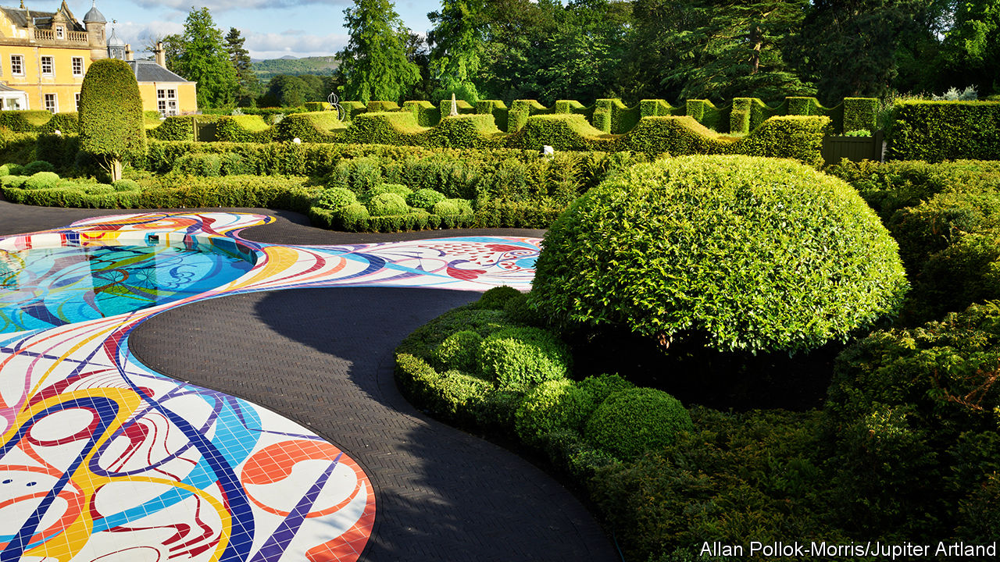

## Looking for gardeners

# Finding a great gardener can be a challenge in Britain

> Green gods

> Mar 12th 2020

MARCH IS WHEN the clocks change in the northern hemisphere. Spring is sprung, tulip bulbs put forth shoots and garden proprietors think about hiring. Anders Holch Povlsen, a Danish clothing billionaire, is advertising for a head gardener for his Aldourie Estate along the shores of Loch Ness in Scotland. The successful candidate will be in charge of 200 hectares of parkland, including a formal castle garden, an arboretum and a recently planted walled garden with glasshouses. Closing date: March 30th. “It’s all flat-out at the moment,” says Mark Read, a recruitment adviser at English Country Gardeners, “with estate owners realising that spring is around the corner.”

Gardening has never been so popular. The Royal Horticultural Society welcomed its 500,000th member in 2019, the same year that saw the number of jobbing gardeners in Britain grow by more than 5% to 157,000, according to Statista, a business data platform. But finding the right head gardener is a delicate business. One proprietress likens it to trying to recruit a lover and hairdresser in one, calling both for deep professional acumen and exquisite fingers. Many head gardeners are delicate flowers—creative loners who are easily bored. The best are inevitably already employed, but poaching is deeply frowned upon, especially within the same county.

Robert and Nicky Wilson, the owners of Jupiter Artland, a popular contemporary sculpture park outside Edinburgh, changed their job specification completely when they met Thomas Unterdorfer, a gifted Austrian gardener who trained at Kew and spent seven years helping the Keswick family develop the walks and herbaceous borders of their Gloucestershire garden at Rockcliffe. The Wilsons had advertised both for an estate manager and a head gardener. But Mr Unterdorfer knew he did not want an office job, and he worried about losing interest if all he had to do was to maintain an established garden. So the Wilsons created a new position for him: senior head gardener in charge of all Jupiter’s green spaces, which was a challenge on a different scale.

Their adaptability paid off. Mr Unterdorfer created a magnificent green backdrop to the brightly coloured tiled pool that the Wilsons had commissioned from Joana Vasconcelos, a Portuguese artist, which opened last July. Pruned in undulating waves, the 3,000 Portuguese laurels, beeches and boxwoods make an impressive showcase to set off Ms Vasconcelos’s spirited creation (pictured).

Mr Unterdorfer switched jobs for the opportunity rather than for money, he says, though it never pays to be tight if you are trying to recruit a head gardener. One British entrepreneur who wanted to transform his country seat in the Surrey Hills into an oasis of niwaki—Japanese cloud pruning—thought he might economise last year by proposing that his head gardener should do a job-share with a neighbouring family. Within months the man was off, lured by the offer of £50,000 a year and his own cottage. “I’m just too cheap, I now realise,” wails the entrepreneur, who is looking for a new head gardener.

## URL

https://www.economist.com/britain/2020/03/12/finding-a-great-gardener-can-be-a-challenge-in-britain
