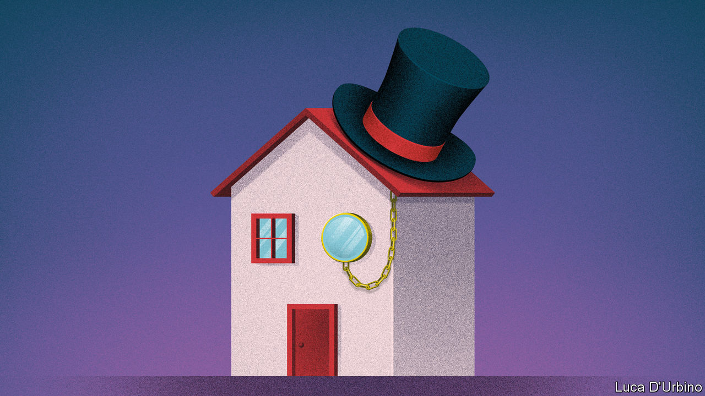

## Dun Namin’

# Why Britons’ house names reflect their class anxieties

> British houses are often given names like Belle Vue or Dunroamin

> Mar 12th 2020

IN GEORGE ORWELL’S “Coming Up For Air” (1939), a novel about a middle-aged, middle-class Englishman bitter about the destruction of good old-fashioned English values, the lead character complains about his area, where the homes are “alike as council houses and generally uglier. The stucco front, the creosoted gate, the privet hedge, the green front door. The Laurels, the Myrtles, the Hawthorns, Mon Abri, Mon Repos, Belle Vue.”

House names in Britain are held in low esteem. They are either sneered at or ignored by current residents, who often prefer numbers. A citation in the Oxford English Dictionary for the word “naff” says “it is naff to call your house The Gables, Mon Repos, or Dunroamin’.” Yet no such embarrassment surrounds smart people’s houses: Buckingham Palace is not 1 The Mall. The reason, argues Laura Wright, a linguist at Cambridge University, in a new book, “Sunnyside: a sociolinguistic history of British house names”, is, as ever, class.

House names were rare until late Victorian times because single-family homes were exceptional. Even a century ago, nine in ten homes were privately rented. A post-war housing boom created hundreds of thousands of homes. By 1939 a quarter of homes were owner-occupied. With the surge in homeowners came a rise in home-namers.

Ms Wright classifies these into five groups: the transferred place name (Hanover Lodge); the nostalgically rural (Orchard House); commemorative (Albert Villa); names linked to nobility (Grosvenor House); and fads (Dunroamin’). All show a striving to talk up the owner’s social standing. A Royal Mail survey in 2015 found 230 homes named Clarence, 133 Sandringhams and 67 Balmorals.

In London, fancy apartment buildings were named So-and-so Court in the early 20th century as a signifier of luxury. That spread to blocks of flats and council-built towers after 1945. Names started by denoting sophistication until they were adopted by enough people to become, well, a bit naff. (Something similar happened with garden gnomes, which Dr Wright says were first installed in Long Island in 1924 to commemorate a visit by the Prince of Wales.)

House names are less common today. Address conventions have been standardised and few people build their own homes. Those that remain are no less imbued with class connotations. In 2017 Savills, an estate agent, saw interest in a new country house grow when its name changed from a “farm” to a “manor”.

## URL

https://www.economist.com/britain/2020/03/12/why-britons-house-names-reflect-their-class-anxieties
