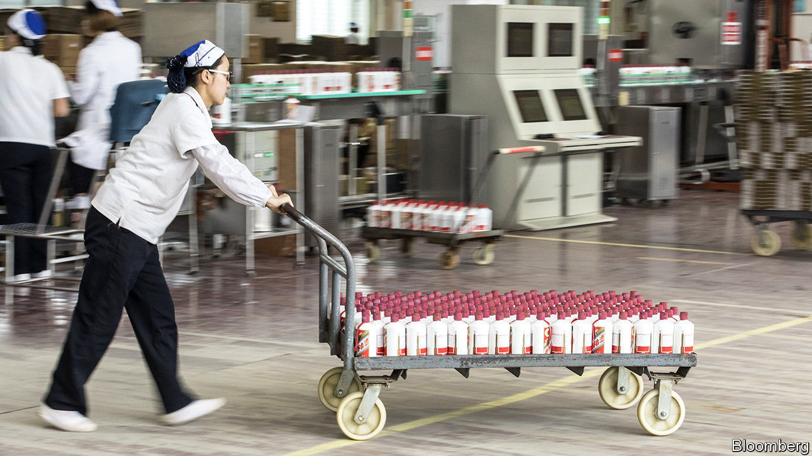

## The anti-covid industrial complex

# Chinese companies rush to produce anti-covid kit

> Makers of booze, cars, nappies and spacecraft are retooling to fight the epidemic

> Mar 14th 2020SHANGHAI

CHINESE DISTILLERS of baijiu are proud of their role in Mao’s Long March, when the firewater produced by Kweichow Moutai is fabled to have sterilised soldiers’ wounds and steeled their resolve. It is only fitting, then, that they would mobilise for what China has termed a “people’s war” against covid-19. Moutai has donated 114m yuan ($16m). Others have gone further, setting up sidelines in medical disinfectant made with 75% ethanol. Amid an acute shortage of antivirus gear, the state is handing out production licences.

Last month Li Keqiang, China’s prime minister, urged firms to boost supplies of protective kit for medical workers by expanding or converting production lines. Yibin Guomei Liquor, a baijiu distiller from Sichuan province, had already swung into action. By February 4th a sister company that makes ethanol was sending sanitiser to its baijiu workshops for bottling and packaging. Two assembly lines now produce 250,000 bottles of disinfectant a day.

Yibin Guomei’s first 2m bottles were sold (at a loss) to the local government, which distributed one to each home in Yibin. The next batch went to the fire brigade, traffic police and other departments. The next lot was distributed nationwide—at full price. Liao Maolan, who helps run Yibin Guomei, expects subsidies. The firm is already drawing up plans for a permanent disinfectant-packaging workshop.

It is not just booze businesses that are retooling. An affiliate of GEM, a battery recycler, is producing sanitiser. BYD, a maker of electric cars, aims to churn out 50,000 bottles of disinfectant and 5m masks a day—a quarter of China’s usual capacity. Shaanxi Automobile Group, which builds lorries, is producing goggles. So is Xingchi Hengdong, a division of China South Industries Group, an armsmaker (it normally 3D-prints spacecraft parts). Daddy Baby, a nappy producer, has gone into masks.

All told, over 10,000 companies have added masks, hazmat suits, thermometers and the like to their product lines in the past two months, estimates Tianyancha, a data firm. Thomas Luedi of Bain, a consultancy, says weak demand during the outbreak spurred factories to redeploy workers to make vital goods. Licence in hand, Yibin Guomei called back labourers on their spring-festival break. Making masks and disinfectant is “not awfully complicated”, Mr Luedi adds.

Firms are also producing antivirus kit for their own use, in order to meet new workplace standards. Yibin Guomei is scrubbing its baijiu factories with its disinfectant. Foxconn, a contract manufacturer that assembles iPhones, is making masks for its 1m-plus employees. State-owned enterprises have been commandeered to produce and donate much-needed supplies. For market-oriented firms, the sooner covid-19 is contained, the sooner they can get back to business, notes Mr Luedi. Most expect a surge in orders because of pent-up demand, and will quickly return assembly lines to their original purpose.

The government has assured virus-fighting firms that it will buy leftover stock. It has also directed state banks to grant cheap loans to those making crucial equipment. Xiaomi, a smartphone-maker, is among those seeking a 5bn-yuan loan to make thermometers and other gear, according to Reuters. Authorities have already reportedly caught some 50 state-owned borrowers masquerading, literally, as makers of face masks and such.■

Dig deeper: