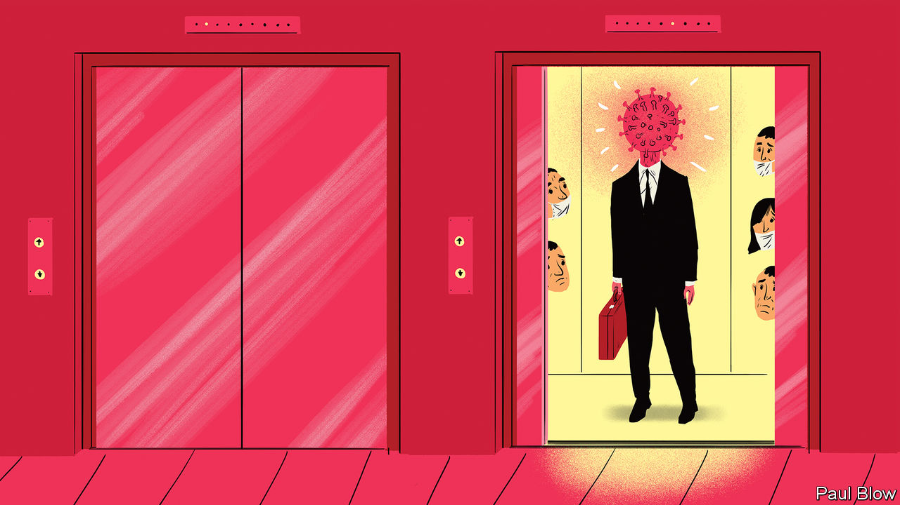

## Bartleby

# Rethinking sick leave

> Attitudes towards employee illness are out of step with the times

> Mar 14th 2020

THE GLOBAL spread of covid-19 has led to calls for those who might be infected with the new disease to “self-isolate” at home. That could prove a threat to economic activity. It also represents a terrible dilemma for workers, some of whom could face financial hardship if they don’t turn up.

The quandary is all the greater when the disease is unfamiliar, with symptoms that are often mild, at first, and resemble common ailments. And if, like a quarter of all Americans working in the private sector, employees get no paid sick leave at all, they are more likely to take the risk and attend. In 2009 the outbreak of swine flu presented workers with a similar decision. Many American ones decided to turn up for work regardless, further spreading the infection. One study* estimated that around 7m co-workers were infected as a result.

The most recent global survey** of sick pay by the International Labour Organisation, from 2010, showed that 145 countries provided for paid sick leave at the time. Most mandated replacement pay of around 50-75% of wages. More than 100 allowed employees to be absent for a month or more.

The fear of employers and governments is that generous benefits will be costly and create the temptation for employees to malinger. It is true that Britain and America, which have stingy (if any) benefits, see almost no days of absence, on average. But most countries with generous benefits experience fewer than ten days a year of absence. Based on OECD data from 2017 the gap between annual days lost to sickness in France, where 50-100% of income is replaced during sick leave, and in America was a mere 4.4 days.

Other evidence does not suggest that more generous sick pay leads to extra skiving. The Earned Sick Time Act became law in New York in 2014. A survey of 352 employers four years ago found that almost 85% had experienced no increase in costs and only 3% had suffered more than a token rise. Connecticut adopted similar legislation in 2011 in the face of opposition from business lobbies. A study of companies in 2013 found that many noted benefits such as improved morale and fewer infections in the workplace.

The problem may be that sick-pay rules are too strict for employees, not too generous. Given the need to pay the rent, many low-paid workers may feel they have to work unless they are so sick as to be physically incapable of leaving the house. But things may be changing. In America the Democrats have long proposed statutory sick leave. President Donald Trump now talks of emergency relief for sick workers.

British policy has also shifted. Statutory sick pay will now be payable on the first day of absence, rather than the fourth. In its budget on March 11th the government removed a minimum income requirement that kept many part-time workers from qualifying for sick pay. It will also allow workers to get a sick note online rather than travel to a clinic and risk infecting other patients. Further change may still be needed. The statutory weekly rate, at £94.25 ($123), is less than 20% of average earnings, and may tempt more workers to turn up when feeling iffy.

At some stage in their careers most people will have turned up to work when they were feeling under the weather, be it because of a looming deadline or for fear of displeasing their boss. The health of fellow citizens, whether at work or on public transport, tends to be treated as collateral damage.

In a world where global travel is common and easy, and diseases have the scope to spread quickly, social norms may therefore need to change. That means not just washing hands, or indeed forgoing the handshake as a greeting. It could also require a shift in attitudes towards workers who turn up while sick and potentially infectious, from plaudits for their diligence to scorn for their lack of consideration.

Countering pandemics requires all sorts of public action, from forging new social norms to devising vaccines that authorities have the duty to supply. Ensuring that workers do not have a financial incentive to spread disease is another example. That requires governments to guarantee a decent level of sick pay, and rules on sick leave that do not punish responsible citizens.

* “Sick at Work: Infected Employees in the Workplace During the H1N1 Pandemic”, by Robert Drago and Kevin Miller, Institute for Women's Policy Research

** “Paid Sick Leave: Incidence, Patterns and Expenditure in Times of Crises”, by Xenia Scheil-Adlung and Lydia Sandner

Dig deeper: