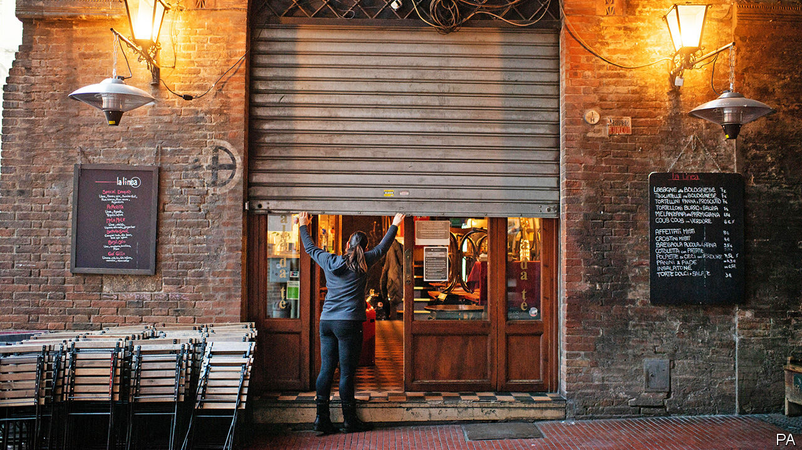

## Sticking plasters

# The challenge of addressing covid-19’s economic effects in Europe

> A swift response depends not only on national governments

> Mar 14th 2020

FEW PEOPLE would wish to trade places with Giuseppe Conte, Italy’s prime minister. As covid-19 spread he put the entire country into lockdown for the first time since the second world war. Now he must try to contain the economic effects. But he is finding that tackling them also depends on lenders and Europe’s institutions.

The immediate prognosis is a severe contraction. Economists at JPMorgan Chase, a bank, expect GDP to fall at an annualised rate of 7.5% in the first quarter of the year. The hope at least is that recovery is rapid. To that end, Mr Conte said on March 11th that he would set aside €25bn ($28bn, or 1.4% of GDP) in order to cushion the epidemic’s economic effects. The precise measures were yet to be agreed as The Economist went to press, but were expected to include compensation for companies that lose revenues and workers who are laid off. Ministers have also promised to help banks suspend repayments on mortgages and small-business loans for a year.

As people fall ill and quarantines are imposed, businesses and households face abrupt disruptions to their income. That means quick fixes are in high demand. Unlike public-spending measures, bank forbearance does not need legislation, and so can take immediate effect. But Italy’s lenders, which already have higher non-performing loan ratios than the euro-area average, warn that they cannot cope with the loss in interest income unless the government guarantees unpaid loans, so that they do not have to hold more provisions.

In any case, leniency from lenders will help some of those most disrupted by the epidemic, but not all. Small firms, which are more likely to rely on bank finance, will benefit. But only 15% of Italian households have mortgages. The neediest, says Tito Boeri, a former head of the social-security administration, cannot take out loans in the first place. More helpful would be to extend unemployment benefit to cover the self-employed, who make up a fifth of the workforce, and temporary workers whose contracts are due to expire. For as long as the outbreak lasts, benefits will need to be unconditional and generous, notes Francesco Giavazzi of Bocconi University. If they are too stingy, people will start hoarding cash, fearing that the government could withdraw its support.

Italy’s membership of the euro means that tackling the epidemic depends not just on ministers in Rome. The European Central Bank (ECB) could help lenders continue to provide liquidity. As this newspaper went to press, the ECB was expected to loosen policy, either by cutting interest rates or offering banks cheap funding to lend to companies. But, with its interest rates already at -0.5%, it cannot cut rates much further. By contrast, both the Federal Reserve and the Bank of England have cut rates by 0.5 percentage points.

That means fiscal policy in Europe will have to do more work. But here Italy’s public finances pose a complication. Government debt is already high: in 2019 it exceeded 130% of GDP. The extra spending means that Italy seems likely to exceed the European Commission’s deficit ceiling, of 3% of GDP, this year. In a sign that investors are fearing for the state of Italy’s finances, and perhaps nervous of a row with Brussels, yields on ten-year sovereign bonds have risen in recent weeks, while those on German bunds have fallen. But if Mr Conte does not borrow more now, the consequence will be a more prolonged downturn—and therefore a higher debt-to-GDP ratio in the long term, warns Mr Giavazzi.

That is perhaps why the European Commission says it will allow Italy to break its fiscal rules. The commission plans to issue new guidelines on spending next week. Emmanuel Macron, France’s president, wants bolder action. He is pressing for the rules to be suspended altogether, and for member states to co-ordinate spending increases; that could shore up confidence that Europe will do what it takes to cushion the economic blow from the virus. But Mr Macron’s efforts have so far come to nothing, because his counterparts in Germany and other northern countries prefer a wait-and-see approach. As the epidemic spreads, though, the advantages of a decisive response will only become clearer. ■

## URL

https://www.economist.com/finance-and-economics/2020/03/14/the-challenge-of-addressing-covid-19s-economic-effects-in-europe
