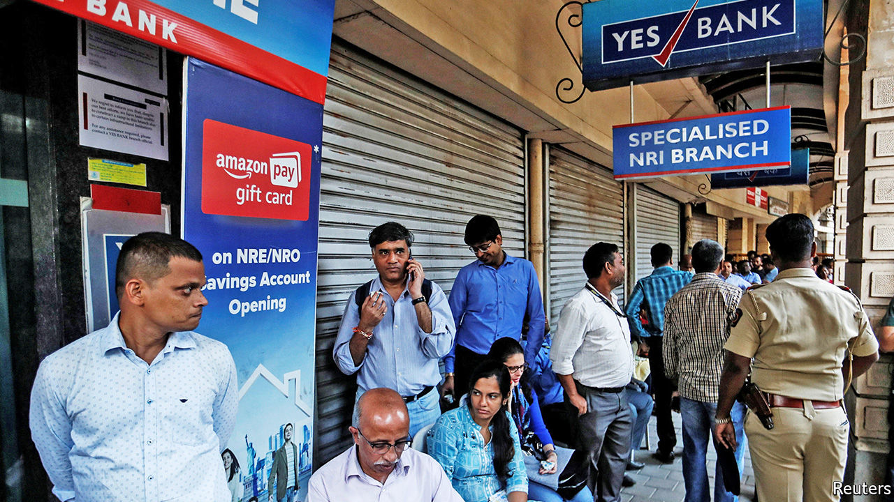

## Indian banks

# Yes Bank’s rescue deepens worries about Indian finance

> It is the second bank scare in six months. Who is in charge?

> Mar 14th 2020MUMBAI

INDIA, WHICH has few declared cases of covid-19, has not escaped the turmoil in global markets. On March 9th its stockmarkets suffered their biggest one-day fall in absolute terms ever, notwithstanding the positive impact low oil prices should have on a big energy importer. Its problems go beyond people’s health.

On March 6th a different crisis came to a head when a government-controlled but publicly listed lender, State Bank of India (SBI), threw a lifeline to Yes Bank, once a darling of the stockmarket, which now faced a scramble to withdraw deposits. It was India’s second banking scare in six months. It raises questions about who is safeguarding the financial system.

Yes’s problems are hardly new. As far back as 2013 concerns were raised by a small group of sceptics at the Reserve Bank of India (RBI), the central bank, that Yes, then a nine-year-old institution, had grown at an extraordinary rate while reporting only a trivial number of bad loans, even though it lent to some of India’s most troubled companies.

Its name was widely understood to contrast it with stodgier operators too willing to say “no”. Investors were entranced. Yes’s share price went on a tear. At its peak in 2017 it was valued at $13.4bn, making its co-founder and chief executive, Rana Kapoor, a billionaire.

By 2019 reality had set in. The RBI forced Mr Kapoor out of his job and new management reported a pile of bad loans. A search for desperately needed new capital failed to satisfy regulators, prompting the RBI on March 5th to depose Mr Kapoor’s successor and the bank’s board in favour of its own caretaker regime.

A series of dramatic actions followed. Deposit withdrawals were capped at 50,000 rupees ($670). Then SBI stepped in, agreeing to inject $330m as part of a $1.5bn resolution plan in exchange for up to 49% of Yes’s shares, as well as the cancellation of $1.2bn of bonds on Yes’s balance-sheet.

Mr Kapoor was arrested and formally charged on March 8th with money laundering and corruption, which he denies. He becomes merely the latest among once-prominent Indian financiers to find themselves in the hands of the law. As the bank’s customers lined up in the streets to withdraw money from ATMs, others found their electronic payments disrupted, a consequence of Yes’s pivotal role in India’s digital-payments architecture.

The finance minister, Nirmala Sitharaman, sought to allay depositors’ fears by pledging that no financial institution would “fall of the cliff” during her tenure. The RBI attested to the soundness of the banks and the safety of depositors. Less reassuringly, the comments echoed what they had both said in September during the collapse of yet another financial institution, the Punjab & Maharashtra Co-operative Bank.

While the technical issues were swiftly sorted out, fundamental ones remain. The resolution plan was far short of the $4bn needed for provisioning, reckons Ashish Gupta, an analyst at Credit Suisse, a bank. SBI has said it does not intend to merge with Yes, leaving the latter’s fate unclear and, to use Mr Gupta’s careful phrasing, its “reconstruction…unlikely”. The chaotic approach has complicated the life of other small and mid-sized banks, he says, affecting their liquidity and ability to raise deposits, which in turn may aggravate the country’s deepening credit crunch.

This half-baked outcome was not inevitable. A private-equity investor says he heard of more than 40 private-equity firms, mostly from outside India, who had expressed interest in buying Yes, only to be dissuaded at the last minute by the thicket of regulations, particularly for foreign investors, not to mention the business risks. A handful of the same names are reported to be in discussions with SBI about buying stakes. Yet falling stockmarkets and financial mayhem make it an inopportune time for dealmaking. Many of the former optimists of Indian finance who bought into Mr Kapoor’s story may never say yes so eagerly again. ■

## URL

https://www.economist.com/finance-and-economics/2020/03/14/yes-banks-rescue-deepens-worries-about-indian-finance
