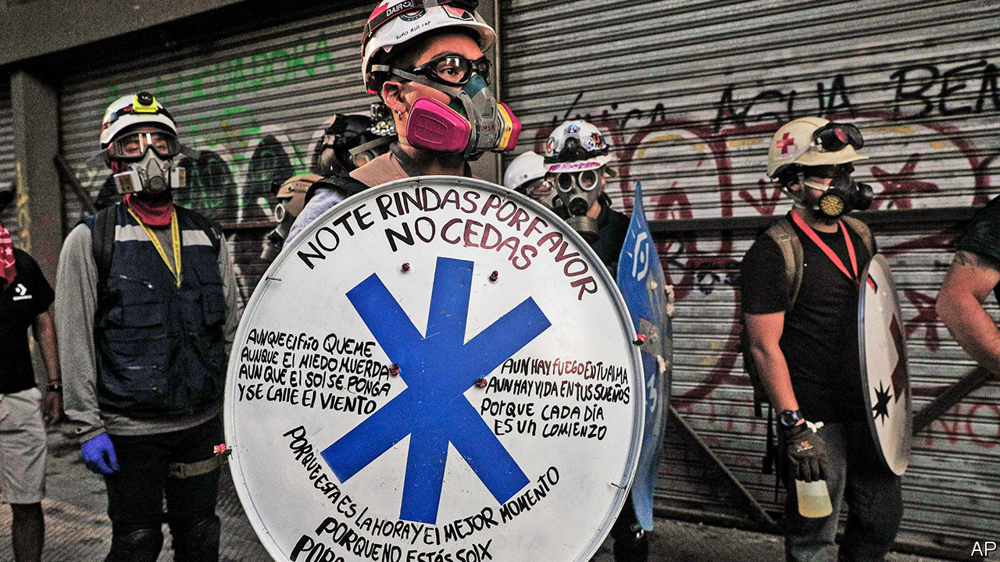

## A tarnished star

# How to reform Chile

> A new constitution offers the country a path out of anger and disorder

> Mar 12th 2020

FOR MUCH of the past 30 years Chile has stood out from the rest of Latin America as a country that seemed to be doing most things right. It combined an open market economy with the rule of law, stable institutions and growing social provision. Poverty rates fell steeply and most Chileans became middle-class by official measures. The large, sustained and sometimes violent protests that have shaken the country since last October have therefore come as a shock. They have called into question the success of the “Chilean model” and its future.

What happens now in Chile matters beyond its borders. Its protests, which have resumed this month (see [article](https://www.economist.com//books-and-arts/2020/03/12/demonstrators-in-chile-are-looking-to-the-past-for-their-soundtrack)), are just one manifestation of the discontent sweeping Latin America. Several other countries have also seen protests, though these have mainly been more narrowly focused. The election of contrasting populists in Brazil and Mexico in 2018 was a further sign of anger. So were opposition victories in recent presidential elections across the region.

It is not hard to divine the causes of this discontent. Latin America has seen little or no economic growth since 2013. Its new middle classes fear that they have fewer opportunities. Corruption has discredited the political class. And there is a widespread sense that democracy has not brought equal treatment and equal access to basic services for all citizens.

Several of these factors apply in Chile (see [article](https://www.economist.com//the-americas/2020/03/12/can-chile-reinvent-itself)). The right identifies the problem as slow growth combined with a more demanding middle class. For the left, the protests are a rebellion against inequality and the “neoliberal model” imposed by the dictatorship of General Augusto Pinochet.

On the face of it the left’s complaint is far-fetched. Since 1990 democratic governments have made many reforms. Yet, the main grievances really do concern legacies of the dictatorship: a private pension system that fails to offer security in old age, a segregated health system and a sense of impunity for the rich. In addition, violence and vandalism have called into question the ability of the state to maintain public order. The police, once respected and left to run themselves, have in recent years shown themselves to be corrupt, brutal and incompetent. They need to be thoroughly reformed.

In an effort to placate popular anger Sebastián Piñera, the embattled president, struck an agreement to hold a plebiscite on April 26th on whether to set up an assembly to write a new constitution. Mr Piñera, a billionaire former businessman, has veered between sounding tough and acknowledging that Chile needs big changes. As if haggling over a business deal, he offered concessions at the margin in pensions, health subsidies and so on. A bolder approach is needed. Many Chileans want the promise of a pension system with a stronger safety-net and a universal public-health system. That means allowing private insurance but abolishing health bodies known as Isapres, a Pinochet invention, which drain contributions into a high-priced private system. It also means a commitment to raise taxes, which are only 20% of GDP. Better public services must be paid for.

Is a new constitution essential to achieve these changes? It has been a device of the far left in several Latin American countries to seize control and impose a (failed) socialist model. But in this respect Chile is different. Although much-amended, its constitution is branded illegitimate by its origin under Pinochet. Polls have long shown that two-thirds of voters favour a new charter. The existing constitution is very hard to reform. Matters of routine disagreement, such as health care and education, require a supermajority to change.

That is not to deny the risks. On April 26th Chileans will vote not just on whether to set up the constitutional convention but also on whether this should be wholly elected or composed partly of existing legislators. The new body may suffer from inexperience. Many recent Latin American constitutions have been prolix and Utopian, stuffed with unaffordable “rights” and spending promises. But Chile has safeguards. Unless the new document is approved by a two-thirds vote of the assembly and then in a referendum, the existing constitution will remain.

Above all, the convention offers Chile a path out of its labyrinth. The new constitution should embody a new social contract. It should remove the obstacles to reforming the police, providing universal health care and regulating private universities. A healthier, better-educated population would be more productive. A stronger safety-net would encourage workers to be more flexible. A new basic law could give Chile a fresh start—and Latin America a new model from which to learn. ■