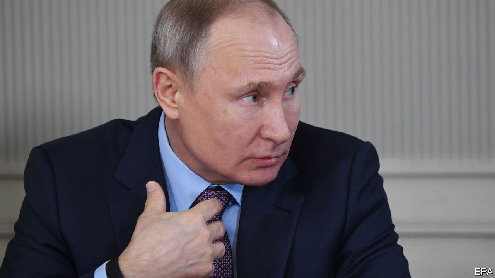

## Vlad the indefinite

# Russia’s president reluctantly agrees to 16 more years in power

> Vladimir Putin has no plans to retire. Poor Russia

> Mar 12th 2020

WHAT A CONVENIENT thing a tame parliament is. On March 10th, acting on a proposal from the first woman in space (now a celebrity MP), the Russian Duma approved an amendment to the country’s constitution that would reset the clock barring anyone from serving more than two consecutive terms as president. As it happens, that would allow Vladimir Putin, at present ineligible to run for another term when his current one expires in 2024, to stay on for two more six-year terms after that date, assuming he can win two more elections on top of the four he has won already. By then, in 2036, he would be 83, and would have ruled Russia for 36 years, as long as Ivan the Terrible. Two of the world’s biggest military powers, China and Russia, now have what look like presidents-for-life. Such leaders seldom improve with age.

A few technicalities remain (see [article](https://www.economist.com//europe/2020/03/14/why-vladimir-putin-cannot-retire)). Russia’s Constitutional Court still has to rule on whether Mr Putin’s changes are indeed constitutional. It is a sign of how completely Mr Putin has packed and bent Russian institutions to his will that no one imagines that he will fail to get his way, just as no one imagines that Valentina Tereshkova, who took her giant leap for womankind back on June 16th, 1963, was acting off her own bat. The third hurdle is an “all-people vote” of doubtful legality on the newly adjusted constitution, which Mr Putin has scheduled for April 22nd. That, perhaps, is a little less in the bag, but the Kremlin’s operatives are dab hands at suppressing protests and neutering the press. And the rest of the changes to the constitution are designed to enhance its popularity with tradition-minded Russians, for instance by stressing that Russian law must have primacy over international law, that state pensions must be inflation-proof and that gay marriage will never be permitted.

None of this ought to come as a surprise. Mr Putin and his circle have made too many enemies and too much money for him to risk giving up power voluntarily. The real question has been how he would dress up his intention to rule indefinitely. Once before he got around the two-term rule, by taking the supposedly less powerful post of prime minister, swapping jobs with the pliable Dmitri Medvedev who served as president between 2008 and 2012. Mr Medvedev then dutifully swapped back again, allowing Mr Putin to resume being president with his clock reset and the term extended from four years to six. Mr Medvedev was dumped as prime minister earlier this year, and the Kremlin seems to have opted for an even simpler run around the rules.

The trick assumes that Mr Putin will be as weakly opposed in 2024 and 2030 as he was in 2000, 2004, 2012 and 2018. Is that plausible? The timing of the changes is ominous for him. This week’s collapse in the oil price will hurt the economy. Despite 20 years in charge and a clear global trend to find substitutes for fossil fuels, he has failed to do nearly enough to diversify Russia away from oil and gas. His government has built up enough financial reserves to last for years, but not for ever. Meanwhile, deep-rooted corruption and a lack of competition have hobbled the prospects for growth. Mr Putin’s political actions—annexing Crimea, invading eastern Ukraine, meddling in other countries’ elections and presiding over the murder of opponents on foreign soil—have made his country a pariah, subject to sanctions that show no sign of being relaxed. Import substitution since 2014 has bought him breathing space, but for ordinary Russians life is likely to get harder.

Mr Putin’s popularity has faltered since the election in 2018, partly because of a weak economy, but also because he tried to raise the age at which Russians receive state pensions. This was necessary but unpopular, and he watered his plans down. At municipal elections last year his United Russia party suffered heavy losses, especially in Moscow, despite efforts to keep strong opponents off the ballot. Still, by manipulating the media and electoral law, he has so far prevented any single challenger from securing broad support. Mr Putin won re-election as president in 2018 with a thumping 77% of the vote, his best result ever, helped by the fact that his most popular opponent, Alexei Navalny, was barred from the contest on trumped-up charges of fraud. No despot is immortal. But Russians have good cause to worry that their modern-day tsar has a long future on the throne. ■

## URL

https://www.economist.com/leaders/2020/03/12/russias-president-reluctantly-agrees-to-16-more-years-in-power
