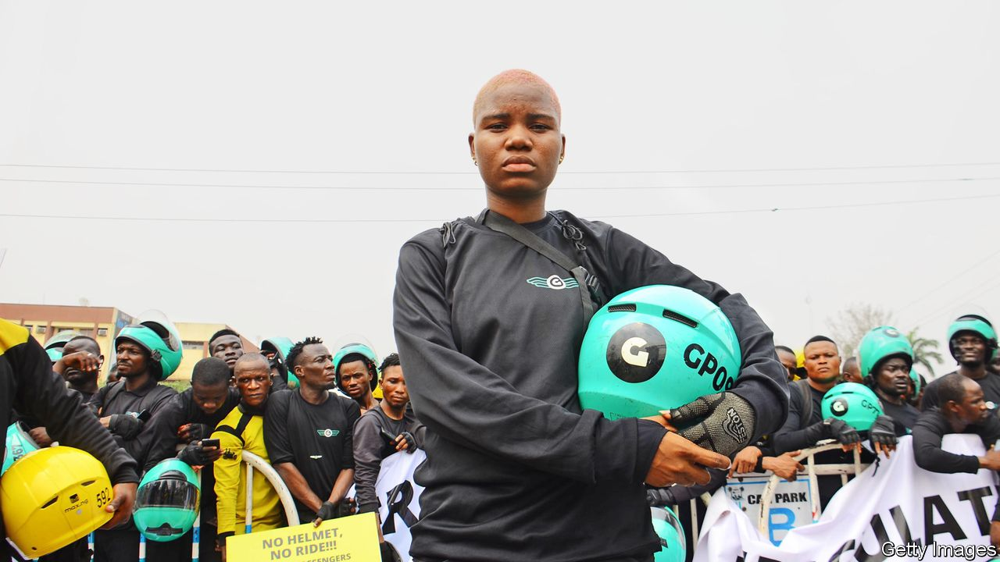

## War on wheels

# A ban on motorcycle taxis is causing chaos in Lagos

> It was supposed to ease gridlock, but made it worse

> Mar 12th 2020LAGOS

ON A BUSY street in Lagos, Nigeria’s business centre, the usual horde of motorbike-taxis jolting passengers through evening gridlock is palpably absent. The men who used to ride them sit idly. “How do we feed our families?” asks Stanley, a former rider.

The authorities confiscated his motorbike after suddenly banning two- and three-wheeled taxis, known as okadas (after a now-defunct airline, for their ability to soar over traffic) and kekes. The ban, which was imposed on February 1st across big parts of the city, was intended to make commuting safer. City authorities absurdly blame the motorbikes for congestion and, somewhat more plausibly, for being involved in accidents. Further issues, they said, were that motorbikes are used by criminals and have no place in the master plan they have drawn up to improve the city.

Instead of ushering in modernity, the ban has wrought chaos. Riders have clashed with police and burned tyres in the neighbourhood of Alimosho, west of the city centre. Commuters have suffered. At dawn thousands of people trek by foot through inner-city streets. Those able to take cars have done so, adding to the city’s already insufferable gridlock: one study before the ban found that residents spent almost as much time commuting to work (30 hours a week) as they spent once they got there. To fill the gap the government has laid on an extra 65 buses. That is roughly one bus for every 300,000 residents.

Another effect of the ban may be to deter investment. Nigeria already has a reputation for arbitrary governance; making gridlock worse won’t help. Among the worst-hit firms are Gokada, a sort of Uber for motorcycle taxis, and Max, a motorcycle courier business. Both had attracted millions of dollars from foreign investors. Valuations of both have slumped. Lagos without okadas may be both less liveable, and poorer.