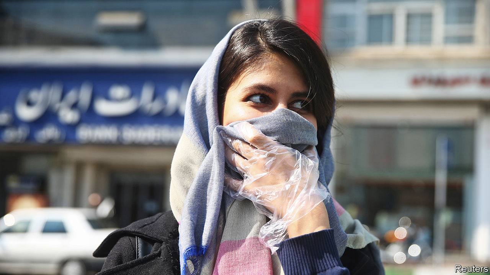
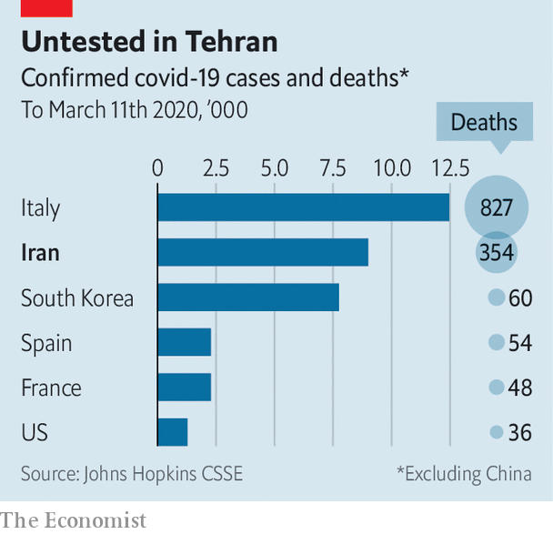

## Sickly state

# Iran has let its covid-19 outbreak get out of hand

> A slow response and unreliable numbers are making matters worse

> Mar 12th 2020

NOWHERE HAS covid-19 hit a country’s leaders harder than in Iran. Two vice-presidents, ministers and 24 members of parliament (almost 10% of the total) have contracted the virus. Two of those parliamentarians, as well as two former high-ranking diplomats and a member of an advisory council to Iran’s supreme leader, have been killed by it. Hassan Rouhani, the president, now hosts sparsely attended cabinet meetings, as questions mount about the absence of other senior officials.

According to the government, the virus has infected 9,000 people and killed over 300. That would make it the second-biggest outbreak outside China (see chart). But no one believes the government’s numbers. The outbreak is probably much worse than it is letting on.

Trust in the regime was already low as a result of its killing of protesters in November and its attempt to cover up the downing of a Ukrainian passenger plane over Tehran in January. When the virus struck, officials hid news of it so that voters would turn out for a rigged parliamentary election on February 21st. Visibly sick, the deputy health minister denied a cover-up on February 24th. He tested positive for the virus a day later. The number of infected officials alone suggests an enormous outbreak. So do public surveys and other indicators. Some in the government think the actual number of cases is closer to 100,000. Outside estimates go even higher.

The government has closed schools, universities and theatres, and told people not to attend large gatherings. Some 300,000 soldiers and volunteers have been mobilised to fight the disease. But these measures have come late and are incomplete. There was no thought of quarantining the holy city of Qom, where the outbreak started. As fear of the virus grew, sick residents fled to other parts of the country, spreading it to every province. Hospitals, dubbed “virus factories” by locals, are overloaded. Yet the mullahs still refuse to close the popular (and lucrative) holy shrines in Qom and elsewhere. Two men even filmed themselves licking the shrines (and were arrested). By contrast Saudi Arabia, with many fewer cases, has banned foreign pilgrims from its holy sites.

Before the virus, Iran’s economy was largely isolated, thanks to American sanctions. Now it is even more cut off. Neighbours including Iraq, its main trading partner, are restricting the passage of people and goods. Religious, medical and leisure tourism, worth almost $12bn last year, has dried up. Iranians themselves are not spending ahead of Nowruz, the new-year festival on March 21st. Restaurants, concert halls and hotels have shut for want of business. Shopping malls and bazaars are empty. Some businesses have cut the work week in half, but many employees are not showing up at all. March 8th was the Tehran metro’s quietest day in a decade.

As imports become harder to get, inflation is likely to rise. The collapsing price of oil has cut into the profits of smugglers. With little hard currency entering the country, market-watchers expect another run on the rial, whose value has plummeted over the past year. Jamshid Edalatian, an economist, thinks GDP could shrink by 25-30% as a result of the virus.

In February the government said it would punish anyone spreading rumours about a serious outbreak. Officials have blamed America for fearmongering. But the regime’s own ailing members have made the scale of the crisis impossible to conceal. And it could get worse for Iran’s rulers. Many of them are old, infirm and especially at risk of dying from covid-19. ■

Dig deeper:

## URL

https://www.economist.com/middle-east-and-africa/2020/03/12/iran-has-let-its-covid-19-outbreak-get-out-of-hand
