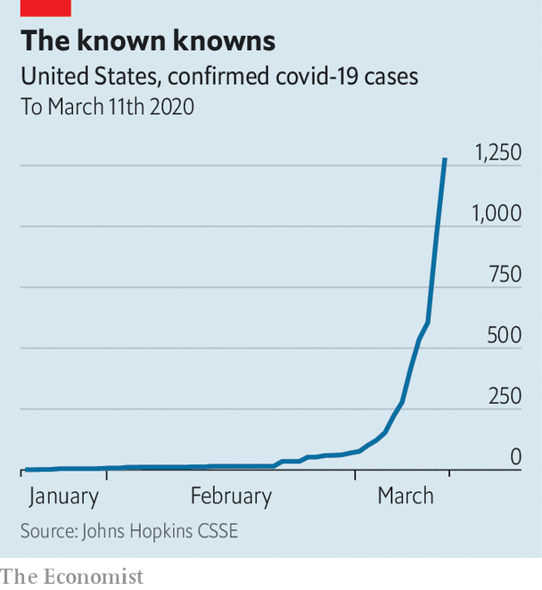
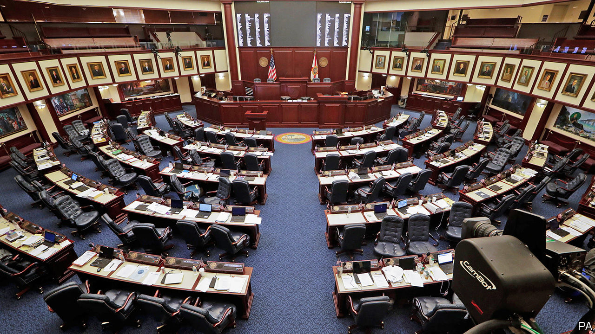

## Uncle Sam v the coronavirus

# Covid-19 is spreading rapidly in America. The country does not look ready

> There are structural reasons why America finds a response to the pandemic hard

> Mar 12th 2020CHICAGO, NEW YORK, AND WASHINGTON, DC

WHEN A NEW disease first took hold in Wuhan, the Chinese authorities did not have the luxury of advanced notice. Their initial strategy, in the crucial early weeks of what would become the global pandemic covid-19, was obfuscation and censorship, which did nothing to halt the spread of the virus that causes the disease. Only now, months after the first cases were reported, have new transmissions slowed to close to zero—and only after an unprecedented, draconian lockdown for hundreds of millions of citizens.

America, by contrast, had the luxury of several weeks’ notice. Yet the crucial early weeks when it could have prepared for the spread of the disease were squandered, in a country with some of the world’s best epidemiologists and physicians. As of March 11th, almost 1,300 Americans had been diagnosed with covid-19. Several times more probably have the disease undetected and are transmitting it within communities. And still the country looks behind in its preparations for what now threatens to be a bruising pandemic. (For more coverage of covid-19 see our [coronavirus hub](https://www.economist.com//news/2020/03/11/the-economists-coverage-of-the-coronavirus).)

America’s decentralised authority, expensive health care and skimpy safety-net will all make the pandemic response harder to deal with. The uncertainty is high, but a plausible scenario—one-fifth of the population falling ill, and a 0.5% fatality rate—would lead to 327,000 deaths, or nine times that of a typical flu season.

How America got here was the result of two significant failures—one technical, the other of messaging. A country of America’s size could probably not have avoided a serious outbreak of covid-19. But with enough information, the early spread of the disease could have been slowed. That lowers the peak of the outbreak, lightening the load on hospitals when they are most overstretched, thereby saving lives. It also gives the health service and the government time to prepare, and the population a chance to learn how to respond.

However, in America the testing regime has worked badly, because of faulty test-kits manufactured by the Centres for Disease Control and Prevention (CDC) and tangles in administrative red tape between the CDC and the Food and Drug Administration (FDA), another government agency. “The debacle with the tests probably reflects underlying budget cuts. You can’t have surge capacity if you’ve already been cut to the bone,” says Scott Burris, director of the Centre of Public Health Law Research at Temple University. In 2010 the CDC budget was $12.7bn in current dollars; today it is $8bn. Whether skimpy budgeting, bureaucratic blockages or both were to blame is as yet unclear and sure to be the subject of a future investigation.

When there are just a few infections, the health system has enough epidemiologists to track down and quarantine patients and their recent contacts. Without surveillance, however, small clusters rapidly become full-blown epidemics. This is where America finds itself today. The estimated doubling time of the virus is six days. If that remains constant, as is likely, the close-to-1,300 current cases are the bottom of a sickening ride up an exponential curve of infections. “In literal terms, we have no idea about the number of cases because nobody has tested to any meaningful extent,” says Marc Lipsitch, a professor of epidemiology at Harvard. “Tens of thousands of cases in the US seems plausible,” he adds.

A successful testing regime also buys time for the right messaging. But from the start, President Donald Trump has downplayed the chance of big disruption to ordinary lives and the economy. His insistence that virus hysteria was being amped up by his political enemies has distracted from the crucial message, which is to get ready. His announcement on March 11th of a ban on most travel from Europe was confused (he initially appeared to suggest it would apply to cargo), arbitrary (it excludes Britain) and accomplishes little now that the virus is spreading from within.

These mistakes cannot be undone. But what matters now is giving people the right information and reinforcing hospitals ahead of the inevitable deluge of cases. Unfortunately, the difficulties in testing and honest messaging look set to persist.

Even after the error in the test kits was detected, the increase in testing has been slow. Andrew Cuomo, the governor of New York, and Bill de Blasio, the mayor of New York City, have been begging the FDA to speed up approval for automated testing, to boost capacity from around 100 tests a day to the several thousand that are needed. A doctor at a Chicago clinic says that she has received no kits, nor guidance on when they will come. When she sees patients with covid-19-like symptoms she has to send them to be tested at a nearby hospital.

Now that kits are being delivered, researchers are reporting another problem—a shortage of the components needed to extract genetic material from samples. The White House promised capacity of 1m tests by March 6th. The CDC has stopped publishing data on the number of tests performed. But the latest cobbled-together estimates, as of March 11th, are of 7,000 tests in total, well behind almost every developed country with an outbreak.

Mr Trump has minimised the threat all the same. On March 9th he blamed the “Fake News Media” and Democrats for conspiring “to inflame the Coronavirus situation” and wrongly suggested that the common flu was more dangerous. The same day, Nancy Messonnier, an official at the CDC, was warning, correctly, that “as the trajectory of the outbreak continues, many people in the United States will at some point in time this year or next be exposed to this virus.”

Correcting the course of the outbreak is vital because America’s health infrastructure, like that of most countries, is not equipped to deal with an enormous surge in serious cases. A recent study of covid-19 in China found that 5% of patients needed to be admitted to an intensive care unit (ICU), with many needing intensive ventilation or use of a more sophisticated machine that oxygenates blood externally. America has 95,000 ICU beds and 62,000 mechanical ventilators, while only 290 hospitals out of 6,000 offer the most intensive treatment. Much of this equipment is already being used for current patients, including those with seasonal flu. Human capacity, such as the number of pulmonologists and specially trained nurses, is also a limiting factor—although in Italy, where the epidemic is raging, specialisms have begun to matter less. Mortality in overwhelmed hospitals will certainly be higher.

To reduce the chances of this happening, rates of transmission must be slowed by encouraging social distancing and telework, and cancelling large gatherings. (Sports events are already being called off: the National Basketball Association season was suspended on March 11th.) But in America authority over public health is largely delegated to the states and some cities. It is for each locality to declare a state of emergency; 13 had done so as of March 11th. The decentralised system means that containment regimes will differ.

Mr Cuomo has ordered a series of measures: a one-mile containment area in New Rochelle, site of a cluster, serviced by the National Guard; and a state-produced line of hand-sanitiser made by prisoners to ameliorate a shortage. At the same time, New York City and Chicago have so far resisted closing their public schools, noting that many poor households rely on them for meals and child care. Many private universities are cancelling classes and switching to tele-instruction (causing much difficulty for some septuagenarian professors). Harvard gave its undergraduates five days’ notice to pack their things and leave.

Maintaining a healthy population requires people not to spread the disease, but also to seek treatment without worrying about crippling debt. America is one of the few countries in the developed world that does not mandate paid sick leave. A mere 20% of low-paid, service-sector workers can count on it. Those without cannot stay at home, because a retail worker cannot just fire up Slack and Zoom as a white-collar office worker might.

Health care is also extraordinarily costly. People who are uninsured, underinsured (ie, liable for a high share of their treatment costs) or fearful of surcharges for using out-of-network hospitals and physicians may keep away—particularly if their pay has recently fallen or stopped altogether. “The idea that people should have skin in the game kind of doesn’t work when you’re also playing with your neighbour’s skin,” says Wendy Parmet, a professor of public-health law at Northeastern University. Some insurers, as in Illinois or in California, insist that patients will not be made to pay for testing. But as yet there is no such policy at national level.

Last week Congress passed an emergency appropriation of $8.3bn to fight the virus, which Mr Trump signed into law. Almost all that money will be devoted to front-line measures—such as test-kits, laboratory equipment and additional staff. A bigger fiscal stimulus will probably be needed. Mr Trump and Democratic leaders have sketched competing visions for what to do. The president would like to provide tax credits directly to stricken industries such as airlines, frackers and cruise-ship operators, cut payroll taxes (usually paid every two weeks) and offer paid sick leave to hourly workers. Democrats have proposed more generous paid-sick-leave rules, expanded payments for programmes like unemployment insurance and nutrition assistance, and guaranteed payment of all testing and out-of-pocket treatment costs. The need is urgent, but the haggling could drag on for some time.

Thus far in his presidency, Mr Trump has faced a few crises. Most he generated himself, including various trade wars and bouts of chest-thumping, which could generally be defused. The virus, however, will circulate no matter how much the president may wish it gone. Talking down the risks is not a winning strategy. To fight the outbreak, America needs clear, unvarnished public information and policies based on the best science. Is the president capable of endorsing that? ■

Dig deeper: