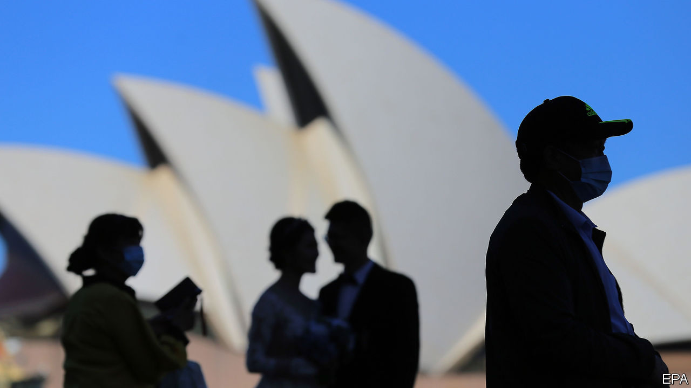

## Up, up, up and down

# Covid-19 will end Australia’s 28 years of unbroken growth

> The first recession since the 1980s looms

> Mar 19th 2020SYDNEY

THE BUSHFIRES that raged through December and January could not stop it. Nor could a recent fall in house prices, a slump in iron-ore prices in 2014, the global financial crisis or the dotcom bust of 2001. But covid-19 seems likely to do what none of these other setbacks could: interrupt Australia’s unbeaten run of over 28 years without a recession.

It is no longer a “question of whether we have two successive quarters of negative growth,” says Warren Hogan of the University of Technology Sydney, “but how severe the contraction turns out to be.” The first half of the year is “going to be bad”, agrees Sarah Hunter of BIS Oxford Economics, a consultancy. Output could shrink by a little in the first quarter of this year and by about 3% in the second, according to her provisional forecasts, which she expects to have to revise as the outlook becomes clearer, if not necessarily brighter. In theory, the economy could rebound in the second half of the year, but only if the pandemic is quelled in the next 3-6 months.

Australia will not succumb to a recession without a fight. Its central bank, the Reserve Bank of Australia (RBA), helped it survive the global financial crisis by easing monetary policy sharply. But it entered that battle with its benchmark interest rate at 7.25%, leaving it plenty of room to cut. The RBA started this year with the rate at only 0.75%. It then cut it to a record low of 0.5% on March 3rd and lowered it again on March 19th to 0.25%—about as low as it can go. The RBA is helping banks to fund themselves, especially if they increase loans to businesses. It will also begin buying enough government bonds to keep the yield on three-year securities near 0.25%, allowing the government to spend without fear of driving up its borrowing costs.

And spend the government will. In response to the 2008 global financial crisis, Australia resorted to several rounds of fiscal stimulus worth over 4% of GDP in total, including infrastructure spending and cash bonuses of up to A$900 ($531) paid to about 8.7m taxpayers. These stimulus efforts, undertaken while the Labor Party was in power, have been derided by the conservative coalition that now leads Australia’s government. Scott Morrison, the prime minister, has described them as ill-disciplined and wasteful. He won last year’s election promising to return the budget to a surplus, undoing the “fiscal debacle” left behind by the “economic panic merchants” his party replaced in 2013.

But his government’s response to the covid-19 crisis will probably look quite similar. Last week it launched a programme worth A$17.6bn, or a little over 1% of GDP, focused on bolstering consumer spending and propping up small businesses. It plans another round of stimulus soon. “Everyone is a Keynesian in the foxhole,” as Robert Lucas, a Nobel prize-winning economist, once pointed out.

But even this admirable ideological flexibility is unlikely to prevent the economy from shrinking. The damage is already evident. Tourism, which last year contributed over 3% of output, was reeling from the bushfires even before the pandemic emerged. The dramatic rock formations of the Blue Mountains, west of Sydney, would normally be heaving with visitors at this time of year. Tour buses now drive by nearly empty. Anthea Hammon of Scenic World, which runs a cable car and railway through the area’s canyons, reckons visits have fallen by up to 70%.

On the island of Tasmania, fishermen are at a loss. They typically box up and sell 90% of their catch to China, where abalone and rock-lobster are popular, especially during Chinese new year. This year boats have been stuck with hundreds of thousands of dollars of unsold catch. Some fishermen have been forced to recast themselves as fishmongers, flogging their hauls off the side of their boats to locals at steep discounts. The catch—let alone sales—of local fisheries could fall by 12% in value in the year ending in June, according to the government’s forecasts.

During the global financial crisis, Australia’s close economic relationship with China was an asset. In this crisis, it has exposed the economy to early damage. The price of iron ore, which feeds China’s steel mills, fell by 17% from January 21st to February 3rd, although it has since rebounded. And the vulnerabilities are not limited to mining. Australia’s educational institutions host more international students, relative to the size of its population, than any other country. Almost a third of them (about 150,000) are from China. Roughly 100,000 of these hapless scholars were locked out of the country when Australia’s government banned arrivals from China on February 1st. Some of those have managed to enter after spending 14 days in a third country (the Australian press has complained about students taking “quarantine holidays” in Thailand). But the impending loss of fees is already forcing some institutions to slash spending.

Although Australia is proud of its bustless record, it should not set too much store by it. The country’s economy was free of recession over the past 28 years, but it was hardly free of trouble. Output has shrunk for a single quarter four times since 1991. And the economy has often failed fully to employ its resources of labour and capital. According to the OECD, a club mostly of rich countries, the economy has fallen short of its potential (its full-capacity output) in 18 of the past 28 years. Plenty of countries have done better by that measure, including nearby New Zealand. ■