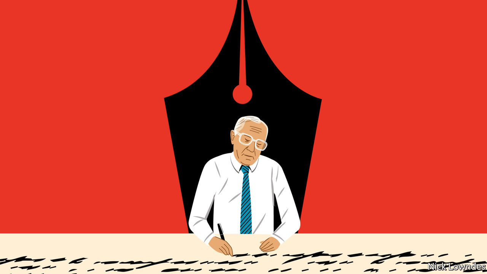

## Johnson

# A tribute to the original Johnson columnist

> Stephen Hugh-Jones loved language and believed in the power of talking

> Mar 19th 2020

THE FOUNDER of this column, Stephen Hugh-Jones, died on February 28th. He was an extraordinary character at The Economist—long, lean, waspish, and a self-appointed menace to facile consensus. His theatrical interventions tended to come at Monday editorial meetings where, sitting on the floor with his back to the editor’s desk, he would uncurl his lanky frame to shout “Phooey!” Such exclamations (“Ho hum”, “Baloney”, “Piffle”) often found their way into copy, both his own and other people’s. His edits, during which he chanted and sometimes almost sang the lines aloud, were razor-sharp.

He was hired in the 1960s before leaving to run a magazine in Paris. He was lured back to oversee the business pages in 1974, and his first act was to buy calculators for his writers, which along with his force of personality made an immediate difference in quality. He huffed out in 1980 after an organisational dispute, but so admired was he that he was hired a third time—and given a language column from 1992 to 1999.

The column grew from Stephen’s love of the great dictionary-maker’s humanity, and of the original Johnson’s hatred of cant. “The Goths have already seized the airwaves. Do not expect young Johnson to encourage them,” he wrote in high dudgeon in his opening manifesto. His exactitude showed up in columns on “may” v “might”. “Hitler might have won the war” is a counterfactual that wonders what would have happened had Stalingrad gone differently, he explained. “Hitler may have won the war” means the outcome remains unknown.

But he also knew (like the original Johnson) that though changes in language could be slowed, they could not be stopped: “Lovers of English do well to resist until majority opinion overrules them.” In the “endless debate between...the pedantic view of language and the anyfink-goes one...the wise man expects no resolution.” He could be shockingly old-fashioned. “Parental love is seldom honoured in poetry,” he opined; “most mothers, perhaps, are too busy caring for their young to write poems about them, and men prefer their mistresses.” Yet he knew this about himself, and welcomed change too: “political correctness, at its silliest, has never done one-fiftieth as much harm as its reverse.”

His column was global in its reach. Portuguese pronunciation, Indian languages and Chinese characters found a home alongside the more obvious German and French, Greek and Latin. Despite the odd potshot at the yoof and yobs, he wrote admiringly of Caribbean patois, black American vernacular and rural English dialects. Johnny Grimond, who wrote most of The Economist’s style guide, calls him a keen contributor—but mostly to suggest rules for deletion, not addition. His column (twice) quoted Churchill as saying the rule forbidding a preposition at the end of a sentence was the kind of nonsense “up with which I will not put”.

Alas, Churchill never said it—the kind of misstep Stephen would not have made in the age of Google. Indeed, he did not mention the internet until a Christmas piece in 1999. He drank in the world’s languages the old-fashioned way. He was born in Egypt, brought up in Scotland, and was variously an encyclopedia salesman in America, a soldier in Germany and a junior journalist in India. And he was a lifelong reader.

A stubborn legend pursued Stephen—that he threw a typewriter out of his office window in a rage. Or perhaps intended to, but failed to break through the glass. Or perhaps it was a phone, through a window in an internal door. No two versions of the story are the same; he himself denied it, in a history of The Economist published in 1993. But, he told the book’s author, he could understand why people might believe it.

Yet his frantic bursts of irascibility would be followed by graceful and kind conversation, as though nothing was untoward. Friends and colleagues remember surprising tendernesses. He collected glass artefacts. He lavished affection on children visiting the office. Perhaps his most lyrical piece for the paper was a tour of the English churchyards he cherished, finding poignant gravestones of both great and humble. And yes, he was in love with language.

He knew words could be weapons, but they were the best kind. His son David recalls a cover of The Economist that showed a Palestinian and Israeli shouting in each other’s faces, and his father saying “What a hopeful picture that is.” To his puzzled child’s inevitable “why?” he replied: “they’re talking to each other.”

## URL

https://www.economist.com/books-and-arts/2020/03/19/a-tribute-to-the-original-johnson-columnist
