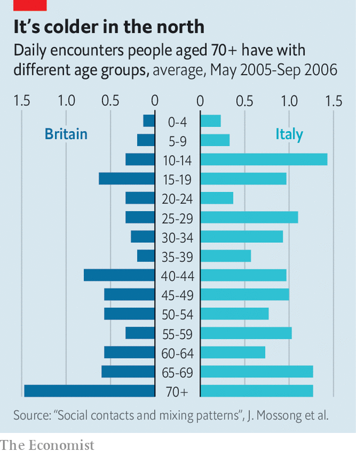

## Demography and COVID-19

# In Britain, old people already practise social distancing

> The sociable Italians are in more danger

> Mar 21st 2020

Editor’s note: The Economist is making some of its most important coverage of the covid-19 pandemic freely available to readers of The Economist Today, our daily newsletter. To receive it, register [here](https://www.economist.com/https://my.economist.com/user#newsletter). 

DOROTHY MOIR, a 77-year-old retired head teacher who lives on the Isle of Wight, kept busy last week. She talked to teenagers in a nearby school, attended a charity-trustees meeting and two intellectual clubs, and dropped in on friends. “I had a lovely time,” she says. “There won’t be another week like that for some time.”

Muddled and changeable though the government’s response to covid-19 has been, it is clear about one thing. The over-70s must isolate themselves from society more drastically than younger people. That will change Ms Moir’s life. But for a large proportion of old people—bigger in Britain than in the rest of Europe—it represents a sadly small adjustment.

Joël Mossong, head of epidemiology at the national health laboratory in Luxembourg, has studied social interactions in eight European countries, as recorded in special diaries. He found the same basic pattern everywhere: the young are much more sociable than the old. But the study also turned up differences between countries. On average, old Britons see many fewer young and middle-aged people than old Italians do (see chart).

That is probably because family life is so different. Despite complaints about a “boomerang” generation that goes to university and then lands back at home, young Britons are comparatively keen to get away. In 2018 just 16% of 25- to 34-year-olds lived with their parents, compared with 44% of Spaniards and 49% of Italians. Three-generation households are much rarer than in southern or eastern Europe. Britain has 28m households, of which 4m consist of a single person over 65, living alone. British social butterflies like Ms Moir go out to socialise; her Mediterranean equivalent would hold court over a busy home.

When British children leave the parental home, they tend not to come back. Researchers have developed a “filial responsibility” index to measure how obliged people feel to care for their parents. Britain comes 20th out of 24 European countries (Austria, the Netherlands, Sweden and Finland are lower). Nor do the old feel much obligation to their children or grandchildren. In the Netherlands, where many mothers work part-time, many grandparents baby-sit. That is rarer in Britain, though not as rare as in Scandinavia, where almost all children go to nurseries.

All this is a shame in many ways—but it does protect old Britons from dangerous germs. Melinda Mills, a sociologist at Oxford University, says that northern Italy was particularly susceptible to the new coronavirus. Not only does it have a lot of old people; those people see a good deal of the young and middle-aged. Many workers commute to highly connected, germy cities like Milan, then go back to their village to have dinner with mum.

Despite their isolation, old Britons do not feel particularly lonely. According to the national Community Life Survey, conducted in 2016 and 2017, just 3% of over-75s report feeling lonely all the time, compared with 10% of 16- to 24-year-olds. That could reflect a generally benign outlook on life—the old are more cheerful in many ways. Or it could be that the few social interactions they have are especially enjoyable. We are about to find out.■

Dig deeper:For our latest coverage of the covid-19 pandemic, register for The Economist Today, our daily [newsletter](https://www.economist.com/https://my.economist.com/user#newsletter), or visit [our coronavirus hub](https://www.economist.com//coronavirus)