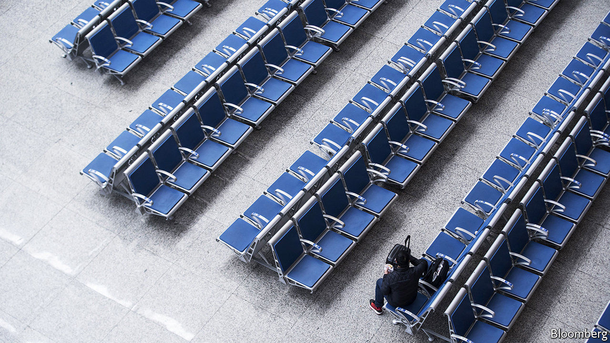
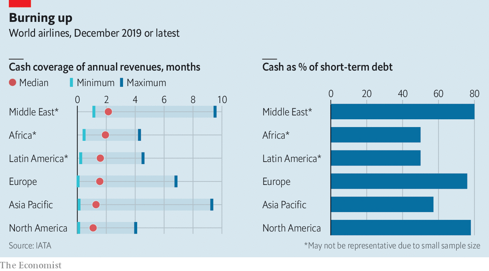
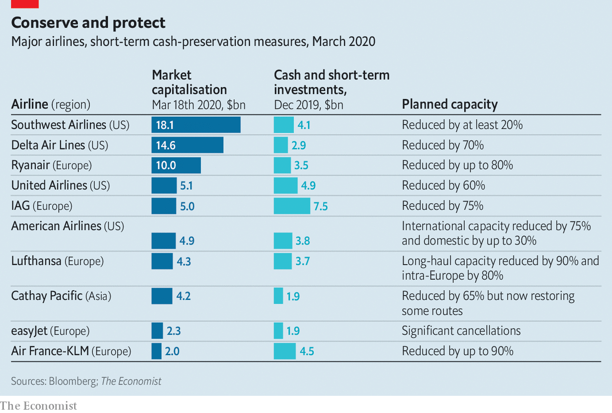

## Flight risk

# Airlines are running out of cash

> Many will fail unless governments bail them out

> Mar 19th 2020

NO INDUSTRY HAS been more battered by covid-19 than air transport. With people wary of confined spaces—and country after country imposing travel bans—passenger numbers have nosedived, and with them airline revenues. The estimate of $113bn in lost sales, which the International Air Transport Association (IATA) made on March 5th, already looks rosy. The trade body says that the world’s carriers may need $200bn in state aid to stay aloft.

Plenty were stalling before the pandemic. Of the 120 airline companies ranked by IATA only around 30 made money in 2017 and 2018. Last year the biggest half-dozen in Europe earned the bulk of the $7bn in profits there, calculates Citigroup, a bank. Many firms had borrowed heavily to buy planes which the virus has grounded. The 90-odd that are in the red have on average six times as much net debt (adjusted for aircraft leases) as EBITDAR (a measure of airline profits). In January the typical carrier had enough cash to cover between 50% and 80% of short-term liabilities and about two months of revenues, IATA says (see chart). Three-quarters could not cover costs beyond three months—if that.

Big companies have secured generous credit lines from banks. IAG, which owns British Airways, can tap €1.9bn ($2.1bn) in revolving credit. EasyJet, a British low-cost carrier, has $500m available. Most firms, especially in Europe and Asia, nevertheless have no choice but to cut flights and sack staff. Cancellations in America are a bit less savage while planes are still permitted to crisscross its air space; Southwest has cut just one in five flights. If revenues fall by 35% in 2020, Delta, Southwest and United should end the year with “adequate” liquidity, says JPMorgan Chase, another bank—as long as demand begins to bounce back.

China offers hope that it might. The first to be infected, its airlines are lifting off again. In mid-February capacity was down by 71% compared with a year ago, says OAG, a data firm. In the first week of March it was 43% lower, as people returned to the skies lured by cheap fares (see [article](https://www.economist.com//graphic-detail/2020/03/21/as-western-flights-shut-down-chinese-routes-are-opening-again)). Combined with government handouts to carriers, which are mostly state-owned, this may tide them over. Airline bosses elsewhere are banking on similar luck—and largesse.

## URL

https://www.economist.com/business/2020/03/19/airlines-are-running-out-of-cash
