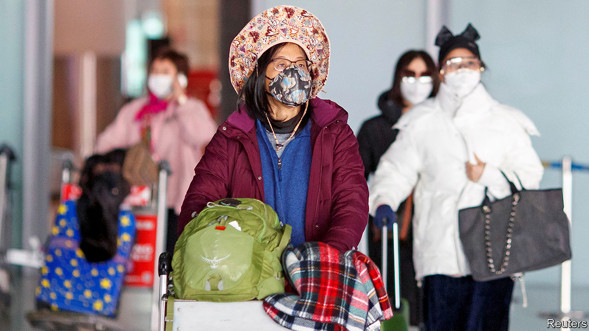

## A frosty welcome

# China worries about infections by travellers from abroad

> It is increasing border checks as many citizens return home

> Mar 21st 2020BEIJING

Editor’s note: The Economist is making some of its most important coverage of the covid-19 pandemic freely available to readers of The Economist Today, our daily newsletter. To receive it, register [here](https://www.economist.com//newslettersignup). For more coverage, see our coronavirus [hub](https://www.economist.com//coronavirus)

IN EARLY MARCH Alina Wang, a Chinese citizen studying in Sydney, decided it would be best to go back to her native country. She felt that China was doing a good job curtailing the spread of covid-19. In Australia she had worries, including that few people wore masks when out and about. Now Ms Wang is in a hotel near her family’s home in a north-eastern Chinese province. She is serving out the last few days of a two-week quarantine that local officials said new arrivals must undergo. Fortunately her room has good Wi-Fi. She is keeping busy with coursework.

As infections dwindle in China and soar elsewhere, many Chinese citizens living abroad are wondering whether it would be safer to return. The pull is strongest for the 1.5m Chinese studying in foreign universities, many of which have suspended face-to-face classes. They are often urged to return by family members, who fear that foreign countries do not have the gumption or the power to enforce the kind of sweeping restrictions that China has used to fight the new coronavirus. On March 15th Global Times, a Beijing tabloid, said the less-draconian measures adopted by Britain and the Netherlands were “irresponsible and harmful to the world”.

Long ago China was reluctant to allow its citizens to travel the world freely. Now its doors are open and the numbers living abroad have soared. China sees them as a source of soft power and of knowledge that can help the country’s rise. In recent years it has been trying to boost their loyalty to the motherland by standing up for their interests. It says that since the outbreak began it has repatriated 1,000 nationals who had become stranded in hard-hit countries. But now it is starting to worry.

Officials say that making sure people entering China do not bring the virus with them has become a priority. All 34 new cases of covid-19 that were detected in the country on March 18th involved someone who had recently entered from abroad. Most of those people are believed to be Chinese citizens.

Netizens have been expressing anxiety about this on social media. They have raged against a handful of people who have concealed symptoms when entering the country or disregarded requests that they self-quarantine for two weeks after they arrive. This anger relates to a common complaint in China, that those with money and connections are often able to skirt rules. Only a small fraction of Chinese are rich enough to study abroad.

Officials appear keen to stem the return flow, especially to Beijing (protecting the capital is always considered vital). On March 16th it was announced that most people who enter the city from a foreign country would have to do two weeks of quarantine in a designated hotel and pay $30-$80 a night for it. Two days later a city official advised Chinese students not to return unless they had to.

Many Chinese students abroad say there are good reasons to stay put. Going home before graduation could make it harder to find jobs overseas. Some worry that they could catch the virus in transit, or that returning would cause hassle for their parents. On balance, Ms Wang thinks she made the right decision. She says being home is a great relief. ■

Dig deeper:For our latest coverage of the covid-19 pandemic, register for The Economist Today, our daily [newsletter](https://www.economist.com//newslettersignup), or visit our [coronavirus hub](https://www.economist.com//coronavirus)

## URL

https://www.economist.com/china/2020/03/21/china-worries-about-infections-by-travellers-from-abroad
