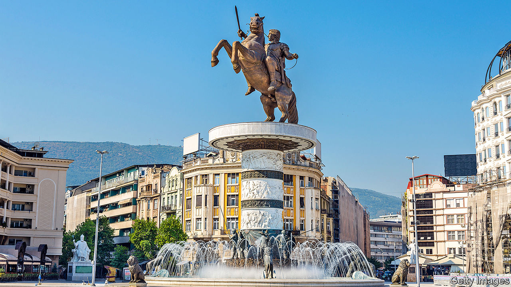

## Deplinthing a potentate

# The tricky politics of tearing down statues of Alexander the Great

> Nationalists in North Macedonia claim the ancient conqueror as their own. Greece begs to differ

> Mar 19th 2020SKOPJE

ALEXANDER THE GREAT is off to the dump. If the authorities in Skopje, the capital of North Macedonia, have their way, statues and monuments glorifying him, his father Philip II and other ancient, mythical and more modern Macedonians around the city will soon be yanked off their pedestals and dispatched to a distant park on a reclaimed rubbish tip.

Skopje was refurbished by the previous city authorities, who lost power in 2017. One aim of their €685m ($765m) renovation project was to instil pride in an antique Macedonian past centring on Alexander, the general who created an empire stretching as far east as Pakistan by the age of 30. But Greeks regard Alexander as wholly theirs, and reckon that Skopje’s claim to him is absurd. The territory now occupied by North Macedonia was not, they argue, even part of the ancient kingdom of Macedonia (the Romans added it to their province of that name later on.) By claiming him, North Macedonia poisoned relations with Greece, the regional economic hegemon.

A new coalition government finally managed to end the 27-year-old conflict with Greece in 2018 by agreeing to change the country’s name from Macedonia (which is the name of a Greek region) to North Macedonia.

The Social Democrats who now run Skopje have talked of removing a giant Alexander statue, and others of him and other heroes, though done little. Cost is one reason, says Nikola Naumoski, the mayor’s chief of staff, but politics is a bigger one. Every statue is “like a landmine”, he says. If they are removed, protests will erupt. For that reason, the government pressed the city authorities to hold off on purging the plinths.

However, in October France vetoed the opening of EU accession talks with North Macedonia, infuriating its government. An election was called shortly afterwards, but is now up in the air, thanks to the coronavirus. If the nationalists return to power, they will stop the statues from being removed. But if the incumbent Social Democrats win, says Mr Naumoski, Alexander will be taking a long walk in the park.