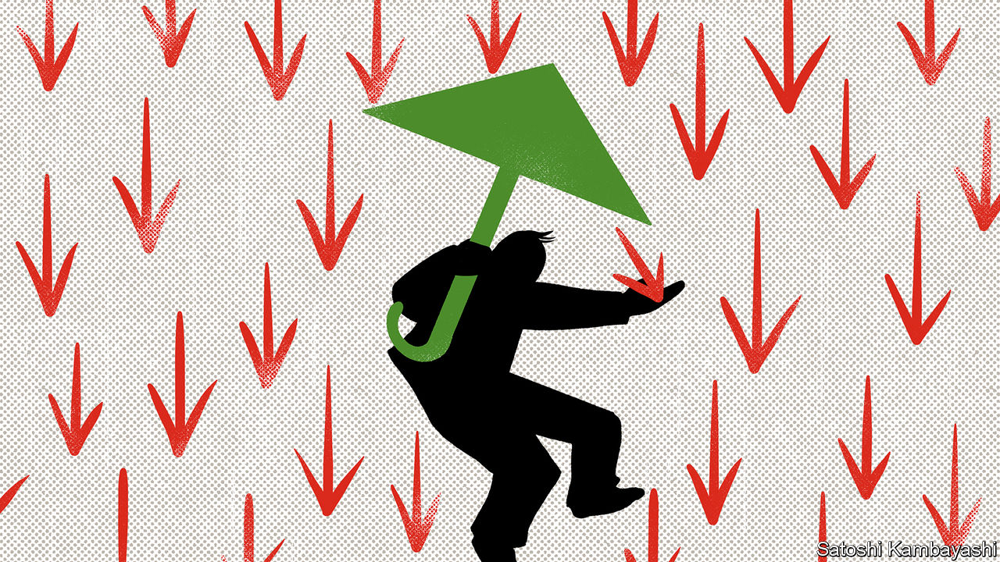

## Buttonwood

# The agonies of stock-picking in a falling market

> A fictional fund manager in his pyjamas ponders capitulation

> Mar 21st 2020

Editor’s note: The Economist is making some of its most important coverage of the covid-19 pandemic freely available to readers of The Economist Today, our daily newsletter. To receive it, register [here](https://www.economist.com//newslettersignup). For more coverage, see our coronavirus [hub](https://www.economist.com//coronavirus)

I SUSPECT THAT this not a common feeling, but part of me is excited about the crash in stock prices. It is the part of me with a personal-account portfolio. I have long-term financial goals. I want to hold equity risk, even as others run from it. If I can buy streams of cash flows at lower prices, I am happy. But another part of me, the professional who invests on behalf of others, is anxious. I try to fuse these two selves. It is not easy.

In my lifetime there have been three bear markets in which the value of shares in aggregate has fallen by half. Perhaps this episode will be as bad—or worse. I don’t know. I can say this, though. For a long-term investor who doesn’t have to worry about perfect timing, there should be opportunities to buy good stocks at attractive prices. As a private investor, I can wait for risky bets eventually to pay off. My clients may not be so patient.

Nobody knows how this pandemic will play out. Lots of people claim to know, of course. A few of them will be right, by luck or judgment. That’s a matter for the scientists and for economists, too. The biggest insight I have gleaned from economics is that asset prices are set at the margin. The stock price on the screen is the one at which the most desperate seller and the bravest buyer are willing to do business. When the ranks of the first group overwhelm the second, the result is a rout—or capitulation, in market-speak.

Every recession is unique. This one has the impact of a natural disaster or a nuclear accident. But every recession is also the same. You can never be sure how deep it will be, how long it will last and what scars it will leave. China has just experienced its sharpest downturn in a century. That is scary. But 2008 was scary. The dotcom bust was scary. I was a baby in 1974, but my old boss tells me that was scary. True, this is a different kind of scary. I call my parents every day to check how they are. I didn’t do that in 2008. (I wasn’t trading stocks in pyjamas on a weekday either.) This could be a savage recession. But it will be like other recessions in that there will be a recovery.

In the meantime, stock prices can keep falling. I understand why people are selling. A lot are forced to. They may have borrowed to buy stocks and had their loans called by nervy lenders. Fund managers that promised low volatility must cut their equity risk. But capitulation is more than this. It is the dumping of stocks that have already fallen a long way. Retail investors are prone to it. But why would any professional do it? Well, sometimes you sell your duds so you don’t have to talk about them anymore—to the firm’s risk manager or to your clients. Owning a stock that goes to zero is too horrible to contemplate. So you sell. And sometimes you sell things that as a private investor you would hold onto or double-down on. Clients want you to take risk. But they don’t like what risk-taking looks like when it doesn’t work. Try explaining, after the fact, why you bought a stock two weeks before the firm went bankrupt, because you judged that, should it survive or be rescued, you stood to make ten times your money.

I am lucky. I have been in the top-quartile of stockpickers. So I have earned the trust to make risky bets in a falling market. A good portfolio in a recession is not necessarily a good portfolio for when the economy recovers. I know that at some point I am going to have to change tack. I would have to be a genius to time this shift perfectly. And I am not a genius. The best I can hope for is not to get it too badly wrong.

My instinct is to be contrarian, to buy what others now hate. Some industries, such as oil, are outside my comfort zone. The politics of OPEC are too messy for me to fathom. But I have an eye on mining companies with attractive dividend yields and low debt. If China’s economy rebounds, they will benefit. And, yes, I am absolutely looking at airlines. A national champion or two is bound to be saved. In the right situation, I might make a lot of money for clients. Dislocation on this scale will take out the weaker players in every industry. The best companies will emerge even stronger. I hope I pick the right ones.

There will come a time when the market surveys the whole panorama—bad businesses cleared out; interest rates even lower; fiscal policy in the pipeline; cheaper stocks—and changes direction. I have to be ready for that. The S&P 500 is America’s capital stock. It will survive (or most of it will). People will want to fly, stay in hotels and go to restaurants and coffee bars again. I have to keep that in mind always. I feel queasy. But this is the game I have chosen to be in.

Dig deeper:For our latest coverage of the covid-19 pandemic, register for The Economist Today, our daily [newsletter](https://www.economist.com//newslettersignup), or visit our [coronavirus hub](https://www.economist.com//coronavirus)

## URL

https://www.economist.com/finance-and-economics/2020/03/21/the-agonies-of-stock-picking-in-a-falling-market
