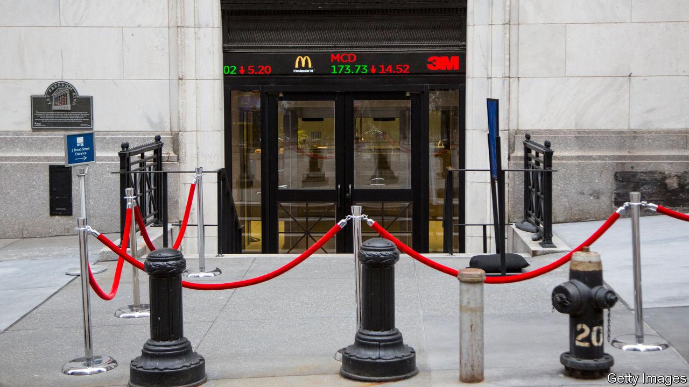

## Closing stock exchanges

# Venues may close. Trading should remain open

> Amid a scramble for cash, the world needs capital markets

> Mar 21st 2020

Editor’s note: The Economist is making some of its most important coverage of the covid-19 pandemic freely available to readers of The Economist Today, our daily newsletter. To receive it, register [here](https://www.economist.com//newslettersignup). For more coverage, see our coronavirus [hub](https://www.economist.com//coronavirus)

INSOFAR AS STOCK exchanges used to worry about viruses, it was of the type that infect the computers through which virtually all trading is done. But on March 18th the New York Stock Exchange (NYSE) became the latest venue to announce that its trading floors would close in response to the covid-19 disease, and that trading would become fully electronic from March 23rd. Such closures, amid extreme market volatility, may add to calls that all securities dealings should be suspended in response to the pandemic. But Stacey Cunningham, president of the NYSE, was not alone when she insisted that markets should stay open. With the world scrambling for cash, it would be the height of foolishness to shut off access to the capital markets.

Some markets have come perilously close to a prolonged shut down. On March 17th the Manila stock exchange was suspended as part of a lockdown on the main Luzon island. But amid fears of a backlash from investors, stock trading has resumed.

In America Steven Mnuchin, the treasury secretary, has mulled over the possibility of shortening trading hours, though he insists markets should stay open so savers can access their stockmarket holdings. Terry Duffy, the boss of CME group, a derivatives exchange, said cutting back trading time “makes no sense ... especially during this unprecedented crisis when news, information and events are changing at such a rapid pace.”

When markets have closed in the past, it has usually been because of some physical limitation on their ability to operate—for example after terrorist attacks in September 2001, or in the wake of storms. Big exchanges stayed open during the financial crisis of 2007-09. When Greece closed its stock exchange in 2015 for five weeks during capital controls, bank shares fell by 30% on the first day that trading resumed and the overall market dropped 16%.

Closing venues for health reasons is less serious than it used to be because so much trading is done electronically. Banks have been rushing out business continuity plans to ensure markets can continue despite potential lockdowns. Traders are in theory able to work from home. Yet having lots of them operating remotely will pose challenges of its own, says one banker. The biggest is the plethora of rules to prevent market abuse by people on bank trading floors. Regulators are being informally asked to relax some restrictions temporarily, such as the need for all conversations by traders to be recorded.

The most tangible trading restrictions so far are on “short-selling”, which allows investors to profit if prices drop. Several European countries including France, Italy and Spain have limited the practice. Hedge funds worry that credit-default swaps, a sort of insurance policy which pays out if a company goes bust, may become difficult to collect because of political pressure. But the end result of such meddling is that investors who might have hedged their existing positions—so protecting themselves against further losses—are likelier to simply sell what they own and stay away.■

Dig deeper:For our latest coverage of the covid-19 pandemic, register for The Economist Today, our daily [newsletter](https://www.economist.com//newslettersignup), or visit our [coronavirus hub](https://www.economist.com//coronavirus)

## URL

https://www.economist.com/finance-and-economics/2020/03/21/venues-may-close-trading-should-remain-open
