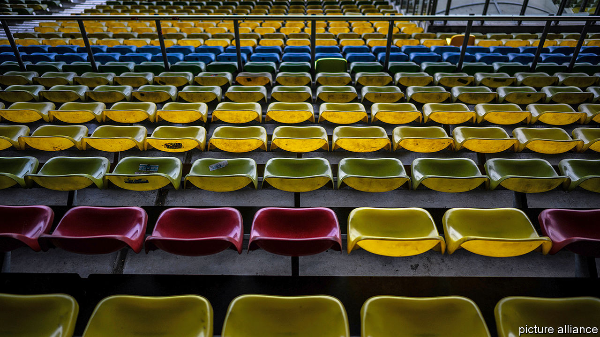

## The game’s the thing

# As covid-19 causes sports cancellations, what can be done?

> Exhibition matches? All-star games? A solution may be needed to maintain morale

> Mar 21st 2020

Editor’s note: The Economist is making some of its most important coverage of the covid-19 pandemic freely available to readers of The Economist Today, our daily newsletter. To receive it, register [here](https://www.economist.com//newslettersignup). For more coverage, see our coronavirus [hub](https://www.economist.com//coronavirus)

MOST FANS of professional sports have some kind of ritual associated with watching a game. Perhaps they wear their team’s shirt, scarf or hat to show their allegiance and bring their team luck. They may organise a “tailgate” party in the stadium car park, or head to a nearby bar to be with friends. For many, the match is the highlight of the week. And their emotions will rise and fall with the fortunes of their team. So the sudden cancellation of sporting events because of the coronavirus outbreak has come as a great disappointment.

Almost all the most prestigious events have been postponed: top-flight football matches, professional basketball and its “March madness” college equivalent, Major League Baseball, professional ice hockey, the Masters golf, the French Open tennis and Formula 1 car-racing. The Euro 2020 football championship has been put off until 2021. The prospects for the Tokyo Olympics in July and August are doubtful.

The economic implications will be significant. Sport is a big business. As well as attending games, American fans buy around $15bn of sports merchandise annually. Globally, many fans pay to subscribe to a sports channel to watch games; the global audience for English Premier League football was 3.2bn people last season in 188 countries. The TV rights for Premier League matches are worth £3.1bn ($3.6bn) a season. Loyal viewers mean companies like to associate themselves with teams; global sports sponsorship was estimated to be worth $55bn in 2018. Up to $150bn is wagered illegally on sports every year in the United States and more than 50% of Americans have placed a sports bet at some point.

But the effect on consumer sentiment of the hiatus may be even greater. Surveys suggest that 59% of Americans are sports fans. For many, the loss of their favourite sports events will compound the effect of being stuck at home. An important source of enjoyment will disappear. And alternative sources of entertainment are hard to find. Big movie releases, such as the latest James Bond film and Disney’s “Mulan”, have been postponed. Broadway has been closed down. Many rock concerts have been cancelled or postponed. Classical recitals (traditionally a magnet for a nation’s worst coughers) have gone the same way.

The cancellations are understandable. Allowing people to congregate in huge numbers during a pandemic seems like a big risk. Mass events also require a large presence of police and emergency services who may be needed elsewhere.

John Maynard Keynes talked a lot about the importance of “animal spirits” to economic growth. How will consumers feel when all forms of collective enjoyment are denied them? There are only so many Netflix shows one can binge-watch without going stir crazy. The Romans understood the importance of “bread and circuses”—keeping the public not just fed, but entertained, too. Hence the provision of gladiatorial games and chariot races in ancient times.

In the second world war many sports were cancelled as players were conscripted into the armed services. But exhibition games were played where possible. A British services eleven played football in newly liberated Paris and Brussels in September 1944. In America a women’s baseball league was organised. Tyler Cowen, an economist, has proposed that a small number of elite athletes could be tested for the virus and then cocooned. After a quarantine period, they could play all-star games to keep citizens entertained, with audiences watching via the internet or TV. It seems an idea worth exploring. If all work and no play makes Jack a dull boy, then no work and no play risks making Jack (and Jill) depressed and discontented. ■

Dig deeper:For our latest coverage of the covid-19 pandemic, register for The Economist Today, our daily [newsletter](https://www.economist.com//newslettersignup), or visit our [coronavirus hub](https://www.economist.com//coronavirus)

## URL

https://www.economist.com/leaders/2020/03/21/as-covid-19-causes-sports-cancellations-what-can-be-done
