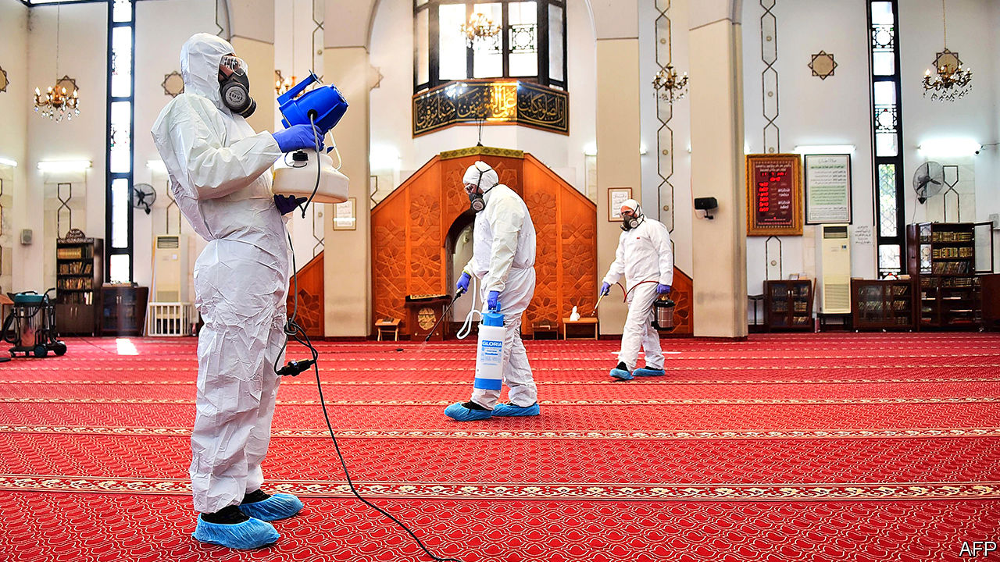

## Coping with covid-19

# How prayer is changing as a result of covid-19

> Mosques are closed, sermons are shortened and communion causes anxiety

> Mar 21st 2020BEIRUT

Editor’s note: The Economist is making some of its most important coverage of the covid-19 pandemic freely available to readers of The Economist Today, our daily newsletter. To receive it, register [here](https://www.economist.com//newslettersignup). For more coverage, see our coronavirus [hub](https://www.economist.com//coronavirus)

FOR CENTURIES the adhan, the Muslim call to prayer, has been a changeless feature of life in the Arab world. In war or peace, prosperity or famine, the same rhythmic chant echoes across cities and towns five times each day. Midway through comes an exhortation to worship. But on March 13th a muezzin in Kuwait, his voice plainly cracking with emotion, made a small tweak. Instead of “hayya alas-salah” (come to prayer), he told the faithful “as-salatu fi buyutikum” (pray in your homes). Words that seemed immutable were no longer such.

Covid-19 has already disrupted economic and social life. Across the Middle East it is also changing ancient patterns of worship. There is scriptural precedent for stopping Friday prayers: for example, an uncle of the Prophet Muhammad is said to have urged followers to stay at home during foul weather. But Kuwaitis say this is the first time in their modern history that prayers were cancelled.

Other countries are following suit. Egypt, the most populous Arab country, first capped Friday sermons at 15 minutes. Then al-Azhar, the Sunni world’s most prestigious scholarly centre, decreed that they could be halted altogether to stop the virus from spreading. The United Arab Emirates stopped them on March 18th. Jerusalem’s al-Aqsa mosque has been closed indefinitely, though worshippers still gather on the large esplanade outside.

The scene is even more striking in Mecca, the spiritual centre of the Muslim world. In normal times the city’s grand mosque is a teeming mass of humanity, filled day and night with thousands of pilgrims circumambulating the Kaaba, the imposing granite cube that is Islam’s holiest site. On March 4th, though, the authorities in Saudi Arabia suspended the umrah, a pilgrimage that occurs year-round. Astounded Saudis swapped photos of the mosque’s white-marble plaza, glittering in the sun—and deserted, save for a few workers spraying disinfectant.

Younger Saudis could not recall ever seeing it so empty; older ones drew a parallel with 1979, when the mosque was seized by extremists and besieged for two weeks. The government has not made any decision about the annual haj pilgrimage, which should begin in late July. Cancelling it would be a blow both spiritual and financial: it attracts millions of people and contributes more than $10bn to the Saudi economy. Pilgrimages are the kingdom’s largest source of revenue after oil.

Coptic churches in Egypt have suspended most activities. Instead of holding one large mass they plan to conduct several, to limit crowds. The Maronite church in Lebanon ordered priests to hand communion wafers to worshippers, instead of placing them on their tongues. Holy water has been replaced with hand sanitiser. In Jerusalem the Western Wall, the holiest site where Jews are permitted to pray, is largely deserted. Rabbis have urged the faithful not to kiss the stones.

The outlier has been Iran. It has the third-highest number of confirmed cases of the virus, behind only China and Italy. Yet for weeks it refused to close the bustling shrines in Qom, a holy city that is the centre of its outbreak. When the authorities shut them at last on March 16th, small crowds broke through the doors in protest. A few other congregations have been restive: a mass in Ajaltoun, a village in the mountains north-east of Beirut, had to be halted when worshippers complained about the changes to communion.

Most have accepted them with equanimity, though. Some even find small cause for amusement. The new taboo around social contact is alien to many in the region, used to clasping hands or kissing on the cheeks. But it is old hat for conservative Muslims, who avoid physical contact with the opposite sex. Instead of awkward innovations like the elbow bump, they greet as they always have: a hand on the heart, a slight bow of the head. Not everything has changed. ■

Dig deeper:For our latest coverage of the covid-19 pandemic, register for The Economist Today, our daily [newsletter](https://www.economist.com//newslettersignup), or visit our [coronavirus hub](https://www.economist.com//coronavirus)