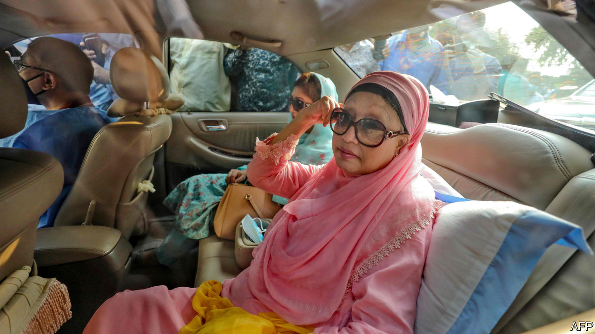

## Ee begum!

# Bangladesh releases a jailed opposition figure

> Some see a link to the coronavirus epidemic

> Mar 26th 2020

LIKE MANY others, the government of Bangladesh has issued a ban on public gatherings to curb the spread of covid-19. Yet not even the threat of a pandemic could deter supporters of Khaleda Zia, a jailed opposition leader, from turning out en masse to witness her release on bail. The 74-year-old, who leads the Bangladesh Nationalist Party (BNP), was granted a six-month reprieve from prison on March 25th in order to seek medical treatment.

Mrs Zia, who served as Bangladesh’s prime minister from 1991 to 1996 and from 2001 to 2006, was handed a five-year prison sentence in 2018 for misusing funds intended for a charity for children. The BNP claims that case and others against Mrs Zia—there are 34 in all—are politically motivated. For a time the leadership of Bangladesh seesawed between the two begums, Mrs Zia and Sheikh Hasina Wajed, the incumbent prime minister. But since her re-election in 2008 Sheikh Hasina has governed in an increasingly authoritarian vein.

“I hope this will bury the old animosity and pave the way for a new future,” says Badiul Majumdar of SHUJAN, an anti-corruption group. But most explanations of the decision are more cynical. Tasvirul Islam, a BNP district leader, says it is designed to “divert the attention of the people” from the covid outbreak. Others speculate that the government is worried that Mrs Zia might die behind bars. “There would be riots,” says one Bangladeshi journalist. Whatever the government’s motivation, Mr Islam sighs, “The current health crisis will mean the government is even less tolerant of opposition.”