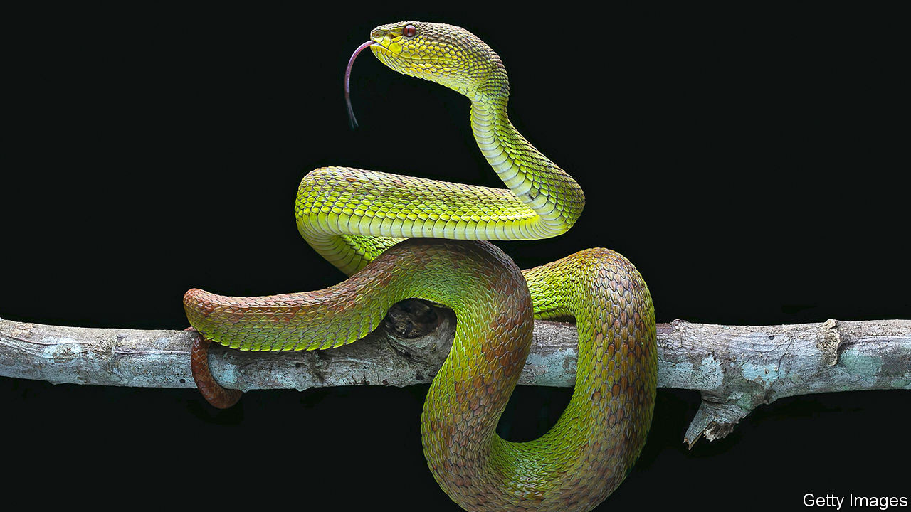

## The yolk of fate

# Bulgakov’s biting vision of an avoidable plague

> “The Fatal Eggs” is a parable of bureaucratic bungling and drastic countermeasures

> Mar 25th 2020

Editor’s note: The Economist is making some of its most important coverage of the covid-19 pandemic freely available to readers of The Economist Today, our daily newsletter. To receive it, register [here](https://www.economist.com//newslettersignup). For more coverage, see our coronavirus [hub](https://www.economist.com//coronavirus)

The Fatal Eggs. By Mikhail Bulgakov. Translated by Hugh Aplin.Hesperus Press; 112 pages; £6.99.

WHEN PROFESSOR Vladimir Persikov’s wife runs off with an opera singer, she leaves him a note. “An unbearable shudder of revulsion is aroused in me by your frogs,” she tells him. In “The Fatal Eggs”, a little-known novella by Mikhail Bulgakov, a pestilence spawned by the professor’s zoological research threatens not just his marriage, but civilisation itself.

The scourge in the story—published in 1925 and set three years later—is not a disease, exactly. In their imagination of epidemics, novels such as Mary Shelley’s “The Last Man”, “The Plague” by Albert Camus or José Saramago’s haunting “Blindness” might seem more apposite in the time of covid-19. Nor is this biting tale Bulgakov’s finest work (that is his satirical fantasia, “The Master and Margarita”). But as a parable of bureaucratic bungling, avoidable disaster and drastic countermeasures, it is horribly relevant.

In his laboratory in Moscow, Persikov discovers a “ray of life” that makes amoebae and tadpoles reproduce at speed. Thrilled, he orders extra kit from Germany and exotic eggs from across the Atlantic (like the virus, this is a globalised affair). Foreign powers covet the new technology, but the Soviet state requisitions it to help kick-start poultry production. The apparatchik in charge of the state farm, Alexander Faight, was once a flautist in Odessa; he is carrying his instrument when he encounters a giant serpent, which he tries to pacify with a waltz from “Eugene Onegin”. He fails, and the beast eats his wife.

The Russian author takes digs at the church, heedless carousers in the streets, blinkered scientists—and, naturally, at the Bolsheviks. But his depiction of blasé, incompetent officialdom resonates across the ages and all forms of government. “Honest to God, it’ll work out,” Faight says blithely of the poultry plan, like a president recommending an unproven drug. Disaster ensues because the authorities botch their deliveries, sending the hens’ eggs meant for the farm to Persikov, and his exotic specimens to the farm. Then, after the creatures hatch, the first, all-too familiar response is disbelief and denial. Faight stammers a report to two security agents; one thinks he is hallucinating, the other that a circus animal might have escaped. A newspaper editor dismisses an urgent telegram as a drunkard’s raving.

Before long, though, everyone goes berserk. Martial law is declared in Moscow amid a flood of refugees. Like quarantined Europeans applauding ambulances from their balconies, cowering citizens take to the pavements to salute the cavalrymen on their way to interspecies battle, and the marching gas squadrons “with breathing tubes over their shoulders and with cylinders on straps behind their backs”. Artillery units bombard forests; aeroplanes spray poison. Civilian casualties mount. And, following a perennial instinct, vigilantes hunt for someone to blame.

In the end, the weather intervenes, as some hope it might today. An unseasonable summer frost kills the serpents and freezes the eggs, and a year after the trouble arose, it is all over. Moscow, Bulgakov writes encouragingly, “again began to dance, to burn and to spin with lights”. ■

Dig deeper:For our latest coverage of the covid-19 pandemic, register for The Economist Today, our daily [newsletter](https://www.economist.com//newslettersignup), or visit our [coronavirus hub](https://www.economist.com//coronavirus)

## URL

https://www.economist.com/books-and-arts/2020/03/25/bulgakovs-biting-vision-of-an-avoidable-plague
