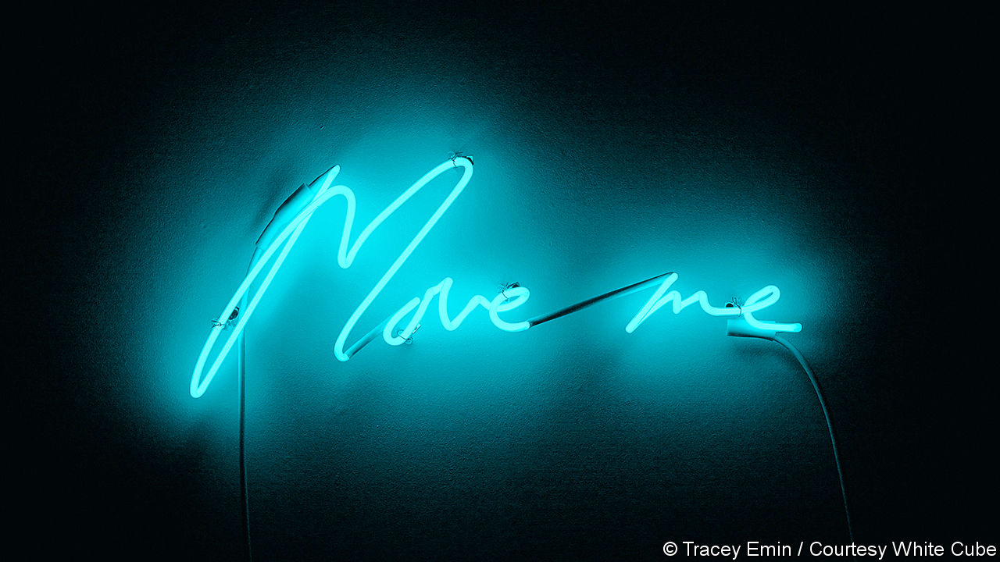

## The online of beauty

# How art galleries are adapting to the lockdown

> Some of the joys of viewing art are hard to replicate on-screen

> Mar 26th 2020

ART BASEL HONG KONG, Asia’s biggest contemporary-art fair, was cancelled because of covid-19, but anyone who had planned to visit last week could enjoy an experimental alternative: the viewing room. At the click of a keyboard, you could enter a panoramic but private visual salon, without having to brave the airless Hong Kong Convention and Exhibition Centre.

Participating galleries were told that, for a quarter of the original fee, they could have a slot in the online fair. Over 90% of the line-up—231 galleries—gave it a whirl, offering more than 2,000 works worth $270m in total. The viewing room was a telling indication of how art might be shown (and sold) in the future, in a pandemic-stricken era or if travel is otherwise restricted. It offered encouragement—and some lessons on digital engagement.

There, on one webpage, was Jeff Koons riffing on Botticelli’s “Primavera” in a tribute to the history of painting at David Zwirner Gallery. Ota Fine Arts offered one collector the chance to acquire an “infinity room”, one of the most Instagrammed artworks of recent years—the creation of the psychedelic, nonagenarian Japanese artist, Yayoi Kusama. White Cube presented an array of international works by Andreas Gursky (German), Theaster Gates (American) and Beatriz Milhazes (Brazilian).

But not every artist, gallery and form showed to equal advantage in this alternative fair. Not surprisingly, simple two-dimensional works in bright colours came across best. No sculpture or conceptual art was included. Subtle pieces, such as Lucas Arruda’s impressionistic desert-scapes, which seem as much a mood or a state of mind as a physical depiction when you see them in real life, had little impact when viewed remotely.

Besides depth and texture, there are aspects of gallery-hopping that a website is unlikely to replicate. One is serendipity—the sense of wandering between artworks and encountering the unexpected. Another is sociability. Art is a communion between artist and viewer, but galleries and fairs are also places to swap opinions and share enthusiasms.

There are ways to compensate for these inevitable deficiencies. As they shut their physical doors, some of the world’s finest galleries and museums are offering whizzy interactive visits, 360-degree videos and walk-around tours of their collections, all without queues and high ticket prices. One of the best is laid on by the Rijksmuseum in Amsterdam; its tour allows visitors to view its Vermeers and Rembrandts, including the magnificent “Night Watch”, far more closely than would normally be possible. Another standout offering is from the Museu de Arte de São Paulo, which has an even broader collection. On its virtual platform, its paintings, spanning 700 years, appear to be hanging in an open-plan space, seemingly suspended on glass panels, or “crystal easels” as the museum calls them, ideal for close-up inspection.

But such wizardry may be beyond most galleries and artists. For Art Basel, Tracey Emin, a British artist at White Cube, exhibited a heartfelt demand spelled out in icy-blue neon: “Move me” (pictured on previous page). At a distance, that is hard. ■

## URL

https://www.economist.com/books-and-arts/2020/03/26/how-art-galleries-are-adapting-to-the-lockdown
