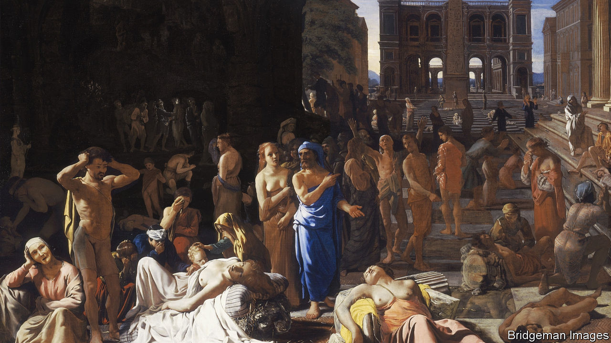

## How to survive a plague

# When Athenians feared a disease would wreck their democracy

> But it didn’t: mutual trust and free information were a powerful defence

> Mar 26th 2020

IT IS ONE of the most lurid descriptions in literature of a society collapsing under the shock of a virulent disease. In 430BC, the second year of its war with Sparta, the vibrant city of Athens was struck by a malady that caused panic, despair and a loss of faith in sacred values and institutions. Symptoms included raging fever, retching, convulsions and disfigurement. According to Thucydides, “the catastrophe was so overwhelming that men, not knowing what would happen to them next, became indifferent to every rule of religion or law.”

In his chronicle, Thucydides places ghoulish images of the plague immediately after an oration over the war dead by Pericles—a speech that celebrates the openness and egalitarian optimism of the Athenian state. Perhaps the juxtaposition was meant to emphasise the destruction wrought by the scourge. Consolingly, however, modern research suggests the ancient historian got it the wrong way round: the documentary record is patchy, but these days the crisis is thought to attest to the resilience of Athenian democracy, rather than its fragility.

That record is certainly chastening. Athens, the star among Greek city-states, was profoundly damaged by the disease. The epidemic was the first in a sequence of dire events over three decades: military miscalculations, a rumbling civil war between democrats and oligarchs, violent coups, and surrender to Sparta in 404BC. Anticipating the Bolsheviks, the Spartans sent armed men to close the city’s assembly and impose an authoritarian regime. To anyone witnessing all that first-hand, it must have felt as if the world’s first experiment in rule by the people had ended.

But that feeling would have been premature. The Athenian pestilence and its aftermath were not, in the end, a seismic event comparable to the later plague that began in 540AD, recurred over two centuries and destroyed the late Roman world; or to the Black Death, starting in around 1350, which broke up the feudal society of Europe. In Athens, democracy proved stronger than disease; rather than crumbling, argue Josiah Ober and Federica Carugati of Stanford University in a forthcoming paper, the Athenian system evolved.

True, at least a quarter of the 300,000 or so people who lived in or near the city died—many, writes Ben Akrigg of Toronto University in a recent book, because of disrupted food supplies rather than the disease itself. But there is evidence that Athenian institutions proved robust. Consider the fate of Pericles, who had been elected as one of the city’s ten military commanders in each of the previous 30 years. As anger surged, he was removed in mid-term—but by democratic procedure, not a crazed mob. The next year he was re-elected, only to succumb to the plague himself.

Or take the continuity in the city’s artistic life, including annual drama festivals that required vast, expensive organisation. As Jennifer Roberts of the City College of New York notes, Athenians were presented in 429BC with “Oedipus Rex”, a milestone in world literature. Its portrayal of a king trying to assuage the wrath of Apollo, which took the form of a deadly plague, resonated with audiences who half-suspected that their city had offended the god. Amid the strife of the next 30 years, dramatists went on producing poignant tragedies and rollicking farce.

The key to this resilience, thinks Mr Ober, was the “democratic advantage” enjoyed by Athenians, in common with other societies based on free speech and a broad franchise. “We are a democracy,” Angela Merkel reminded Germans last week. “We don’t achieve things by force, but through shared knowledge and co-operation.” Much the same went for ancient Athens, which at its finest cherished truth-telling and held that good information drove out bad.

The things the city did best, such as staging performances, or building and manning ships, required both state funds and voluntary contributions from the rich—what would now be called public-private partnerships. And despite the strain, these activities, and the sense of mutual trust and public service that sustained them, continued in the time of plague. For example, against the odds in 429-428BC the Athenians won a naval battle against a Peloponnesian fleet off the coast of Patras.

These democratic virtues wavered in the post-plague years, dominated as they sometimes were by cynical demagogues; but they did not vanish. It helped that the oligarchs who seized power in 411BC were incompetent and only lasted a few months—and that, after a bout of civil war, the Spartans seemingly lost interest in their vanquished foes’ affairs, whereupon democracy was restored to Athens. To survive, it adapted.

Along with its artistic laurels, the brilliant fifth century BC had seen the apogee of the “demos”, the body of free male citizens that was empowered to steer the city. In the muted fourth century, the demos was balanced by a judicial procedure under which a citizen could be fined, even hypothetically executed, if he took initiatives in the assembly that misled the people or deviated from the constitution. That sounds draconian, but Ms Carugati sees an analogy with later judicial constraints on authority, such as America’s Supreme Court.

After a grim epidemic, the Athenian case suggests, tolerance for reckless decision-making declines. Meanwhile, although the haemorrhage of manpower made it harder to wage war, prudent tactics and canny diplomacy let a reformed Athens claw back influence in the endless contest between Greek states.

The impact of the plague, which flared up again for several years, should not be understated. It was part of a chain reaction which led to the loss of Athens’s empire. But such was the city’s will to live that it rumbled on, more or less democratically, for another eight decades, until its liberties were suppressed by Macedonia in 322BC. Today that endurance is as uplifting a precedent as the glorious Athenian heyday. ■