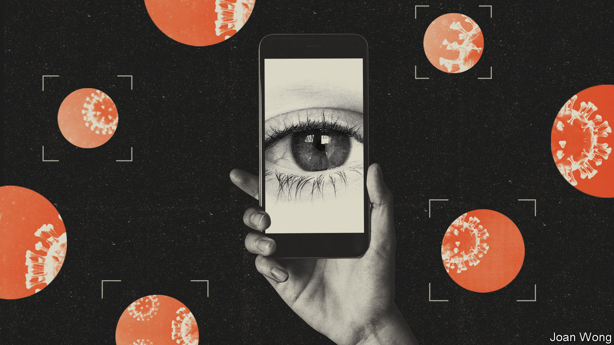
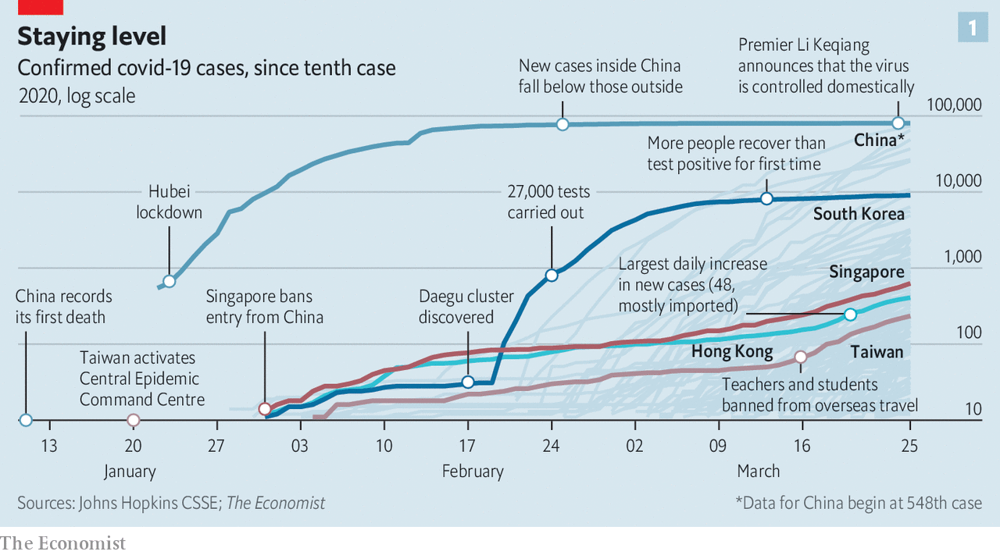
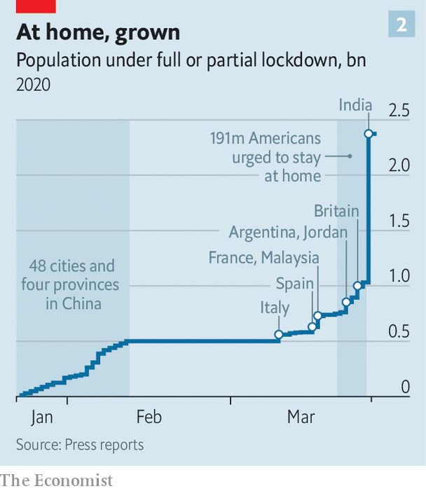
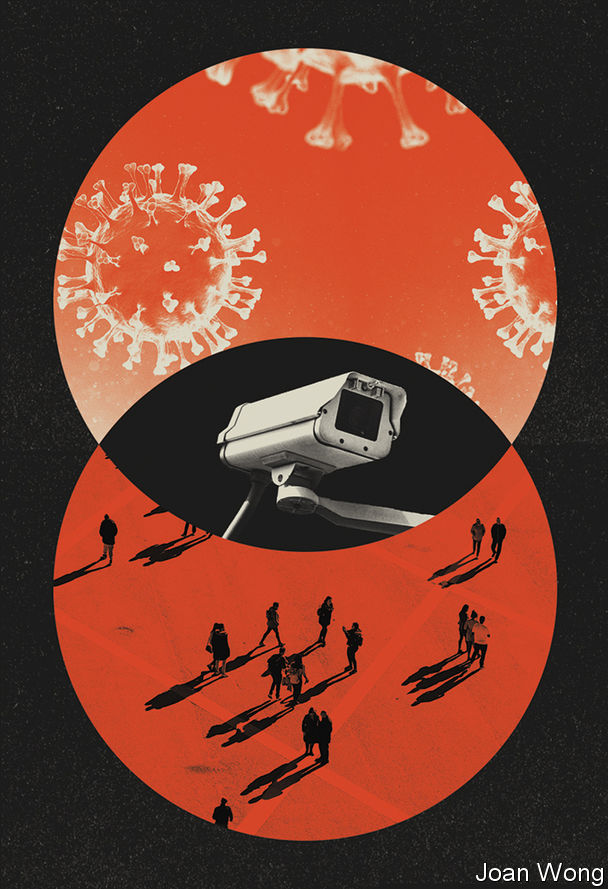
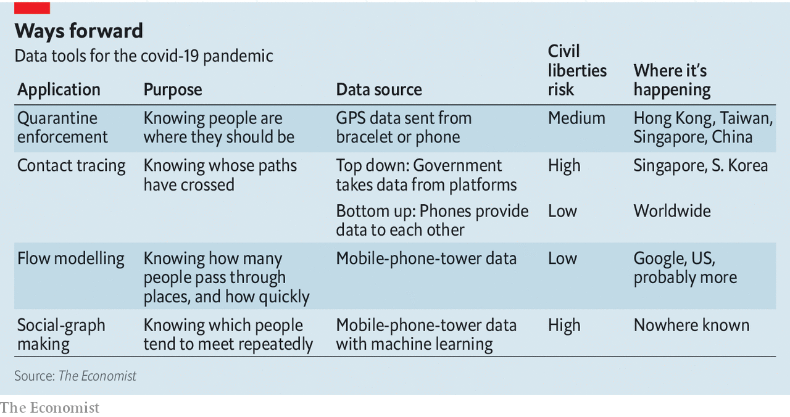

## Creating the coronopticon

# Countries are using apps and data networks to keep tabs on the pandemic

> And also, in the process, their citizens

> Mar 26th 2020HONG KONG, SINGAPORE, SAN FRANCISCO, SEOUL AND TAIPEI

Editor’s note: The Economist is making some of its most important coverage of the covid-19 pandemic freely available to readers of The Economist Today, our daily newsletter. To receive it, register [here](https://www.economist.com//newslettersignup). For more coverage, see our coronavirus [hub](https://www.economist.com//coronavirus)

HAVING BEEN quarantined at his parents’ house in the Hebei province in northern China for a month, Elvis Liu arrived back home in Hong Kong on February 23rd. Border officials told him to add their office’s number to his WhatsApp contacts and to fix the app’s location-sharing setting to “always on”, which would let them see where his phone was at all times. They then told him to get home within two hours, close the door and stay there for two weeks.

His next fortnight was punctuated, every eight hours, with the need to reactivate that always-on location sharing; Facebook, which owns WhatsApp, requires such affirmation so people do not just default to being tracked. Compared with his first lockdown—in a spacious apartment, with family and dogs for company—the ten-square-metre flat with two tiny courtyard-facing windows was grim. When he emerged, on March 8th, he immediately donned mask, goggles and gloves and took a ferry to the island of Lamma where he galloped down lush forest trails for 30km, high on freedom, injuring his knees in the process. He still has trouble sleeping. But he is fit to work, and Hong Kong is content that he poses no risk to the health of his fellow citizens.

Mainland China and South Korea have reduced the number of reported new covid-19 cases down to around 100 a day or less; Hong Kong, Singapore and Taiwan never saw steep rises in the first place (see chart 1). Now they all face the same challenge: how to limit the all-but-inevitable rise in cases that will follow when they relax current controls, a rise which can already be seen in some places. To meet that challenge they are all turning to information technology.

Their efforts, like others elsewhere, are experimental. They risk failure; they also risk adverse side-effects, most obviously on civil liberties. But around 2.5bn people have now been put on some sort of lockdown during the pandemic (see chart 2). Only a fraction of them have been or will be infected, and thus become immune. The rest, when they emerge, will need watching—for their own sakes, and for the sakes of those around them.

The tools in use fall into three categories. The first is documentation: using technology to say where people are, where they have been or what their disease status is. The second is modelling: gathering data which help explain how the disease spreads. The third is contact tracing: identifying people who have had contact with others known to be infected.

When it comes to documentation, most of the action is in quarantine: replacing phone calls and home visits with virtual checking-up. While Hong Kong uses WhatsApp, South Korea has a customised app that sounds an alarm and alerts officials if people stray; as of March 21st 42% of the 10,600 people under quarantine there were using the app. Taiwan uses a different approach, tracking quarantined people’s phones using data from cell-phone masts. If it detects someone out of bounds, it texts them and alerts the authorities. Leaving quarantine without your phone can incur a fine; in South Korea fines for breaking quarantine are hefty, and will soon be accompanied by the threat of prison.

Phones need not just send data back to the government; they can also pass data on to third parties. China’s Health Check app, developed by provincial governments and run through portals in the ubiquitous payment apps Alipay and WeChat, takes self-reported data about places visited and symptoms to generate an identifying QR code that is displayed in green, orange or red, corresponding to free movement, seven-day and 14-day quarantines. It is not clear how accurate the system is, but Alipay says people in more than 200 cities are now using their Health Check status to move more freely.

A group of academics, developers and public-health officials from the World Health Organisation (WHO) and elsewhere are building a similar WHO MyHealth app. When reliable tests for immunity—whether gained through infection or, one day, vaccination—become available, such documentation apps may be used to communicate their results in some places, too.

When it comes to helping with modelling and situational awareness, there is a wealth of data. Phone companies know roughly where all their mobile customers are from what cell their phones are using. And because advertisers will pay to tailor ads, internet companies such as Bytedance, Facebook, Google and Tencent gather scads of data about what their billions of users are doing where. Modellers can use data from both kinds of company to fine-tune predictions of the spread of disease.

Governments can use the same data to check how their policies are performing at a district or city level. In Germany Deutsche Telekom has provided data to the Robert Koch Institute, the government’s public-health agency, in an aggregated form which does not identify individuals. The British government is in talks with cell-phone carriers about similar data access. It could simply require it: the Investigatory Powers Act of 2016 gives it the power to take whatever data it wishes from any company within its jurisdiction in order to fight the virus, and to do so in secret. In practice, negotiation and openness make more sense. The belief that personal data are being passed to the government in secret could erode exactly the sort of trust on which an “all in it together” fight, as called for by Boris Johnson, the prime minister, depends.

Google, which may well have more information about where people are than any other company around, says that it is exploring ways in which it could help modellers and governments with aggregated data. One example could be helping health authorities determine the impact of social distancing using the sort of data that allow Google Maps to tell users about how congested streets or museums are.

Computational social scientists, who use data from digital systems to study human behaviour, are mulling over other ways that this kind of data might inform and improve epidemiological models. One problem with current models, says Sune Lehmann of the University of Copenhagen, is that they assume that people mix and interact in a uniform manner; that passing a friend and a stranger in the street is exactly the same sort of interaction. His research group has written machine-learning software which can sift through historical records from mobile-phone providers to diagnose and explore how relationships modulate such interactions. Applied to current data this understanding might show that interactions between friends in coffee shops are not that important for the spread of disease, but that the delivery of packages is—or vice versa. During an extended pandemic, such information could, if reliable, be a great help to policymakers trying to keep bits of the economy running.

The use of data becomes most fraught when it moves beyond modelling and informing policy to the direct tracking of individuals in order to see from whom they got the disease. Such contact-tracing can be an important public-health tool. It also has a resemblance to modern counter-terrorism tactics. “The technology to track and trace already exists and is being used by governments all around the world,” says Mike Bracken, a partner at Public Digital, a consultancy, and former boss of the British government’s digital services. To what extent those capabilities are now part of the fight against covid-19, no one will say.

One reason governments keep secret the procedures and powers by which they seize and make use of data is a concern that informed enemies would thus evade them. When it comes to public health, this is unconvincing. Complex as it is by the standards of RNA-based viruses, SARS-CoV-2 is not going to change its behaviour because of what the spooks are doing. But their adversaries are not the only people that spooks like to keep in the dark. Citizens concerned with civil liberties fit the bill, too. This is why Mr Bracken expects governments not to be forthcoming about any use they are making of such capabilities in the fight against covid-19: to be frank would, he says, “expose the power that governments have very quickly”.

Apparently unworried about doing so, on March 16th Israel’s government authorised Shin Bet, the internal security service, and the police to use their technical know-how to track and access the mobile phones of those who have been infected. Israel’s High Court initially limited the powers; after parliamentary oversight was established, though, they were good to go.

South Korea, too, is using digital systems to ease the load on its human contact tracers. At the beginning of the outbreak the Korea Centers for Disease Control and Prevention ran their requests for location histories through the police, who used their channels to data controllers to retrieve the required information. But the KCDC says that system was too slow, and it has now automated the request process, allowing contract tracers to pull data in automatically through a “smart city” dashboard. This data-request system was put into operation on March 16th. Korean news reports say that the automation has reduced contact-tracing time from 24 hours to ten minutes.

It might also be possible to do something similar from the bottom up, thus limiting government snooping. Start with an app that sends coherent health and travel data to a central registry, as China’s Health Check purports to. Then add sufficiently smart and powerful number-crunching for the system to be able to find all the places where two people’s histories cross. When someone gets sick, the system can then alert all the other users whose paths that user crossed. Because the infrastructure would be separate from that of the spooks, it could be much more open, scrutable and trustworthy.

Such approaches, though, face serious problems. The number of people an infectious person actually infects will almost always be much smaller than the number they encounter. Sean McDonald, an expert on public health and digital governance, says a system which alerted all the people that an infected person had been near over the past week could lead to a demand for tests that would entirely overwhelm the capacity available in most countries. If the relative risk of, say, walking past someone on the street and drinking from the same water fountain an hour apart were known, and if the data picked up such niceties, things might be different. But they are not.

An alternative to too much testing would be not enough. Annie Sparrow, an epidemiologist who advises Tedros Adhanom Ghebreyesus, director-general of the WHO, points out that modellers without field experience tend to misunderstand the psychology of testing. The stigma associated with a disease, she says, is likely to outweigh the rational pull of keeping oneself and one’s family safe. And both Dr Sparrow and Mr McDonald point out that any solution which relies on smartphones and internet access inherently ignores the half of the planet which does not have internet access. Mr McDonald says he would prefer to see the data wizards apply themselves to easier problems such as optimising the supply chains for medical goods like masks and ventilators.

Google says that, having heard epidemiologists make such points, it is not planning to use the location data it collects to do contact tracing. The data-collection mechanisms built into products like Android or Google Maps are “not designed to provide robust or high-confidence records for medical purposes and the data cannot be adapted to this goal”, the company says. Facebook says something similar. Both companies can be assumed to think that talking explicitly about how well they might be able to do such things would raise concerns about privacy.

What Google and Facebook will not do, though, the government of Singapore is quite up for. Its Government Technology Agency and health ministry have designed an app which can retrospectively identify close-ish contacts of people who come down with covid-19.

When two users of this new app, called TraceTogether, are within two metres of each other their phones get in touch via Bluetooth. If the propinquity lasts for 30 minutes both phones record the encounter in an encrypted memory cache. When someone with the app is diagnosed with the virus, or identified as part of a cluster, the health ministry instructs them to empty their cache to the contact-tracers, who decrypt it and inform the other party. It is especially useful for contacts between people who do not know each other, such as fellow travellers on a bus, or theatre-goers.

The app’s developers have tried to assuage concerns about privacy and security. Downloading it is not compulsory. Phone numbers are stored on a secure server, and are not revealed to other users. Geolocation data are not collected (though Google’s rules governing apps that use Bluetooth mean that they will be stored on Android phones running the app). They are planning to publish the app’s source code and make it free to reuse, so that others may capitalise on their work.

Singaporeans trust their government. Since TraceTogether was released on March 20th it has been downloaded by 735,000 people, or 13% of the population, according to government data. Several Singaporeans your correspondent spoke to one overcast day in the business district were unaware that they could be prosecuted for refusing to hand over their data to the health ministry. But they had no intention of frustrating the authorities. “I’d rather be responsible than irresponsible,” said one trader.

In an attempt to get past the uproar about the security services tracking the infected, Israel’s Health Ministry has launched a similar app that allows people choosing to use it to see if they have come into contact with other users who subsequently took ill. The government says that the app, which uses open-source software, does not share data with the authorities. The WHO MyHealth app, also open-source, might in time take on a similar contact-tracing function.

This patchwork of global systems presents its own challenge: how to make them talk to each other so that they can stimulate a global response to the disease, not just one that operates at a national or city level. Yves-Alexandre de Montjoye, who studies computational privacy at Imperial College, in London, says that governments should come together to agree on common protocols for handling covid-19 data, making it easier to pool their resources. Compared with finding ventilators and protecting health-care workers, though, this is pretty low down the list of anyone’s must-dos.

And there’s the rub. Covid-19 demands an array of drastic, immediate responses. It also requires thinking that looks beyond the next two weeks. The network of computers built for entertainment, convenience, connection and security is helping in all sorts of quotidian ways, from video-conferencing to team-working to gaming for rest and recuperation. But it also provides a network of sensors that can co-ordinate the responses of both individuals and whole populations to a degree unimaginable in any previous pandemic. Countries are learning how to make use of that panopticon’s power in a pell-mell, piecemeal way. The systems that they lash together may last a long time. It would be best to keep an eye on them.■

Dig deeper:For our latest coverage of the covid-19 pandemic, register for The Economist Today, our daily [newsletter](https://www.economist.com//newslettersignup), or visit our [coronavirus hub](https://www.economist.com//coronavirus)