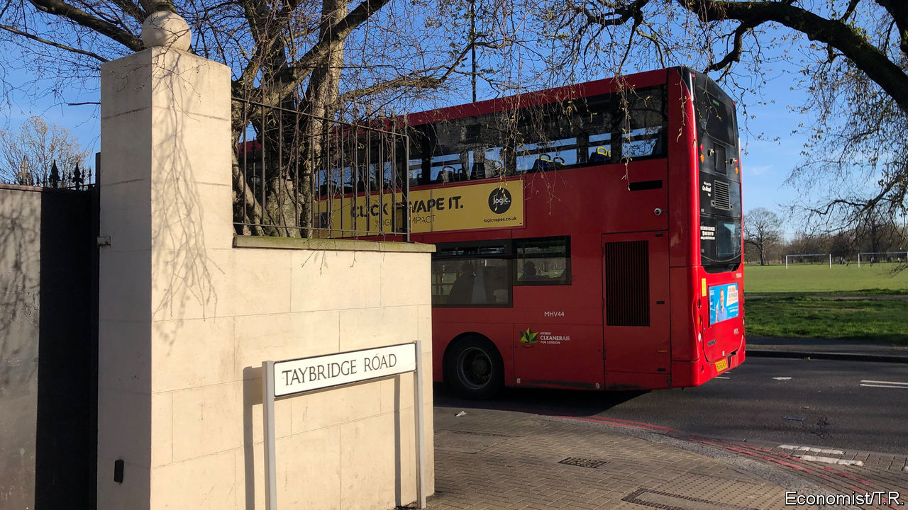

## Community

# How covid-19 is playing out on a London street

> Alone, together in a street under lockdown

> Mar 26th 2020

Editor’s note: The Economist is making some of its most important coverage of the covid-19 pandemic freely available to readers of The Economist Today, our daily newsletter. To receive it, register [here](https://www.economist.com//newslettersignup). For more coverage, see our coronavirus [hub](https://www.economist.com//coronavirus)

LEAN OUT of any of the sash windows on Taybridge Road in Clapham, and there’s always something to listen to. From the early hours, jet engines thrum through the sky, delivering passengers to Heathrow in time for work. Then there’s the rapid footsteps of commuters hurrying for the Tube and the laughter of children scooting to a private school round the corner. Tradesmen begin their hammering and drilling soon afterwards, converting lofts and digging out basements. On Friday nights the clunk of car doors reverberates, as Ubers ferry residents back from parties. The next morning abandoned chicken-shop boxes pay testament to the evening’s jollity.

That is, until this week. Now, like much of the capital, this meandering street of late-Victorian houses has fallen quiet. Planes are grounded, offices and schools are shut. Nobody is throwing parties. Yet behind its neatly-painted front doors, Taybridge Road is busier than ever. In ways big and small, every household is adjusting to life under lockdown.

The pandemic has already put some out of work. One is a freelance photographer, whose bookings have dried up; another is a location scout for feature films, who was given two weeks’ notice after only a day’s filming on her latest project. At the other end of the street, Noelle Woosley has been hit particularly hard. She and her partner run their own recording studio and perform at weddings as a cello-and-guitar duo. “All of our weddings this summer have been cancelled,” she says. “People who were going to be recording in the studio have pulled out.” Her sister, who shares their flat, has also lost her job as a waitress. Others are off sick, with suspected cases of covid-19. In one family, the parents and three children are all showing symptoms.

Many of those still in work are struggling to keep their children occupied and their bosses happy. Zoe Wingfield only started a new job, in human resources, three weeks ago after taking time out to raise her twin daughters, now two. Every day, the pair ask her and her partner, a sales director for a telecoms company, where they are going today, expecting jaunts to museums or perhaps a city farm. “They seem confused when we tell them nowhere,” she says. A few doors down, a French family with four children miss their Dutch au pair, who went home when borders began to close. The father hopes that a previous au pair, who moved to a job in a pub, might return. “She’s not very keen to self-isolate alone,” he says.

Nearly every household has cancelled something. One retiree has had to return 33 concert tickets and negotiate refunds on behalf of five friends for a trip to Germany. Nor will she go to York with her goddaughter to celebrate turning 70. Others have abandoned a house party in Scotland, a family trip to Disneyland in Paris and “granny’s annual Easter egg hunt”.

Every house is seeking new diversions. One couple says “romantic life is more important than ever.” At no 137, the four housemates prefer to settle down to watch the government’s press conference each evening. “It’s the closest we’ll get to wartime,” says one of them, Ed Jones. The three friends who share no 24 are enjoying eating together every evening, rather than waiting for a day when nobody is out. “Now every day’s a Sunday,” says one. Panic buying has made trips to the supermarket a thrilling game of potluck. The couple at no 122 yearn for broccoli. Another resident says she would “love to buy a chicken”, as if hankering after some exotic delicacy.

Once-neglected kitchens are in constant use. One family’s kettle has broken under the strain. Libraries are finally being read. Mr Jones intends to work his way through all the Star Wars and Batman films before turning to every movie made by Marvel, in chronological order: “I think we have time.” Others are finding solace in religion. One says it is a good opportunity to spend more time reading the Bible.

Many say the situation is strengthening their friendships, as people check up on each other. A resident of 44 years’ standing, who has only ever been “on nodding acquaintance” with neighbours, is now on a WhatsApp group, organising support for the elderly. One member of the group has volunteered to lead online workouts. Many are fantasising about the end of the crisis; some are hoping to throw a street party. But even being woken up by a plane would be a welcome glimmer of normality.■

Dig deeper:For our latest coverage of the covid-19 pandemic, register for The Economist Today, our daily [newsletter](https://www.economist.com//newslettersignup), or visit our [coronavirus hub](https://www.economist.com//coronavirus)