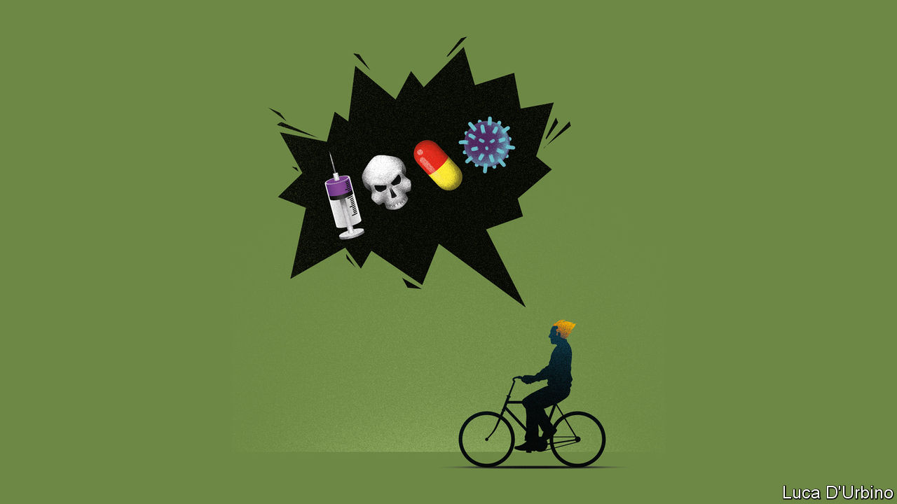

## Typhus off!

# Why Dutch swear words are so poxy

> English insults often refer to sex; Dutch ones, to disease

> Mar 26th 2020AMSTERDAM

IN MOST LANGUAGES, if someone said you had cancer, it would be a diagnosis. In Dutch, it is more likely to be an insult. Kankerlijer (“cancer-sufferer”) is one of a long list of Dutch profanities and expletives derived from diseases. An undesirable person might be told to “typhus off” (optyfussen) or “get consumption” (krijg de tering). If in (American) English you laugh your ass off, in Dutch you might “laugh yourself the pleurisy” (lachen je de pleuris). No one in England has been called a “poxy bitch” for centuries, but in the Netherlands you can still call someone a pokkenteef. A damned long way is a klereneind (“cholera-end”). And so on.

Because expletives are based on social taboos, in most cultures they are linked to sex, excrement or religion. Many Dutch swear words are as well, but they often feel weaker than the medical ones. Schijt is less like its English cognate and more like the gentler French merde. Mierenneuker (“ant-fucker”) is an anodyne expression for someone who fusses over details. “Whore” is an insult in Dutch too, but when the rapper Lil’ Kleine had a beef with pop singer Anouk last autumn, he went with the harsher kankerhoer (“cancer-whore”).

Scholars are not sure why the Dutch swear with illnesses. One theory links it to Calvinism, the puritanical strain of Protestantism that caught on here in the 16th century, which holds that the virtue of those destined for heaven will show itself in worldly prosperity, health and hygiene. “There was a shift in focus from the afterlife to this life, which, for example, diminished the strength of ‘God damn it’,” says Marten van der Meulen, a Dutch linguist and author of a book on swearing. On this theory, “a curse might be stronger if you used something in actual life, like a disease.”

However, there is also what linguists call the frequency hypothesis: the Dutch may curse with diseases simply because it caught on. Language, as Laurie Anderson said, is a virus. Perhaps someday Dutch kids will savage each other on the playground with cries of coronalijer.

## URL

https://www.economist.com/europe/2020/03/26/why-dutch-swear-words-are-so-poxy
