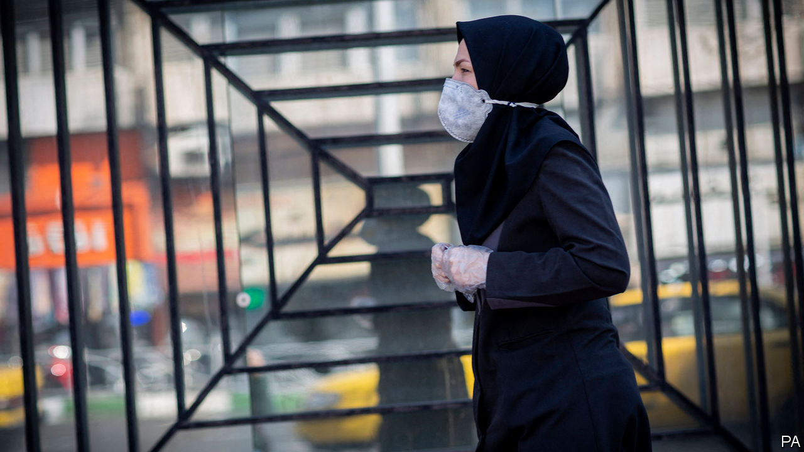

## Get serious

# Iran cannot fight covid-19 with conspiracy theories

> Try public-health policies instead

> Mar 26th 2020

Editor’s note: The Economist is making some of its most important coverage of the covid-19 pandemic freely available to readers of The Economist Today, our daily newsletter. To receive it, register [here](https://www.economist.com//newslettersignup). For more coverage, see our coronavirus [hub](https://www.economist.com//coronavirus)

AS COVID-19 BEGAN spreading across Iran in February, the regime held a rigged election. Weeks later, when nearly 10% of Iranian MPs were infected and it was clear the country had a problem, the ruling clerics refused to close crowded holy spots. Even as it dug mass graves, the government hushed up the scale of the epidemic. Now its leaders are propounding conspiracy theories, such as that covid-19 is an American bioweapon. Rejecting an offer of American aid, Iran’s supreme leader said: “Possibly your medicine is a way to spread the virus more.”

Officially, Iran has suffered over 27,000 cases and 2,000 deaths. All countries undercount, but Iran wilfully minimised the numbers at the outset. Hundreds of thousands have been infected and many will die. That is partly because American sanctions have made it harder to cope. But Iran’s leaders have also mismanaged the crisis. Like officials elsewhere, they have been refusing to quarantine cities or ban large gatherings. Worse, they are placing their confrontational worldview above public health.

The clerics claim they are doing a fine job. Iran has produced more face masks than Italy and tested more people than Britain. Military factories are now making personal protective equipment, oxygen canisters and hospital beds. The government has turned stadiums into isolation centres and increased the number of laboratories testing for the virus from two to almost 60. It has referred 62,000 people to health facilities. Volunteers are distributing hundreds of thousands of food parcels to those who cannot leave their homes. The effort is “unparalleled” in the Middle East—and even much of Europe—says an official at the WHO.

However, the government is doing little to stop the spread of the virus. Malls are still open. Parks are packed. Popular shrines have at last been closed. Nevertheless, many converged on the holy city of Mashhad for Nowruz, the Persian new-year festival, on March 20th. Hundreds jammed the streets of Tehran three days later to touch the coffin of a prominent soldier. On March 25th President Hassan Rouhani at last promised travel bans between cities, but he has dismissed calls to lock down the country. Other officials deflect blame. “A huge part of the danger Iranians face is due to the United States,” says Muhammad Javad Zarif, the foreign minister.

America could certainly do more to help Iran. Its offer of aid means little as long as its sanctions remain rigid. American officials claim that the sanctions allow for the import of medical supplies. But most trade is impossible because banks will not handle transactions with Iran, for fear of America’s wrath. Workarounds set up by European countries, and even one by America, have failed to increase the flow of covid-fighting kit.

Iran is reluctant to enforce a complete nationwide lockdown because it does not have the money to pay people to stay at home. If millions do not show up for work, their families will go hungry. Yet despite pleas to relax sanctions, at least temporarily, America has recently announced new ones.

That bolsters Mr Zarif’s argument that sanctions are keeping Iran from getting the help it needs. But the foreign minister is being disingenuous: his government is also rejecting aid from Médecins Sans Frontières (MSF). Two planeloads of equipment sent by the international NGO have been left on the tarmac at Imam Khomeini airport. A team of MSF doctors was also turned away.

Perhaps they were not needed, as some officials claimed. But state media absurdly portrayed MSF’s efforts as part of an American spying operation. “Iran does not need hospitals established by foreigners,” said a health official. Iran’s leaders, it seems, prefer to confront the outside world rather than engage with it. Their prejudice will cost Iranian lives. ■

Dig deeper:For our latest coverage of the covid-19 pandemic, register for The Economist Today, our daily [newsletter](https://www.economist.com//newslettersignup), or visit our [coronavirus hub](https://www.economist.com//coronavirus)

## URL

https://www.economist.com/leaders/2020/03/26/iran-cannot-fight-covid-19-with-conspiracy-theories
