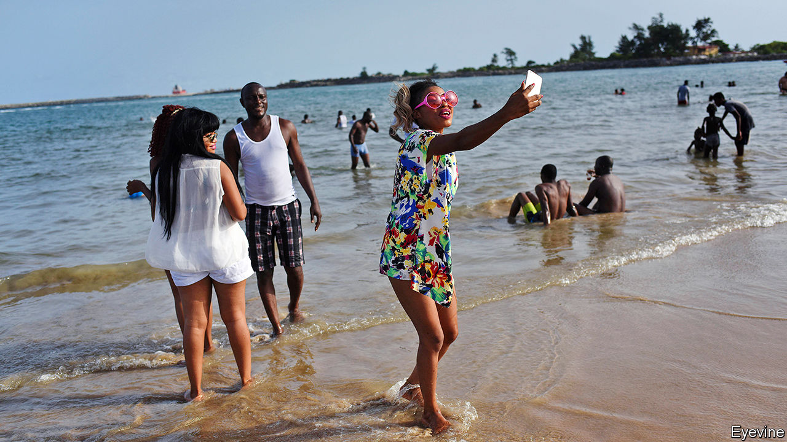
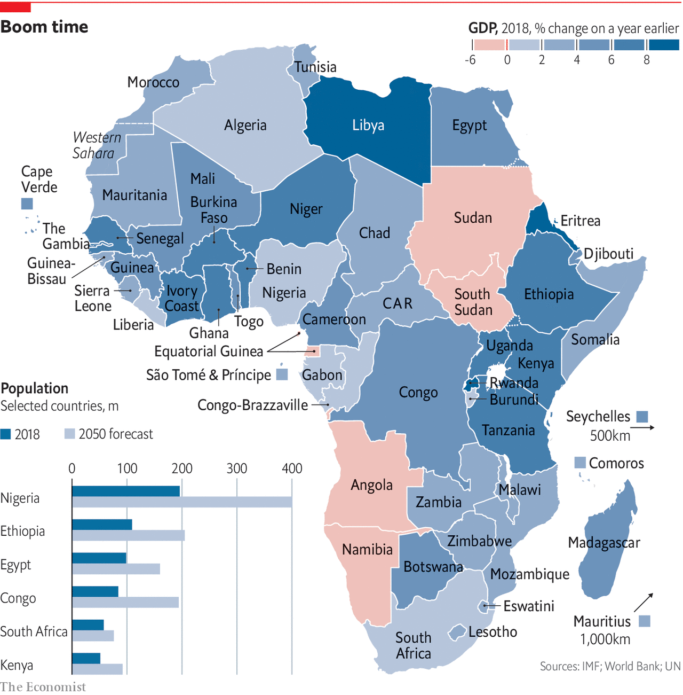

## The African century

# Africa is changing so rapidly, it is becoming hard to ignore

> Rapid economic and social change will give the continent a bigger role in world affairs, says Jonathan Rosenthal

> Mar 26th 2020

SOMETIMES BRIDGING the gap between success and failure, between finishing high school or dropping out, requires a lot of determination and the cost of a cow. Jack Oyugi grew up as the oldest of 14 children to parents tilling an acre of ground in western Kenya. Their crops usually gave them enough to eat—neighbours would feed them if food ran short—but they had little cash. When Mr Oyugi went to secondary school his father sold his only cow to pay the fees. “The neighbours laughed at him,” he says. Now he is having the last laugh. Mr Oyugi went on to university where he studied biotechnology, and then developed a process to make protein-rich animal feed from water hyacinth, an invasive plant on Lake Victoria. He provides jobs for 30 people. Orders for the feed, which is about 30% cheaper than soyabean protein, are coming from as far away as Thailand. As for his father, “I’ve built him a seven-room house and bought him some cows,” he says proudly.

Mr Oyugi is talented and hard-working. But his jump from village to university, from subsistence farming to founding a thriving business, is also one that encapsulates the change that is sweeping across the world’s youngest continent. Almost half of the 1.3bn Africans alive today were born after the terror attacks on America in 2001—the median age of 19 is less than half that of Europe (43).

In 1885, when the colonial powers carved up Africa, it had fewer than 100m people, or about one-third the number in Europe. Today there are almost two Africans for every European. Some outsiders see this rapidly growing population as a recipe for disaster. Although the poverty rate is falling, about a third of children are still malnourished. This leaves many of them with stunted bodies and diminished mental capacities. Every month about one million Africans enter the job market. Many of them do not have the education or skills they need. More than a third of African children do not finish secondary school. In Mozambique and Madagascar that rate jumps to more than half. Extremists find fertile ground in countries with large numbers of poor, unemployed young people.

Unlike other emerging powers such as China and Brazil, Africa is divided into 54 countries, all with their different problems. Two of its biggest economies, South Africa and Nigeria, are barely treading water. Many are riven by tribal divisions and suffer from poor infrastructure, corruption and the legacies of slavery, colonialism and authoritarian rule. Some are challenged by dangerous religious radicalisation that threatens to turn failing states into failed ones. Climate change will make these challenges tougher. In the short term, so will the spread of covid-19.

The continent has disappointed before. Thabo Mbeki, at his inauguration as president of South Africa in 1999, spoke of entering “the African century”. Even after the global financial crisis, rapid growth in Africa gave hope of sustained progress, albeit from a low base. But that was dampened again from mid-2014, when commodity prices fell and African GDP growth slowed considerably.

This special report will argue that, in spite of these setbacks and although many of the continent’s problems persist, social, economic and political improvements since the cold war are gathering pace. After centuries on the periphery, Africa is set to play a much more important role in global affairs, the global economy and the global imagination. Asia’s economic and population booms may continue to dominate the first part of this century, but Africa’s weight will grow in the second half.

Demography is a big part of it. Africa’s population will almost certainly double by 2050, giving it more than a quarter of the world’s total. That alone commands attention. But if accompanied by matching growth in GDP, economies such as Nigeria could overtake France or Germany in size (adjusted for purchasing power), according to PwC, an accounting firm. That may not be as far-fetched as it seems at first glance. The Centre for International Development at Harvard University forecasts that seven African countries will be among the 15 to grow fastest until 2027. This will be helped by improving education systems and the most ambitious effort in the world to lower trade barriers in a continent-wide free-trade area. It is not just the movement of goods that is spurring prosperity, but also of people. Migration is likely to enrich and democratise the continent with money, ideas and skills.

This report will argue that progress is not inevitable, nor will it be evenly spread. Much will depend on whether governments continue to become more accountable. Since 2008 there has been an erosion of some democratic gains won since the end of the cold war. Yet the overall optimism is rooted in Africans’ own views of the future. Whereas less than a quarter of German, Japanese and British people think that their living conditions will improve over the next 15 years, two-thirds of Kenyans, Nigerians and Senegalese think life will get better, according to polling by IPSOS. Africa’s new generation is not just full of hope, but is slowly gaining the tools to turn that hope into reality. ■