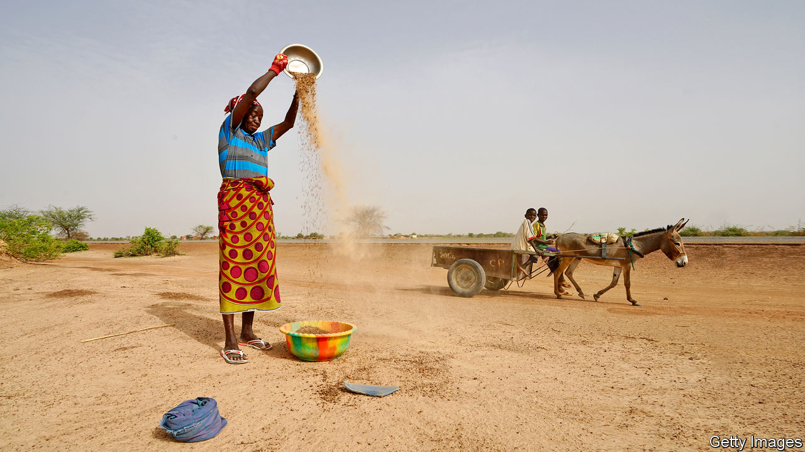
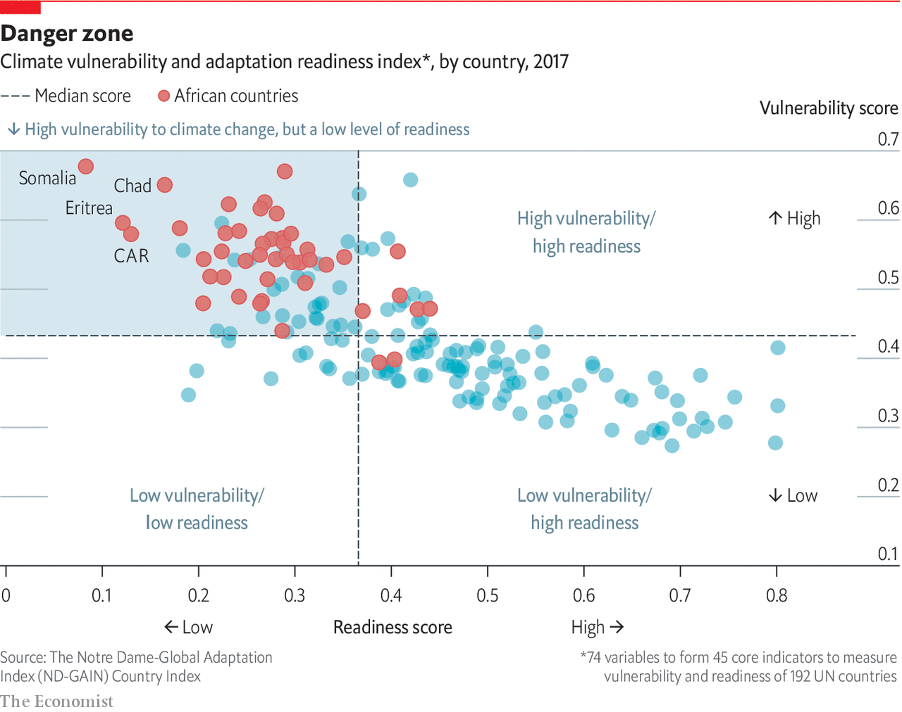

## Food and climate

# African countries must get smarter with their agriculture

> Climate change and continued rural poverty present big challenges

> Mar 26th 2020

ON THE HILLS of central Kenya, almost lime-green with the shimmer of tea bushes in the sunlight, farmers know all about climate change. “The rainy season is not predictable,” says one. “When it is supposed to rain it doesn’t, then it all comes at once.” Climate change is an issue that will affect everyone on the planet. For Africans its consequences will be particularly bitter: whereas other regions were able to grow rich by burning coal and oil, Africa will pay much of the human price without having enjoyed the benefits. “Africa only represents 2% of global greenhouse-gas emissions but it is the continent that is expected to suffer the most from climate impacts,” says Mafalda Duarte, who runs the $8bn Climate Investment Funds, established by the World Bank.

Although there are huge uncertainties as to the precise impacts of climate change, with large error bars around temperature forecasts, enough is known to say that global warming represents one of the main threats to Africa’s prosperity. Parts of the continent are already warming much more quickly than the average: temperatures in southern Africa have increased by about twice the global rate over the past 50 years. Even if the world were to cut emissions enough to keep global warming below 1.5°C, heatwaves would intensify in Africa and diseases such as malaria would spread to areas that are not currently affected. Farming would also be hit hard. About 40% of the land now used to grow maize would no longer be suitable for it. Overall, it is estimated that maize yields would fall by 18-22%.

Africa is particularly vulnerable, in part because it is already struggling to feed itself and it will have to vastly increase yields and productivity if it is to put food on the plates of a fast-growing population, even without climate change. The UN’s Food and Agriculture Organisation reckons that by 2050 global food production would have to rise by about 70% over its level of 2009 to meet demand from a population that is growing in numbers and appetite. Much of this new demand will be in Africa. Yet the continent already imports about $50bn-worth of food a year and that figure is expected to more than double over the next five years. Self-sufficiency is not Africa’s goal, but the fact that it spends more money importing food than it does buying capital goods suggests it has room for improvement.

Finding out why is not hard. Most farms are tiny, tilled by hand and reliant on rain. More than half of Africa’s people make their living from farming. Although its total harvest has climbed over the past few decades, this is mainly because there are more people farming more land. But in many places there is no spare land to farm. Plots in Rwanda are so small (less than two acres) that you could fit 250 of them onto the average American farm. And although output per worker has improved by little more than half over the past 30 years in Africa, that is still far behind the 2.5 times improvement in Asia. Yields of maize, a staple, are generally less than two tonnes per hectare, a fifth the level in America.

The low productivity of African farmers is reflected both in national economic statistics—despite absorbing so much labour farming generates just 15% of GDP—as well as in their poverty, which is generally concentrated in rural areas. “They can’t even feed their families,” says Jennifer Blanke, a vice-president of the African Development Bank in charge of agriculture. “[Farm] productivity hasn’t improved in many parts of Africa for 100 years.”

One reason is that in the first few decades of independence many African governments neglected farming as they focused on industrialising their economies. Others damaged it by pushing down the prices that state monopolies paid for their crops in order to subsidise workers in cities with cheap food. Ghana taxed cocoa exports so heavily that production collapsed by half between the 1960s and 1980s, despite a jump in the price of cocoa. Yet over the past two decades or so governments and donors have begun to look afresh at farming as a way of providing jobs for the 13m young people entering the workforce each year. Much of the focus has been on getting smallholder farmers to use fertiliser and, more important, better seeds. The results can be impressive. Improved varieties of sorghum, for instance, can produce a crop that is 40% larger than the usual variety. Infrastructure is important. A World Bank irrigation project in Ethiopia helped farmers increase their potato harvest from about 8 tonnes per hectare to 35 tonnes.

Better techniques help, too. Smallholder coffee farmers in Kenya are able to increase their incomes by 40% by following a few simple guidelines on caring for their bushes, such as trimming all but three of their stems. Many of their neighbours do not follow the advice, because it seems counter-intuitive. More stems ought to lead to more coffee beans, they say. Yet after seeing those following the advice get bigger harvests for a season or two, many others start doing the same.

One way of spreading knowledge is to link farms to big buyers of their harvests. When Diageo, a British drinks giant, built a brewery in Kisumu in western Kenya, it wanted to use local crops to make a beer cheap enough to compete with illicit home-brew. It organised farmers into groups, improved supply chains for them to get seeds and fertiliser and then agreed to buy their grain. It now provides a market to about 17,000 farmers. Across the region it has doubled its use of local raw material to about 80% over five years, says John O’Keeffe, who runs its Africa business.

Other industries are also benefiting from technology and capital. Jane Toko, a mother of eight, earned a living for most of her adult life catching fish in Lake Victoria, the world’s third-largest lake. “Long ago the number of fish was high,” she says. “Now they are few.” Dotted along the shore are hundreds of small hamlets, whose residents have fished the lake for generations. This rich source of protein helped the population in the area expand from about 10m in 1960 to more than 40m now, contributing to overfishing. Global warming is also having an impact by reducing the amount of oxygen dissolved in parts of the lake, cutting by 40% the habitat available for fish. Data are sparse but some surveys suggest that the total amount of perch in the lake fell by almost half between 1999 and 2011. Locals say the catch of tilapia, a native freshwater fish that is particularly delicious grilled, has fallen 80%. “There are so many people fishing on the lake, but what comes out is small,” grumbles Maurice Muma, a fish trader.

The shrinking fishery has contributed not just to poverty, but also a higher rate of HIV infections by giving fishermen the bargaining power to demand that female traders have sex with them in order to buy their fish. Yet a few kilometres away is part of the solution to the declining catch. Victory Farms, which was founded by two Americans in 2015, has become sub-Saharan Africa’s fastest-growing fish farm. Ponds hold a teeming mass of pregnant fish. Two employees, waist deep in water, sort them and squeeze out the eggs which are hatched in bubbling indoor tanks. Out on the lake floating cages house thousands of growing tilapia. The farm is on track to produce about 10,000 tonnes of fish this year, which is enough to feed about 1m people at Africa’s current rate of fish consumption. The firm hopes to expand to about 60,000 tonnes over the next six years, a figure that would equal more than half of the wild catch in the Kenyan side of the lake. Others are following the example. A recent study by two Kenyan academics found about 4,000 cages in Kenyan waters.

An even more important change is the move from traditional farming to building businesses that can profitably bring technology and investment to smallholder farmers. Taita Ngetich, a young Kenyan, was studying engineering when he wanted to earn a little money on the side. He scraped together 20,000 Kenyan shillings (about $200) to plant tomatoes. Everything went wrong. The crop was attacked by pests. “Then there was a massive flood that swallowed all our capital,” he says. Mr Ngetich persevered by looking into buying a greenhouse to protect his plants from bugs and rain. The cheapest ones cost more than $2,500 each. So he designed his own for half the price. Soon neighbouring farmers started placing orders. His firm, Illuminum Greenhouses, has sold more than 1,400 greenhouses that provide livelihoods to about 6,000 people. The business does not stop there. He also supplies fertiliser, high-quality seedlings and smart sensors that increase yields.

Illuminum’s success shows how technology can help even small farms be more productive. Because such a large share of Africa’s population earns a living from agriculture, even small improvements in productivity can lift the incomes of millions of people. But over the longer run smallholder farming can go only so far, especially in the face of climate change and population pressure.

“If we really want to lift people out of poverty we have to finance projects that will get them an income of at least $100 a month so that they can pay for health care and education,” says Mr Ngetich. “Projects that give them an extra $2 a month from growing beans or maize aren’t going to get them there.” Getting those big jumps will need better jobs in factories and cities. ■

Sign up to our fortnightly climate-change newsletter [here](https://www.economist.com//theclimateissue/)