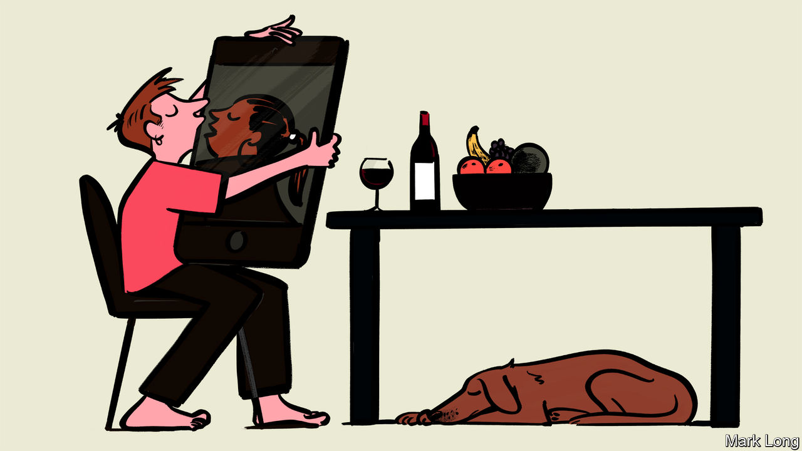

## Love under lockdown

# The return of slow courtship to American dating

> Under quarantine, video courtship replaces hookup culture

> Mar 26th 2020

Editor’s note: The Economist is making some of its most important coverage of the covid-19 pandemic freely available to readers of The Economist Today, our daily newsletter. To receive it, register [here](https://www.economist.com//newslettersignup). For more coverage, see our coronavirus [hub](https://www.economist.com//coronavirus)

FOR TREVOR BARNES, a 27-year-old teacher from Hershey, Pennsylvania, quarantine could be terrible. He lives on his own in an apartment attached to the boarding school he works at, and he is fully locked down. For ten days he has not been able to go outside even to buy groceries. Yet Mr Barnes has discovered that being cooped up inside at least does not mean he has to give up his romantic dreams. Over the past week he has met several women, all by phone call and video conference. “I go on a lot of dates normally, from Tinder, Hinge, Bumble, all that stuff,” he says, but has never found somebody he really hit it off with. “This has been a good way to figure out a more serious approach,” he says.

Though older people will suffer the brunt of the coronavirus, it is the footloose young who will see their lives turned upside down. But a generation that is tied to its phones anyway is perhaps also well-equipped to innovate around some of the problems social isolation imposes. And a lot of young people are proving that just because you cannot actually meet somebody in person does not mean you cannot date.

One popular app, Hinge, says that 70% of its users have expressed an interest in going on digital dates. Match Group, the owners of Tinder, are giving away some features of the app that usually cost money to reflect the fact that people have more time to kill by swiping left and right. All dating apps are encouraging users to try video dating. One Instagram feed, called Love is Quarantine, has taken off by parodying a popular Netflix show called Love is Blind. Its creators, Thi Lam and Rance Nix, who share a flat in Brooklyn, New York, joke that their invention has “gone viral”.

It is not all easy, dating in a lockdown. Kevin, a 26-year-old tech worker, says he met somebody online recently. “After work I set up a hammock in my tiny back yard, grabbed a beer from my fridge and we chatted for an hour,” he says. It went well—he and his date are going to have a walk around a local park next. But he wonders what comes after that. “I am comfortable adding one more person to my isolation group if it comes to that,” he says. Whether his three flatmates will be equally comfortable is less clear.

Still, it could be worse. “It has brought us back to an older way of connecting with people, which is just talking, not all these visual branding cues on profiles,” says Katie Nelson, a journalist confined to her parents’ home in Minneapolis. She used to despair of men rushing to meet up before she knew anything about them. When lockdowns end, it may be too much to hope that the return of slow courtship will last. But by then some people might have become experts at it.

Dig deeper:For our latest coverage of the covid-19 pandemic, register for The Economist Today, our daily [newsletter](https://www.economist.com//newslettersignup), or visit our [coronavirus hub](https://www.economist.com//coronavirus)