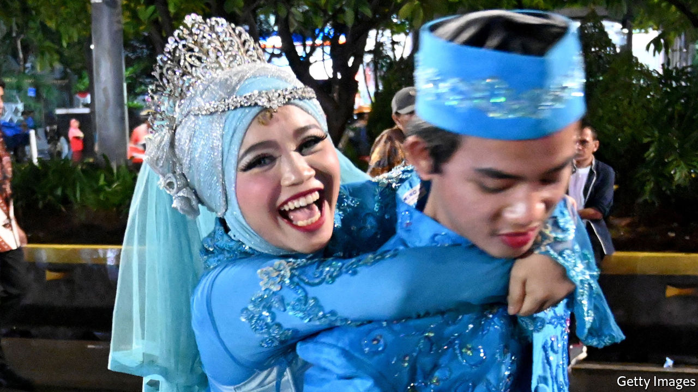

## Got an itch? Get hitched

# Why more Indonesian teens are giving up dating

> Wed now to avoid temptation, online conservatives urge

> Apr 2nd 2020JAKARTA

IT WAS LOVE at first like. When Natta Reza, a dashing Indonesian busker, discovered the young woman’s account on Instagram, he knew he’d found the one. He liked one of her posts, and they started chatting. Within hours he had proposed via an Instagram message. They married soon after, in February 2017. 

Since then Mr Natta and his wife, Wardah Maulina, have become celebrities on Instagram. They are the poster couple for a social movement sweeping Indonesia, home to the world’s largest population of Muslims. Its champions encourage single Muslims to renounce dating, lest they succumb to the temptations of premarital sex, which is barred by Islamic law. Better to marry young, and swiftly, and leave the matchmaking to a parent, cleric or the Islamic internet. Islam in Indonesia has traditionally been a moderate affair. Yet the eagerness with which teenage and millennial Muslims have embraced abstinence shows how a purist strain of the faith has tightened its grip.

It all began five years ago in a dorm room in a provincial Javanese city. La Ode Munafar was worried about his peers and the state of their souls. Many young Indonesians have no problem with dating, or fooling around; perhaps two-fifths of unmarried adolescents have had sex. So Mr Ode leapt into action. He started an organisation called Indonesia Tanpa Pacaran (ITP) or “Indonesia without dating”, launched a social-media campaign, and invited Muslim singletons to join sex-segregated WhatsApp chat-rooms to give each other succour as they hunted for a spouse.

Mr Ode has been wildly successful. By 2018 ITP had at least 600,000 paying members, according to Magdalene magazine. YouTube videos of teenage girls calling their boyfriends and dumping them have racked up thousands of views, while the Instagram accounts of Mr Natta and Ms Wardah, who are ITP ambassadors, have over 1m followers each. Mr Ode’s message is getting through. Mia, a 20-year-old ITP member, thinks forgoing dating in favour of early marriage is “very noble”. The number of young girls tying the knot is startlingly high; in 2018 11% of women aged between 20 and 24 had married before 18.

Mr Ode is by no means the first Muslim to condemn dating, says Dina Afrianty, of La Trobe University in Australia. What’s new about ITP is its use of social media. Mr Natta and Ms Wardah’s Instagram posts put a rose-tinted filter on the life of a young married couple. Their hip social-media personae make the case for chastity and early marriage far more effectively than any sermon. The ability of Mr Ode and other tech-savvy conservatives to market Islam to young Muslims accounts for the popularity of ITP and hijrah, the broader, grassroots movement to which it belongs. A survey by Alvara, a pollster, conducted in 2019 showed that Indonesians between the ages of 14 and 29 are more likely to possess “ultra-conservative” religious views than their elders.

Hijrah’s popularity is a measure of how much Indonesian Islam has changed in the past two decades. The faith used to be syncretic and undogmatic. But after the dictatorship’s fall in 1998, conservative voices that had been silenced began to be heard. Salafism moved from the margins to the mainstream. Preachers educated in Arab countries set about remaking Indonesian Islam in the mould of its austere Arab cousin. Islam emerged as a political force in 2016, when hundreds of thousands of zealots demonstrated against a Christian politician whom they accused, on the basis of doctored evidence, of having insulted the Koran. He lost an election and was jailed.

Conservative Muslims regard women as “the guardians of the family”, according to Ms Dina, and have looked on with indignation as women have carved out space for themselves. Feminists have won some important legislative victories. Last year for instance parliament increased the legal age of marriage for girls, from 16 to 19, in a bid to curb child marriage (the legal age of marriage for men is 19). But emboldened Islamist lawmakers are doing their best to return women to the hearth and home.

Among the bills to be considered by parliament this year is a “family resilience” bill which requires women to “take care of household affairs”. It has been roundly mocked by the urban elite, who point out that it was drafted by female MPs who cannot often be at home. But behind the ridicule lies fear. “The feminist space at the national level is shrinking,” says Mutiara Ika Pratiwi of Perempuan Mahardhika, an Indonesian women’s organisation.

It has long been under attack at the local level. A study from 2008 showed that 52 districts, out of a total of 470, enacted 45 sharia-inspired laws between 1999-2008. Aceh, a special administrative region governed by Islamic law, prohibits women from straddling motorcycles, playing football and leaving their homes at night. In 2015 officials in Purwakarta, a county in West Java, announced that unmarried couples caught together after 9pm would be required to marry or break up. Mr Ode would surely approve.

His organisation, which encourages women to defer to their male relatives and refrain from arousing male lust, has come under heavy criticism from feminists. They would do well to point out that, for every Mr Natta and Ms Wardah, there is a Salmafina Khairunnisa and Taqy Malik. In September 2017 Ms Salmafina, then an 18-year-old Instagram personality, married Mr Taqy, a 22-year-old heart-throb, even though they had met only two weeks before. Ms Salmafina soon learned that he was thinking about getting a second wife; polygamy in Indonesia is legal and encouraged by radical campaigners like Mr Ode. Mr Taqy soon discovered that his beloved was not the “submissive wife” he had expected. Within three months the couple had divorced. ■