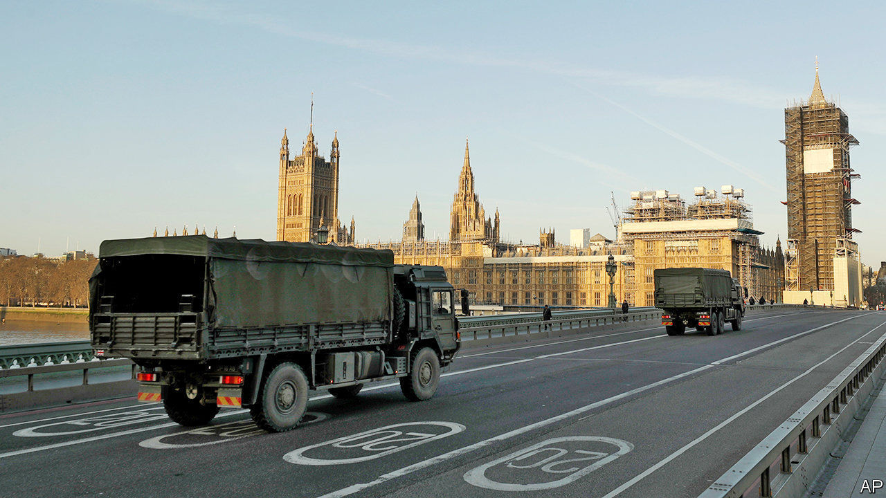

## The army

# British soldiers struggle to maintain social distance

> The army is essential in a crisis, but keeping soldiers apart is tricky

> Apr 4th 2020

Editor’s note: The Economist is making some of its most important coverage of the covid-19 pandemic freely available to readers of The Economist Today, our daily newsletter. To receive it, register [here](https://www.economist.com//newslettersignup). For more coverage, see our coronavirus [hub](https://www.economist.com//coronavirus)

A GENERATION OF British troops who cut their teeth in Helmand and Basra are now seeing action in east London. In contrast to several continental neighbours, Britain’s army is not enforcing the lockdown, but troops are being put to use in other ways.

Army engineers and medics have helped turn the EXCEL convention centre in London’s Docklands into a hospital, with more to follow. Troops are driving oxygen tankers and delivering medical equipment. Logisticians, accustomed to moving tanks into war zones, are helping to get biscuits to pensioners. Though gun-toting soldiers will not confront citizens exceeding their allotted bout of once-daily exercise, they will be used as guards to free up armed police for other duties.

The armed forces have over 10,000 personnel in the Defence Medical Service, including combat medics and reservists. Yet only a fraction may be available due to overseas deployments, failed fitness tests or parental leave. Doctors have already been recalled from exercises in Europe, but it is trickier to pull medics back from deployments in Iraq and Afghanistan. On April 1st Britain called up 3,000 reservists, though it was careful to avoid pulling out those who work as civilians in the NHS.

Amid this heightened attention, the army has been keen to show how unaffected it is by covid-19. In a promotional video, Drill Sergeant Rae of the 1st Battalion Scots Guard wields a 76cm pace stick, before striding three paces (2m and a bit) across the parade ground, the stick flicking up behind him. “There you have the perfect demonstration for social distancing,” he says turning toward the camera.

Squaddies are less than convinced. Documents seen by The Economist suggest that orders have hardly been uniform. Fill Your Boots, an online forum on which troops share their troubles, has been inundated with complaints. At Catterick, a military town in North Yorkshire that is the largest British Army garrison in the world, one soldier says that training is carrying on as normal. A senior soldier was overheard telling others to “crack on”, saying that “it’s just the flu—if we get it then we get it”. More scrupulous commanders have told soldiers to attend parades on Skype, so that officers can check on whether squaddies have washed and shaved without getting too close for comfort.

Sandhurst, Britain’s officer academy, is also drawing much flak from trainees. The military school has claimed that all physical training is cancelled, but photographs sent to Fill Your Boots show cadets carrying out close-contact mock casualty evacuations. “It’s a bit of a clusterfuck,” says Alfie Usher, a former paratrooper who runs the forum. “Commanding officers are taking it on themselves to interpret the rules.”

The Ministry of Defence insists that its training follows Public Health England guidance and that service personnel who experience symptoms are moved to separate parts of their camp. Cadets have been barred from leaving at weekends and team sports and gym use have been cancelled.

Unlike the Pentagon, British officials will not say how many cases of covid-19 have been found in the ranks. At least five personnel at Britain’s military base in Cyprus have tested positive. But even as the virus pulls soldiers to the home front—troops have been ordered back from exercises in Europe and operations in Iraq—there is no let-up on traditional duties.

Russian bombers probing near British and Irish airspace sent Royal Air Force jets scrambling twice last month, and on March 26th the Royal Navy said it had deployed nine vessels to shadow a flotilla of Russian warships in the English Channel and North Sea. Britain’s armed forces will need to stay in tip-top health.■

Dig deeper:For our latest coverage of the covid-19 pandemic, register for The Economist Today, our daily [newsletter](https://www.economist.com//newslettersignup), or visit our [coronavirus hub](https://www.economist.com//coronavirus)

## URL

https://www.economist.com/britain/2020/04/04/british-soldiers-struggle-to-maintain-social-distance
