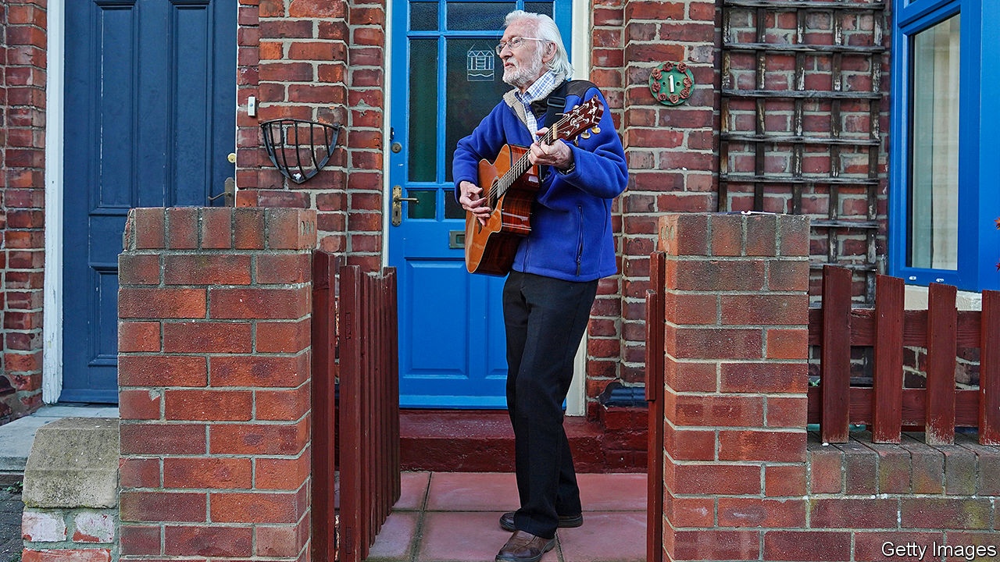

## Life under lockdown

# How British family life is going back to the 1950s

> Households are settling into a way of life that in many ways resembles a timewarp

> Apr 4th 2020

Editor’s note: The Economist is making some of its most important coverage of the covid-19 pandemic freely available to readers of The Economist Today, our daily newsletter. To receive it, register [here](https://www.economist.com//newslettersignup). For more coverage, see our coronavirus [hub](https://www.economist.com//coronavirus)

“FRITTATAS, scrambled eggs, omelettes...” The crisis is no reason to let diets slip, reckons Eleanor Jaskowska. As panic buying took off and lockdown loomed, she bought three rescue hens. Saved from an untimely end in the slaughterhouse, Maggie Hatcher, Roberta and Ginger are now free to roam around her sunny garden in Bristol. In return, their eggs make for delicious suppers.

As Britain hunkers down in week two of self-isolation, families are settling into a timewarp that lies somewhere between the mid-21st century and the 1950s. Aside from working virtually and binge-watching Netflix, they are keeping chickens, playing board games, baking bread and knitting sweaters. Queues for the shops, recalling postwar rationing, are encouraging people to grow or cook their own. The British Hen Welfare Trust rehoused 2,000 ex-battery hens in the week to March 29th; it has had requests for 20,000 more. One poultry breeder says she has been bombarded with requests for hens that are “ready to lay”.

Bread-making is back in vogue, after being sent into decline in 1961 when scientists developed a way of making bread 40% softer, that also reduced its cost and doubled its life. Supermarket shoppers are hoarding baking ingredients as well as loo paper. Some are abandoning food-delivery apps and experimenting with new recipes. On one community WhatsApp group, families offer to drop off samples of their latest creations on neighbours’ doormats. But many are eschewing traditional cookbooks, and learning the modern way. Matthew Jones, owner of Bread Ahead in London’s Borough Market, is live-streaming daily baking classes on Instagram. Judging by the figures, the nation thinks Mr Jones’s sessions are the best thing since, well, sliced bread. His account amassed 30,000 new followers in two days.

Many young people have scarpered from cities to lockdown with their parents, hunkering down with younger siblings who are off school. Of an evening, they gather in their living rooms to make their own fun, just as it used to be. Board games are making a comeback, with sales jumping by 240% during the first week of lockdown. Perhaps it is not surprising that Monopoly Classic is the most sought-after game: it is the closest that most Londoners are likely to get to Pall Mall or Leicester Square for some time. With gyms closed and people hungry for exercise, bicycles are also rolling off the shelves at speed.

Slow-burning activities like learning an instrument are educational and kill time, too. The Sound Garden, an independent music shop in north London, has sold out of all entry-level acoustic guitars. Ukuleles are also popular. Karen Davis and her 12-year-old son have taken it up. “We strum away badly, sing terribly and bring joy into the monotony of lockdown,” she says. “Self-isolation is forcing us to rethink family time. You don’t want your evenings to become what they used to be, slumping in front of the sofa and watching Netflix.” And the 21st century can help with 1950s pastimes: their ukulele tuition is being provided by a local music school, via Zoom. ■

Dig deeper:For our latest coverage of the covid-19 pandemic, register for The Economist Today, our daily [newsletter](https://www.economist.com//newslettersignup), or visit our [coronavirus hub](https://www.economist.com//coronavirus)

## URL

https://www.economist.com/britain/2020/04/04/how-british-family-life-is-going-back-to-the-1950s
