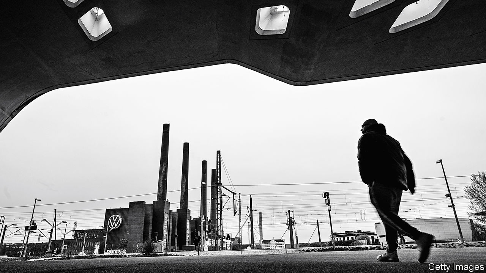
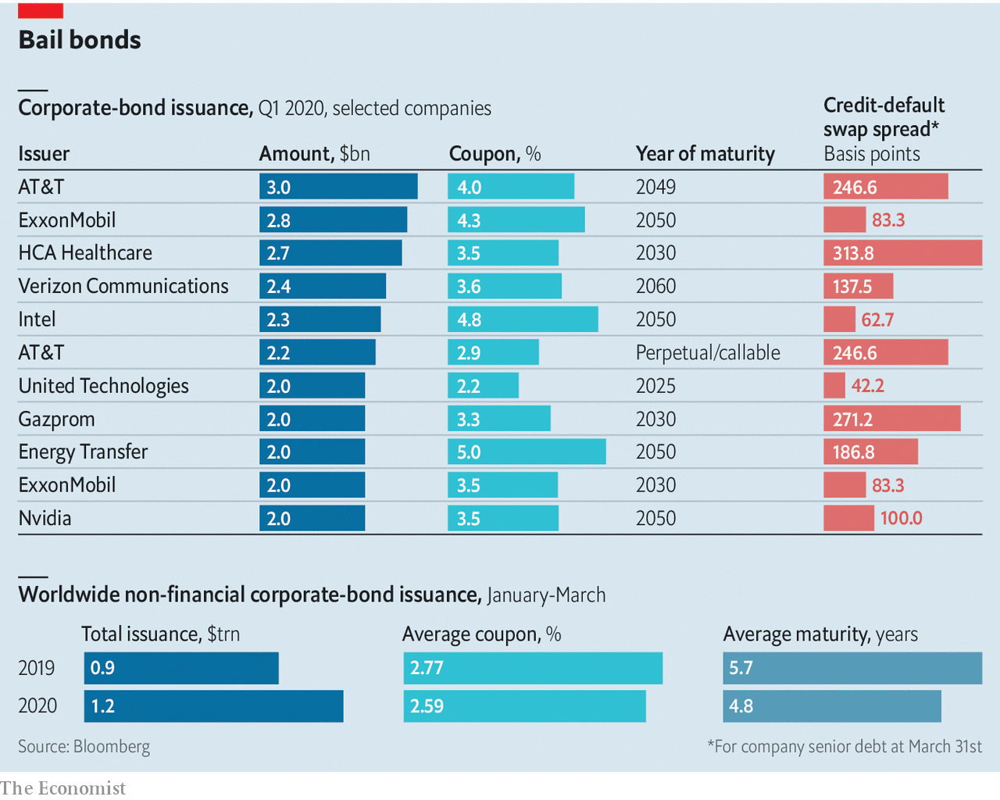

## Great white night

# Governments are once again splurging to keep big companies afloat

> Authorities ponder which companies to bail out—and how

> Apr 4th 2020

Editor’s note: The Economist is making some of its most important coverage of the covid-19 pandemic freely available to readers of The Economist Today, our daily newsletter. To receive it, register [here](https://www.economist.com//newslettersignup). For more coverage, see our coronavirus [hub](https://www.economist.com//coronavirus)

MANAGERS ARE encouraged to set enough aside for a rainy day. The covid-19 cloudburst means even the most prudent companies are rapidly exhausting their cash. Many will need a bigger umbrella that only the state can proffer.

The size of antiviral economic measures agreed so far is breathtaking. On March 27th President Donald Trump signed off on a record $2trn stimulus, which includes loan guarantees that could fund more than twice as much in corporate borrowing. Britain, France, Germany, Italy and Spain have their own “bazookas”, worth hundreds of billions. Who exactly will need help, how much and in what form is not yet entirely clear. But the contours of arguably the biggest corporate rescue in history are taking shape.

Some industries are seeking bespoke packages. First up, airlines. Those with stronger balance-sheets, such as Australia’s Qantas and IAG, owner of British Airways, would be just as happy if weaker rivals disappeared. But the International Air Transport Association, the global trade body, warns the pandemic will cut industry revenues in 2020 by $252bn, or 44%, relative to last year’s. Its members have cancelled 2m flights. Roughly 35-45% of airline costs are fixed, and so cannot be cut quickly, reckon analysts at Citigroup, a bank. Delta, an American carrier, says it is losing around $50m a day.

Some flag-carriers have already been bailed out: Alitalia has been nationalised (again), Dubai has rescued Emirates and Singapore Airlines raised equity with the backing of Temasek, the city-state’s sovereign-wealth fund. TUI, a German tour operator with its own aeroplanes, received €1.8bn ($2bn) in state-backed loans.

In America, where two-thirds of global airline profits are made, vigorous lobbying helped carriers secure their own tailored package. A $50bn mix of loans and grants has been earmarked to keep them aloft. They will be eligible for support worth six months of payroll, far more than other businesses. American Airlines said it was expecting $12bn from the government. Carriers have agreed to retain staff until October, slash salaries of top brass and halt shareholder payouts until late 2021. Some may have to give the government a slice of shares (or securities that convert into them) in exchange for cash, though precise terms have yet to be spelled out.

The only other American businesses entitled to their own pot of cash were those deemed “critical to maintain national security”. That sounds like a euphemism for Boeing, America’s troubled aircraft-maker (see [article](https://www.economist.com//business/2020/04/03/boeing-ponders-its-bail-out-options)). But other industries will no doubt claim the “critical” label for themselves. Oil producers, reeling from low crude prices, are said to be trying.

Elsewhere, some carmakers are liable to make a similar case. Like airlines, they are household names that sit at the heart of complex ecosystems with millions of employees. Governments ignore their pleas, should these come, at their peril. And come they may: demand for cars may slide by around a sixth this year and is unlikely to recover fast. Germany’s Volkswagen says it is losing €2bn a week. Like Renault of France and others, it has furloughed workers through state schemes. Car companies have 4-10 weeks of cash on hand, maybe double that if they tap credit lines, according to Jefferies, a bank. That may not be enough to ride out the crisis unaided.

The financial sector is the other traditional, if less beloved, candidate for state support. Insurers’ liability to covid-19 is, for instance, still unclear. Politicians in America are urging insurance firms to indemnify holders of policies protecting against business interruptions. The companies say these do not cover pandemics, and claim they could be on the hook for losses nearing $400bn a month if forced to do so. States including Ohio and Massachusetts are mulling bills that would compel payouts (see [article](https://www.economist.com//finance-and-economics/2020/04/03/what-missed-rent-and-mortgage-payments-mean-for-the-financial-system)). These would have to be accompanied by a rescue package. At least banks look more solid, thanks to regulations enacted in the wake of the financial meltdown in 2007-09. For once they may be part of the solution, not the problem: governments are using them as a conduit for state-guaranteed loans.

Support which banks, and any other business, will readily accept is coming in the form of relaxed regulations. Lenders are being offered capital relief in Europe and America. Countries from France to South Korea have banned investors from betting on share-price falls, to many a CEO’s delight. Some environmental regulations in America have been waived. European airlines get to keep valuable slots at airports even though they are not using them as required. Steven Mnuchin, America’s treasury secretary, has said the aid is predicated on three months of stoppages. It is anyone’s guess if that will be enough.

Much of the government largesse will be spread among millions of small businesses. Shuttered pizza joints, gyms, florists and the like are facing months of lost revenue. Few voters object to public money being used to pay laid-off or furloughed workers directly, as in Europe, or, as in America, to provide grants for firms that keep staff (see [Schumpeter](https://www.economist.com//business/2020/04/03/from-youre-fired-to-youre-furloughed)).

In fact, programmes which authorities have sold as a way to save mom-and-pop shops may also help big business. In Germany Adidas, a giant maker of sports gear, tried to use a measure designed to tide over small firms to suspend rental payments for some of its shops (it reversed course after the news leaked). American hotel chains won the right to treat each location as a separate business—and with it access to bail-outs designed for firms with fewer than 500 employees.

Many stronger firms would prefer a private-sector rescuer. Those with solid balance-sheets in Europe and America raised $316bn from investment-grade bonds in March, according to Dealogic, a data provider. Although some racier blue-chip firms must pay high coupons, for many yields remain reasonable (see chart).

Some companies with iffier prospects can get their hands on cash, too. Carnival, a cruise-line operator whose share price is down by 83% this year, is raising $4bn through a sale of bonds (in part by mortgaging its ships) as well as fresh equity. Markets are charging a hefty price for this support. So long as they remain willing to shore up corporations on the brink, taxpayers may be spared big payouts—and governments, blushes for helping out unloved big business.■

Dig deeper:For our latest coverage of the covid-19 pandemic, register for The Economist Today, our daily [newsletter](https://www.economist.com//newslettersignup), or visit our [coronavirus hub](https://www.economist.com//coronavirus)

## URL

https://www.economist.com/business/2020/04/03/governments-are-once-again-splurging-to-keep-big-companies-afloat
