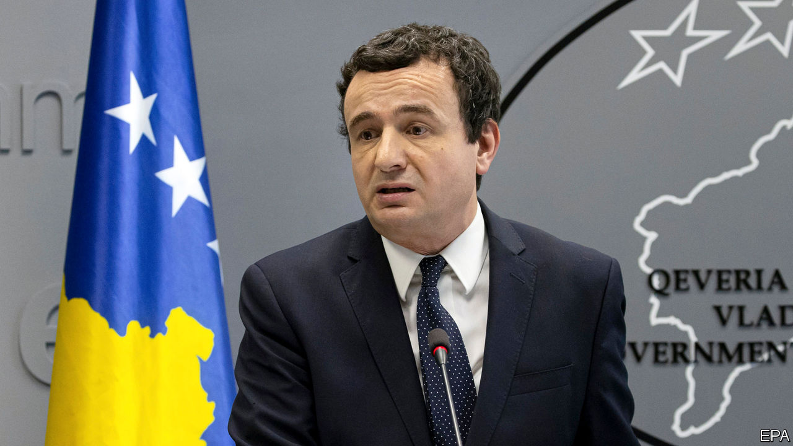
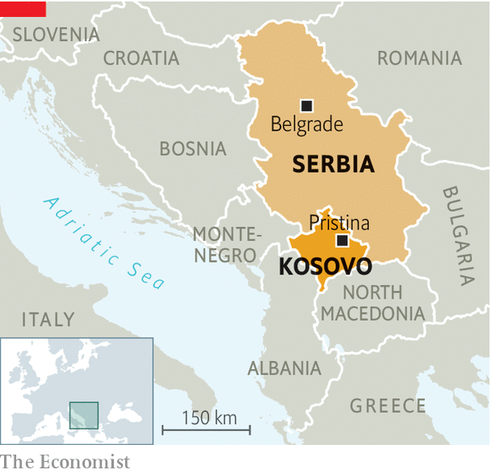

## A Balkan bust-up

# Did America help oust Kosovo’s reformist government?

> A fissile corner of the Balkans just got less stable

> Apr 2nd 2020

IT WAS ONLY 51 days old, but covid-19 was used to kill it. On March 25th a big majority of deputies in Kosovo’s parliament voted to snuff out the government of Albin Kurti, a radical reformer. They may have been doing America’s bidding. Donald Trump’s administration wanted the truculent prime minister out of the way in order to claim peace in Kosovo as a (rare) foreign-policy success in the run-up to America’s presidential election. Its friends have provided.

Mr Kurti spent more than 20 years as a protest leader. After last October’s election months were spent cobbling together a coalition with the parliament’s second-largest party, the Democratic League of Kosovo. Meanwhile his long-standing enemy, President Hashim Thaci, was talking to Serbia’s leader, Aleksandar Vucic, about a deal to make peace between Kosovo and Serbia. Kosovo, whose people are mostly ethnic Albanians, was a province of Serbia until the Balkan wars of the 1990s. Serbia has never recognised its independence, though most EU countries and a majority of UN members have done so.

Once in power Mr Kurti announced that he would now take charge of the talks and that he was against any territorial exchanges with Serbia, which Mr Thaci is thought to have discussed as the price of peace. Mr Vucic then said he would do a deal only if tariffs on Serbian goods were lifted. Mr Kurti agreed to that, but only on the basis of “reciprocity”, meaning that goods from Serbia would, instead of tariffs, be subject to a non-tariff barrier in the shape of a ban if those same types of goods are banned from sale in Serbia. Lifting these bans on Kosovar produce is unacceptable to Serbia, as it believes that doing so would imply recognition of the country. So the proposal was swiftly rejected by Richard Grenell, the acting American intelligence head, who is overseeing the peace talks. American financial aid was suspended. (Mr Thaci and the Americans both deny favouring any land swaps.)

Last week Mr Kurti’s government was voted out in parliament, in a procedure ostensibly provoked by a row over the declaration of a state of emergency owing to covid-19, which would have given the president many exceptional powers. Mr Kurti’s supporters are bitter. They believe he was their only chance to rid the country of the corrupt leaders and warlords of the past.

Weeks of wrangling will now follow. If it were not for the virus a snap election could have been called. A divided and unstable corner of Europe has just become a little more precarious.