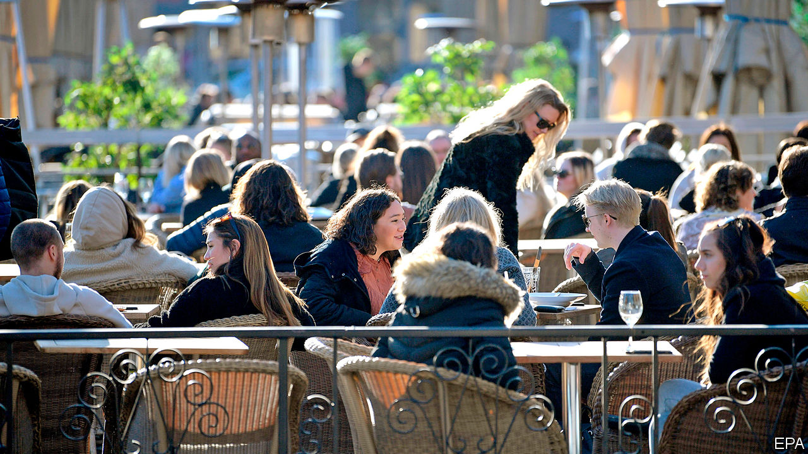

## The Swedish exception

# Why Swedes are not yet locked down

> For now, they can go to bars. That may change soon

> Apr 4th 2020STOCKHOLM

Editor’s note: The Economist is making some of its most important coverage of the covid-19 pandemic freely available to readers of The Economist Today, our daily newsletter. To receive it, register [here](https://www.economist.com//newslettersignup). For our coronavirus tracker and more coverage, see our [hub](https://www.economist.com//coronavirus)

WHILE SWEDEN’S fellow Scandinavians and nearly all other Europeans are spending most of their time holed up at home under orders from their governments, Swedes last weekend still enjoyed the springtime sun sitting in cafés and munching pickled herrings in restaurants. Swedish borders are open (to EEA nationals), as are cinemas, gyms, pubs and schools for those under 16. Restrictions are minimal: the government recommends frequent handwashing for all, working from home for those who can, and self-isolation for those who feel ill or are older than 70. That includes King Carl Gustaf and his wife Silvia, who are self-isolating in a castle. Only on March 29th did Sweden ban gatherings of more than 50.

Britain had a similarly relaxed approach until March 23rd, but then the government imposed a national lockdown. As the number of reported infections and deaths among the 10m Swedes rose to 4,947 and 239 respectively as of March 31st, many predict that Sweden will soon follow the rest of Europe’s example. Some fear it may have wasted precious time.

Inherent in Sweden’s social contract is trust in the state, trust by the state in its citizens and trust among citizens, explains Lars Tragardh, a historian. Swedes can be relied on to adhere to rules voluntarily and to self-regulate. Moreover, jokes Carl Bildt, a former prime minister, “Swedes, especially of the older generation, have a genetic disposition to social distancing anyway.” Over half of Swedish households consist of just one person, the highest number of single-person households in the world. The country is sparsely populated. And Swedes do not kiss or hug as much as southern Europeans tend to do.

Business leaders have been more vocal in their opposition to a national lockdown than in other countries. Jacob Wallenberg, chairman of Investor, an investment company, warned about social unrest, violence, dramatic unemployment and great suffering if the covid crisis goes on for long in an interview with the Financial Times. Johan Torgeby, chief executive of SEB, a bank, worries about creating a banking crisis on top of an economic and health crisis.

So far the policy of Stefan Lofven, the prime minister, has been guided by the country's Public Health Agency. Anders Tegnell, the agency’s chief epidemiologist, advised the government to let the virus spread as slowly as possible while sheltering the vulnerable until much of the population becomes naturally immune or a vaccine becomes available.

Yet some experts worry that Mr Lofven is prioritising the health of the economy over that of the public. A petition signed by more than 2,000 scientists and professors, including Carl-Henrik Heldin, the chairman of the Nobel Foundation, called on the government to introduce more stringent containment measures. It is too risky to let people decide how to behave, argues Joacim Rocklov, an epidemiologist at Umea University.

During other pandemics, such as the outbreak of cholera at the end of the 19th century or the AIDS pandemic in the 1980s, Sweden imposed more stringent restrictions than its neighbours. So far the public is supportive of Mr Lofven’s contrarian strategy—but once the death toll rises this may quickly change. ■

Dig deeper:For our latest coverage of the covid-19 pandemic, register for The Economist Today, our daily [newsletter](https://www.economist.com//newslettersignup), or visit our [coronavirus tracker and story hub](https://www.economist.com//coronavirus)