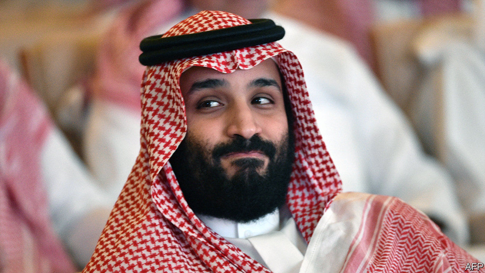

## Lakes of unwanted oil

# A lost year in Saudi Arabia

> The oil crash and the pandemic have roiled plans to focus on diplomacy and growth

> Apr 4th 2020BEIRUT

THE YEAR had got off to a good start for Saudi Arabia. After a sluggish stretch the non-oil economy was growing, and officials were eager to lure new investment. The war in neighbouring Yemen seemed to be winding down. The world had largely moved on from the murder of Jamal Khashoggi, a journalist dismembered by Saudi agents in 2018. And the kingdom was set to host the G20 summit in November.

Lately, though, things have not gone to plan. Muhammad bin Salman, the crown prince and de facto ruler, locked up several princes and scores of civil servants in March. Then he started an oil-price war that sent crude to its lowest level since 2003. The plunge upset not only Russia, its target, but also friends from Abu Dhabi to Washington. And now covid-19 has frozen the Saudi economy and left it with lakes of unwanted oil. Far from being a year to charm diplomats and woo investors, 2020 may leave the kingdom in a deeper economic and diplomatic hole.

In different times the arrest last month of Prince Ahmed, the last living full brother of King Salman, might have been bigger news. The police also rounded up Muhammad bin Nayef, a former heir apparent, and dozens of state employees. Saudis close to the royal court accused the detainees of scheming against the crown prince. Yet there is no evidence of any plot. Indeed, some of the alleged plotters have been released. Instead the arrests seem to have been another warning shot by a prince who tolerates no dissent.

Prince Muhammad’s rash persona was on display days later when OPEC and Russia failed to reach a deal on new output curbs. The prince allegedly overruled his half-brother, the oil minister, and ordered Aramco, the state oil company, to boost production. With the market awash with oil, prices crashed below $30 a barrel and may fall further still. Saudi Arabia is tired of playing swing producer, cutting output to prop up prices when others refuse to do the same. Prince Muhammad is also worried about the future of oil in a world trying to wean itself off the stuff.

If prices stay low, however, the kingdom will need to plug a budget shortfall of up to $2bn a week. It has already cut spending by 50bn rials ($13.3bn), the only G20 member to trim outlays during the pandemic. Ministries have been asked to plan even deeper cuts. Construction firms say new contracts have ground to a halt.

Publicly allies have played along. The state oil company of the United Arab Emirates (UAE) pledged to boost its own output from 3m to 4m barrels a day. In private, though, Gulf officials fume about a decision that will blow holes in their budgets. The UAE has tried, so far without success, to bring Russia and Saudi Arabia back to negotiations. So has America. Barely a year ago President Donald Trump was raging against OPEC for high prices. Now he wants the cartel to raise them before cheap crude cripples America’s shale industry. But the Saudis seem unwilling to budge—even as covid-19 destroys global demand.

Saudi Arabia moved faster than many countries to contain the virus. By mid-March, when it had less than 100 documented cases, it had grounded international flights and suspended pilgrimages to Mecca. Thousands of returnees from abroad were quarantined in pleasant hotels at state expense and tested. Quick action seems to have helped. The kingdom has 1,720 confirmed cases, among the lowest per-capita numbers in the region.

Still, the economic consequences will be severe. The effort to switch the Saudi economy away from oil relies heavily on private consumption. More than 426,000 Saudis work in retail, which has ground to a halt. The kingdom started issuing tourist visas in September and hoped to draw hundreds of thousands of visitors in 2020. Few are likely to show up. Investment may stall.

The virus may also force Saudi Arabia to cancel the most important events on its calendar. The haj, the annual pilgrimage to Mecca (a once-in-a-lifetime duty for Muslims), is meant to begin in late July. Last year it drew 2.5m people. Such a crowd is unlikely while covid-19 rages. On March 31st the minister in charge of pilgrimages told Muslims not to make travel plans yet. A government-backed research centre has published a list of past pilgrimages interrupted by war, bandits and disease. But cancelling the haj would have a cost. Mecca is the largest contributor to GDP after oil.

As for the G20, three weeks after the World Health Organisation declared covid-19 a pandemic, the bloc has done little to co-ordinate a response. Its heavyweights, America and China, would rather bicker with each other. Even the G7, a more homogeneous bloc, could not reach a joint statement because of America’s insistence on calling it the “Wuhan virus”, a name to which China objects. The crown prince’s coming-out party may be overshadowed by further feuding. That is, if it happens at all. If the virus roars back in the autumn, as some epidemiologists expect, the summit might end up not in a gilded ballroom, but on Zoom. ■

## URL

https://www.economist.com/middle-east-and-africa/2020/04/04/a-lost-year-in-saudi-arabia
