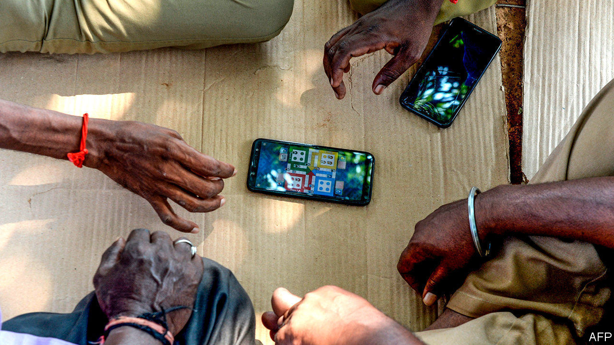

## Covid-19 and telecoms

# Can mobile networks handle becoming stay-at-home networks?

> Or will rapidly increasing demand overwhelm them?

> Apr 4th 2020

Editor’s note: The Economist is making some of its most important coverage of the covid-19 pandemic freely available to readers of The Economist Today, our daily newsletter. To receive it, register [here](https://www.economist.com//newslettersignup). For more coverage, see our coronavirus [hub](https://www.economist.com//coronavirus)

AS COUNTRIES ACROSS the rich world placed themselves under restriction over the course of March, journalists there turned to the question on everyone’s lips: “will the coronavirus break the internet?” For them, the answer in the main is “no”. Most broadband networks are built for peak evening usage, when lots of people settle in for a session of HD streaming. Even widespread, daylong videoconferencing and online gaming do not come close to that level of data consumption. The internet, as one infrastructure provider puts it, was “built for this”.

Such sangfroid does not, however, apply if your internet connection is mobile. And in the poorer parts of the planet that is generally the case. Indeed, most of the 4bn or so people who use the internet today do so via mobile connections rather than land-lines. As countries such as India, South Africa and those in South-East Asia start staying at home they are turning to their phones for entertainment, for communication and for work. With little fixed-line capacity to fall back on, the load on local mobile networks is immense.

A mobile-data connection runs as a radio signal from a phone to the local base-station. Thence it links up, via optical fibre or a microwave connection, with the network’s core, which is connected to the wider internet. If too many people try to connect simultaneously to the same base station, that station will be overwhelmed, causing calls to drop, data-transfer speeds to slow and tempers to rise.

Even some rich countries are suffering in this regard. According to James Barford of Enders Analysis, a British research firm, Telefónica Spain has seen a 30% surge in data traffic and Telecom Italia reports a 10% rise. Download speeds in Italy have also declined, according to OpenSignal, a network-analytics firm.

Elsewhere, things are worse still. Some networks have seen internet use rise by as much as 80% says Bhaskar Gorti of Nokia, which makes networking equipment and helps operators manage their systems. Mobile networks are constantly being upgraded, and have assumptions of double-digit growth baked into them. But those assumptions are for growth over the course of months or years, not days.

So far, network operators have proved equal to the task. But things could deteriorate. Routine maintenance will suffer as engineers go off sick or are forced to self-isolate. There will be less capacity for emergency maintenance. Far-off base stations will become harder to reach. And on top of all this, demands on networks will probably rise. More people will discover video chatting. As television broadcasters struggle to provide fresh entertainment, people will turn to streaming in ever greater numbers. All of these things will add to congestion. The longer that stay-at-home orders remain in place, the more likely it is that some networks will fall over.

Mobile operators and regulators are not standing around waiting for such failures, though. In several countries, including Spain, mobile operators have asked users to reduce their data consumption. Others are trying novel ideas. Kenya has fast-tracked Google’s Loon project, which will provide 4G signals from high-altitude balloons. In India, where data consumption is up 30% and speeds down 20%, operators are contemplating joining forces, to ease each other’s peaks. European and other regulators have asked the big streaming services—Netflix, Amazon, YouTube—to reduce the quality of their videos, in a bid to free up capacity. America has granted its networks additional radio spectrum on a temporary basis, and several other countries are in the process of doing the same.

Around a third of the planet’s inhabitants are now stuck at home. That is bad enough—for morale, for businesses and for countries’ economies. For those people to lose in addition what is, for many of them, their only connection to the wider world just makes it worse. ■

Correction (April 2nd 2020): A previous version of this piece spelled Mr Gorti's name incorrectly. 

Dig deeper:For our latest coverage of the covid-19 pandemic, register for The Economist Today, our daily [newsletter](https://www.economist.com//newslettersignup), or visit our [coronavirus hub](https://www.economist.com//coronavirus)

## URL

https://www.economist.com/science-and-technology/2020/04/03/can-mobile-networks-handle-becoming-stay-at-home-networks
