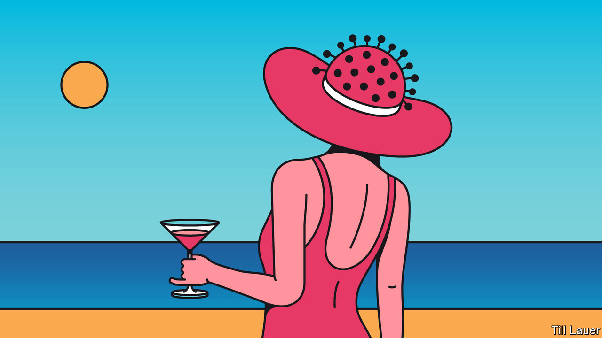

## Banyan

# The eternal, fanciful allure of the South Pacific

> It turns out tropical boltholes can be hard to reach in a crisis

> Apr 11th 2020

Editor’s note: The Economist is making some of its most important coverage of the covid-19 pandemic freely available to readers of The Economist Today, our daily newsletter. To receive it, register [here](https://www.economist.com//newslettersignup). For our coronavirus tracker and more coverage, see our [hub](https://www.economist.com//coronavirus)

AS A DISTRACTING sidebar to much grimmer stories, newspapers around the world have been publishing tales of tourists stranded in palm-fringed places, unable to catch a flight home. A 19-year-old Briton trapped on a tropical island after a stint volunteering for a charity told the BBC, “I think people assume, ‘You’re in Fiji, you’re on the beach sipping cocktails, it’s just a holiday.’ Everything is in lockdown and we spend our days looking for ways to get home.” Some hapless travellers have been told by their governments that the only way to get back to their families is to charter a private jet at their own expense.

That is exactly what some much richer people have been doing, albeit heading in the opposite direction. Scrutineers of flight-tracking websites report an increase in private jets leaving America, in particular, for the vast, remote South Pacific. They include two Gulfstream jets that left Los Angeles earlier this month and landed in Tonga. The Polynesian kingdom is supposedly closed to air traffic. In Fiji, the rumour that Nicole Kidman was holed up on Wakaya Island, where Keith Richards once fell head first out of a coconut tree, proved unfounded. But others have gone to ground there. Agents report a rise in superyacht charters, too, by billionaires and their families looking for “remote” locations in which to self-isolate.

The South Pacific’s allure is fuelled by fantasy: that of a pure, even erotic, innocence, compared with the disease, pollution and corruption of Western civilisation. The trope dates to the West’s first encounters with the Pacific. “Poedua”, the first portrait in oil of a Pacific islander, by John Webber, an artist on Captain James Cook’s Endeavour in the late 1770s, is less ethnographic than pornographic in its representation of the young princess. It is but a short hop to Paul Gauguin’s paintings of Tahitian girls over a century later, today among the world’s most expensive paintings. Tourism brochures depicting island women with frangipani blooms behind their ears play to the same idea.

The fantasy has in fact been lethal, bringing infectious disease with it. The English and French captains who were the first Europeans to visit Tahiti bickered over which crew had introduced syphilis (probably the English). It was a killer. Tahiti later suffered devastating epidemics of smallpox, dysentery, scarlet fever and measles in quick succession. Gauguin infected three child brides and a string of adolescents with syphilis. Missionaries carried death too. When Robert Louis Stevenson visited the Marquesas in 1888, so many had died no one remembered the old songs and dances, and coffins had become prestige items. The population of Hawaii fell from perhaps 250,000 in Cook’s time to less than 40,000 by the end of the 19th century. Bear this history in mind when you hear Fiji’s strongman, Frank Bainimarama, warning those tempted to break the current curfew: “It doesn’t matter how famous you are, it doesn’t matter how rich you are... No one is immune to our laws.” With weak health systems and many vulnerable citizens, South Pacific countries cannot risk an outbreak of covid-19.

But what about New Zealand? One-percenters who have long prepped for the apocalypse—whether caused by disease, nuclear war or the breakdown of society—have always seen it as the place to ride out the end of days. The devastation Cyclone Harold inflicted this week on Vanuatu only highlights smaller countries’ vulnerability. New Zealand, in contrast, is far from global tensions, has a clean environment and a phlegmatic folk not inclined to sharpen their pitchforks. Peter Thiel, a Silicon Valley mogul with land on South Island, has long praised the country’s survivalist attributes. Rising S, a Texan maker of doomsday bunkers, has sold several 150-ton models to American tycoons and shipped them to New Zealand to be buried underground.

Too bad if you’re among the filthy rich who thought of New Zealand only recently: it has tightened its laws to restrict foreign ownership of property. But even if you already own a bolthole, you need to get ahead of the looming catastrophe. Few anticipated Jacinda Ardern, the prime minister, closing borders so promptly last month. And how on earth do you decide which of your family and staff to bring? And—oh lord—which pets? No exceptions: the pets must spend at least ten days in government quarantine. A converted nuclear-missile silo in Kansas, whose prices are reported to be rising, starts to look more appealing.

Dig deeper:For our latest coverage of the covid-19 pandemic, register for The Economist Today, our daily [newsletter](https://www.economist.com//newslettersignup), or visit our [coronavirus tracker and story hub](https://www.economist.com//coronavirus)

## URL

https://www.economist.com/asia/2020/04/11/the-eternal-fanciful-allure-of-the-south-pacific
