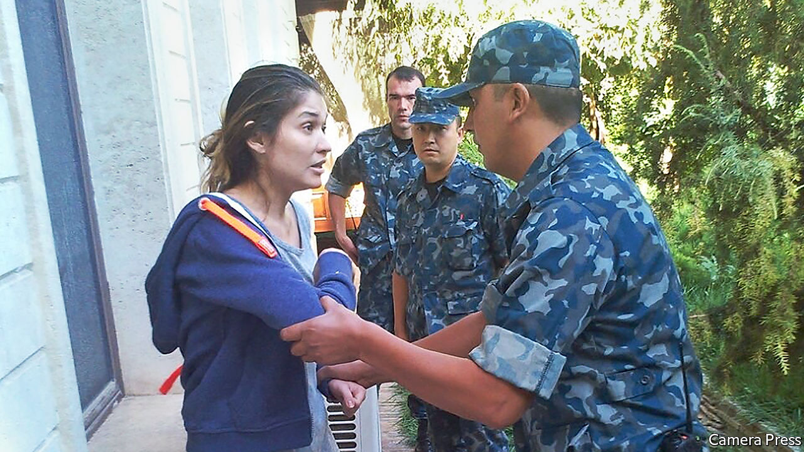

## Blind obedience

# Uzbekistan is reforming its judicial system—up to a point

> The courts are becoming fairer, except in a few prominent cases

> Apr 8th 2020TASHKENT

“IF JUSTICE PERISHES, human life on Earth has lost its meaning,” intoned Shavkat Mirziyoyev, Uzbekistan’s president, quoting Immanuel Kant, a philosopher. Mr Mirziyoyev was explaining to parliament his plans for reform of the justice system. Anyone entering an Uzbek courtroom, he said, should be “fully confident that the principles of legality and justice are unfailingly upheld”. That is a tall order in a country in which, until he came to power in 2016, the courts served a dictatorship. And although the courts are indeed being overhauled, there are limits.

Mr Mirziyoyev has appointed a young British-educated justice minister, Ruslanbek Davletov. Fully 80% of prosecutors were replaced after Mr Mirziyoyev condemned their rampant bribe-taking. The government has decreed that evidence obtained by torture (common under Mr Mirziyoyev’s predecessor, Islam Karimov) is inadmissible. A special council has been set up to boost judicial independence.

These reforms may be paying off: the number of acquittals, previously near zero, has risen. Remarkably, a court recently overturned the conviction of Chuyan Mamatkulov, one of dozens of Karimov-era political prisoners released under Mr Mirziyoyev. The Justice Ministry has also permitted the establishment of Huquqiy Tayanch (Legal Support), a rights group that campaigns for the rehabilitation of former political prisoners. It is headed by Azam Farmonov, an activist who was once jailed in the notorious Jaslyk prison camp, which Mr Mirziyoyev has closed.

Mr Farmonov wants a proper airing of the abuses that took place in Jaslyk and in the justice system more broadly under Karimov, who died in 2016. “Karimov’s repressions repeated Stalin’s repressions,” he says. If they are not exposed, “no one can say something like this won’t happen again.” Human Rights Watch, a watchdog, estimates that 10,000 people were jailed for political reasons; many remain behind bars. Mr Farmonov expects resistance to any reckoning from the police, jailers and judges who took part. Examining the misdeeds of the past could also be awkward for Mr Mirziyoyev, who served as Karimov’s prime minister for 13 years.

The case that most clearly embodies these tensions is that of Gulnara Karimova, Karimov’s daughter. In March a court jailed her for 13 years after a closed trial. Her sentence, on charges of running crime rings, extortion and money-laundering, will run concurrently with a term she was already serving for extortion, embezzlement and tax evasion. The Justice Ministry insists Ms Karimova’s rights were respected, but has not explained why her trial was not public. Ms Karimova, a former singer and socialite, received several plum diplomatic postings from her father. She fell from grace in 2014, while he was still president, and was detained without trial. She has been indicted in America over an “extensive corrupt bribery scheme”.

Conducting Ms Karimova’s trial “behind closed doors, and in violation of due-process norms, does a disservice to the Uzbek government’s efforts to show that the court system has fundamentally improved”, argues Steve Swerdlow, a lawyer. Advocates of reform also worry about two other recent closed trials. In January Kadyr Yusupov, an ex-diplomat who suffers from schizophrenia and who was arrested after a suicide attempt, was jailed on espionage charges. In March, Vladimir Kaloshin, a journalist for a military newspaper, received a 12-year sentence for treason after proceedings that featured no defence witnesses. His daughter, Anastasiya Episheva, says it was “not a trial but a travesty”.

These investigations were led by the State Security Service, a feared intelligence agency which Karimov used to silence dissidents, but which Mr Mirziyoyev has reined in. Some observers suspect that these secret policemen, whom the president once labelled “mad dogs”, are trying to prove their worth by uncovering phantom plots. Whatever their motivation, the intelligence services’ continued clout creates a “climate of fear” and “adversely affects” judicial independence, a UN rapporteur concluded last year. ■