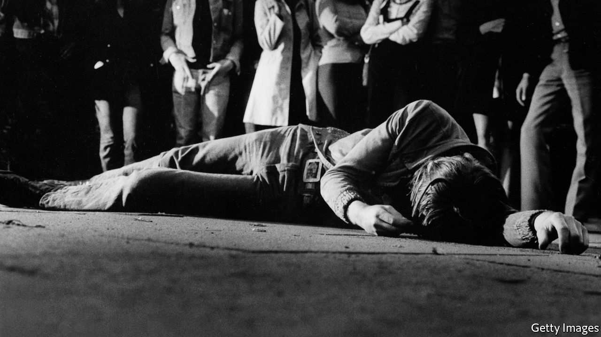

## Walking on by

# Why do so many people fail to do what they know is right?

> Catherine Sanderson tries to find out—and asks what can be done to turn bystanders into “moral rebels”

> Apr 8th 2020

Why We Act. By Catherine Sanderson.Belknap Press; 272 pages; $27.95. Published in Britain as “The Bystander Effect”; William Collins; £20.

WHAT WOULD you do if you saw someone lying unconscious in the street? Would it make a difference if you were rushing to an important appointment? Why do so many people who say they deplore racism and sexism do little to challenge them in practice? And what can be done to purge the conformism that deters complaints about toxic colleagues, for fear of ostracism or career setbacks?

These are among the questions that Catherine Sanderson, an American professor of psychology, addresses in her new book, an examination of moral courage and its disappointing scarcity. Ms Sanderson thinks bullying, political corruption and corporate crime flourish because of “the failure of good people to stand up and do the right thing”. Drawing on an abundance of research in social psychology, she probes why this is the case—analysing, for instance, how witnesses to wrongdoing perform “subconscious cost-benefit analysis”, which typically reinforces the “natural human tendency to stay silent”.

Ms Sanderson maintains that even minor transgressions should be called out, because getting away with them makes the offender more likely to graduate to worse ones. She describes how people who socialise in groups generally leave poor tips for waiting staff, “assuming that their own contributions will not be noticed and that others will contribute more to compensate”. This is known as “social loafing”; in other contexts, such willingness to hide in a crowd can have graver consequences.

The author elucidates several similar terms. “Evaluation apprehension” is being inhibited from taking action by worries about looking silly. “Pluralistic ignorance” is the phenomenon whereby someone privately rejects a certain doctrine or attitude, yet goes along with it on the incorrect assumption that it is widely held.

This book’s chief virtue lies in its wealth of instructive examples—whether about employees’ silence over fraud at Enron, the murder of James Bulger, a Merseyside toddler, or the efforts of the helicopter pilot Hugh Thompson Jr to halt the My Lai massacre. The downside is that its insights are sometimes banal. “We tend to feel greater connection to members of our own group,” Ms Sanderson writes, as a prelude to explaining why Manchester United football fans are more likely to help a distressed person wearing their team’s shirt than one in the colours of their rivals Liverpool. “Creating a greater sense of connectivity at school”, she advises, can “go a long way toward combating the widespread apathy of high schoolers”.

A new lexicon is required, the author concludes. To this end, she cites Jeffrey Wigand, a biochemist who in the 1990s revealed that Brown & Williamson, a tobacco firm, was manipulating its products to make them more addictive. Mr Wigand thinks the word “whistleblower” is “laden with pejorative connotations” and should be replaced by “person of conscience”.

Ms Sanderson prefers the term “moral rebels”, and sets out some practical strategies to inspire more of them. “Create a culture of speaking up,” she suggests, and encourage children to question authority. But she is aware of the obstacles, too. “We need to develop our ability to feel empathy,” she writes, while conceding this will be tricky in an age suffused with narcissism. ■