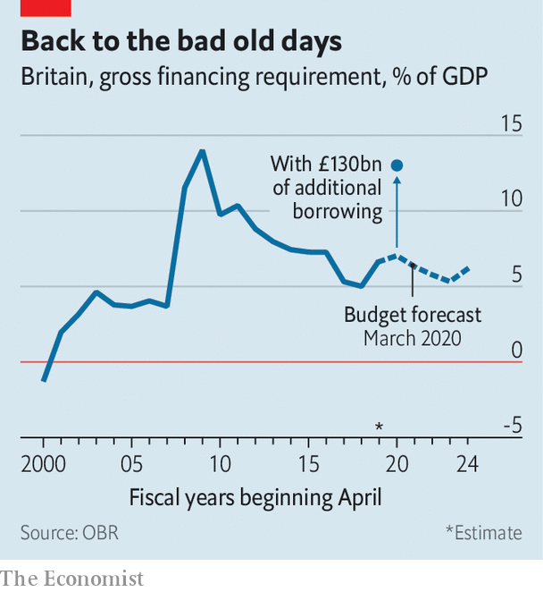

## Recession looms

# Covid-19 causes Britain’s fastest economic contraction on record

> Government borrowing is rocketing, undoing a decade’s work to shrink the deficit

> Apr 11th 2020

Editor’s note: The Economist is making some of its most important coverage of the covid-19 pandemic freely available to readers of The Economist Today, our daily newsletter. To receive it, register [here](https://www.economist.com//newslettersignup). For our coronavirus tracker and more coverage, see our [hub](https://www.economist.com//coronavirus)

LENIN WAS probably thinking about the Communist revolution in Russia when he said that “there are decades in which nothing happens, and there are weeks in which decades happen”, but the observation fits Conservative economic policy just as well. In his budget on March 11th, Rishi Sunak, the chancellor, unveiled a response to covid-19 that added up to some £12bn ($15bn). Just over a week later, with much of the economy shut by government decree, the direct fiscal response was increased to more than £30bn and the government sought to guarantee £330bn (around 15% of GDP) of private sector lending.

The severity of the decline and its pace look to be without modern precedent. According to Samuel Tombs of Pantheon Macroeconomics, a consultancy, “In a normal recession, if it was very bad, you might see a quarter-on-quarter drop of 2% in GDP. The second quarter this year will probably be down closer to 20%.”

Official data from the Office for National Statistics will take time to catch up to the new reality, but survey data are startling. The composite purchasing managers’ index (PMI) fell from 53 in February to 37.1 in March, a record low for the series and the largest monthly decline on record. Any number below 50 signals contraction. Elsewhere in Europe, PMIs have fallen to even lower levels, but this reflects the timing of lockdown measures. Britain locked down on March 23rd, later than most of Europe. Other data paint a similarly grim picture; car registrations fell by 44% in the year to March, while claims for Universal Credit, the main out-of-work benefit, rose by around 950,000 in the two weeks after the lockdown began.

The scale of the economic damage and the cost of the policy response will in months undo a decade of effort to reduce the fiscal deficit. The take-up of support schemes appears to be running well ahead of what was anticipated. The jobs-retention scheme, for example, allows firms to furlough staff on 80% of their wages up to £2,500 a month with the taxpayer picking up the bill. At first the Treasury estimated that around 3m private-sector employees, just over 10% of the workforce, would be furloughed, at a cost to the exchequer of around £10bn. But a survey conducted by the British Chambers of Commerce found that three-quarters of respondents planned to use the scheme, and almost four in ten intended to furlough more than three-quarters of their staff.

In his budget, Mr Sunak estimated that government borrowing would rise to 2.4% of GDP. The Institute for Fiscal Studies, a think-tank, now estimates that it could increase by around an additional £130bn this year, to around 10% of GDP. That would take the government’s total financing needs back to levels last seen in the financial crisis (see chart).

The best hope is that the recession and recovery will be V-shaped, with the steep decline matched by an equally rapid bounce-back once the lockdown is ended. But despite help from the government, unemployment is rising and firms are failing, causing damage that may scar the economy and slow the recovery. ■

Dig deeper:For our latest coverage of the covid-19 pandemic, register for The Economist Today, our daily [newsletter](https://www.economist.com//newslettersignup), or visit our [coronavirus tracker and story hub](https://www.economist.com//coronavirus)