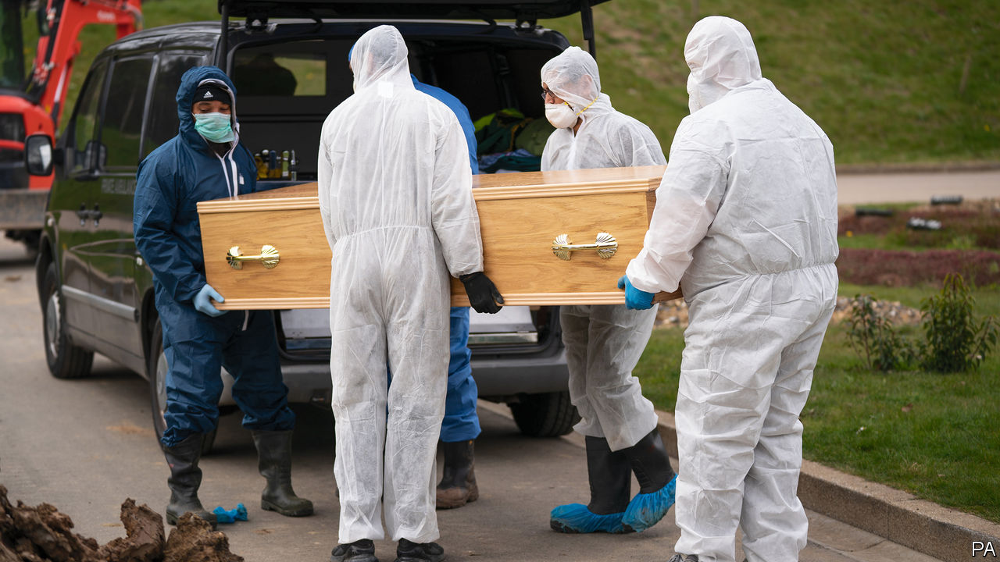

## Funerals

# How covid-19 is changing funerals

> There’s a tension between the demands of a crisis and people’s spiritual needs

> Apr 11th 2020

Editor’s note: The Economist is making some of its most important coverage of the covid-19 pandemic freely available to readers of The Economist Today, our daily newsletter. To receive it, register [here](https://www.economist.com//newslettersignup). For our coronavirus tracker and more coverage, see our [hub](https://www.economist.com//coronavirus)

LAURA FOSTER’S mother, Hilary Heath, wanted to be buried in a red flowery dress, but the current crisis does not permit people to choose the style of their departure. Ms Heath, who died of covid-19, will be cremated as soon as her daughter’s self-isolation is over. The vicar will be the only other person present.

Funerals these days are even sadder than in normal times. Public Health England has ruled that only close family members may attend, anyone with coronavirus symptoms is banned, and social distancing must be enforced. Some councils, like Bradford and Leeds, have banned mourners altogether; others have put limits on attendance. In Birmingham, where six are permitted, Tahir Ali, a Labour MP, was scolded by police after going to a constituent’s funeral as an observer.

Even tighter rules were originally envisaged. The Coronavirus Act, passed into law on March 25th, gave local authorities the power to order compulsory cremations. But after some pushback from Jewish and Muslim groups, for whom a ritualised burial is essential, the act was amended to take into account people’s religious beliefs.

The act reflects concerns about the funeral industry’s capacity. In normal times, weekly death rates vary from 8,500 to 14,800. Neil Ferguson, an epidemiologist from Imperial College London, suggests that between 7,000 and 20,000 Britons will die from coronavirus, increasing demands on a sector already under pressure.

The Crown Commercial Service, the government’s purchasing agency, has increased mortuaries’ capacity by extending them through the use of refrigerated tents. Mortuary storage is up by 25,000. Refrigerated lorries are on standby as a last resort.

Making cremations compulsory nationwide would have relieved pressure on burial sites. In 2013, a BBC study found that a quarter of England’s local authorities expected their graveyards to be full by 2023. Even though fewer than a quarter of Britons choose to be buried, covid-19 will bring this date forward.

That is of particular concern in London, where covid-19 is concentrated. Hackney and Tower Hamlets have already run out of graves. Tower Hamlets also has the highest proportion of Muslim residents in the country; Hackney has the largest group of Charedi Jewish people in Europe.

Religious groups have been organising their own sites. Gardens of Peace, a dedicated Muslim cemetery in East London, opened in 2002. Within 15 years its 10,000 plots were full. It opened a second graveyard in 2018, and has purchased a third.

Pandemics change burial traditions. The Spanish flu, which killed over 200,000 Britons a century ago, brought an end to the horse-drawn funeral processions that were popular in Victorian times. Whatever impact covid-19 has in the long run, for now its victims’ mourners are looking forward to proper commemorations when the lockdown is lifted. “When this is all over we can have the hymns, the readings, the party that Mum wanted,” says Ms Foster. “I just see this cremation as a way to get her home. I just want her home.”■

Dig deeper:For our latest coverage of the covid-19 pandemic, register for The Economist Today, our daily [newsletter](https://www.economist.com//newslettersignup), or visit our [coronavirus tracker and story hub](https://www.economist.com//coronavirus)

## URL

https://www.economist.com/britain/2020/04/11/how-covid-19-is-changing-funerals
